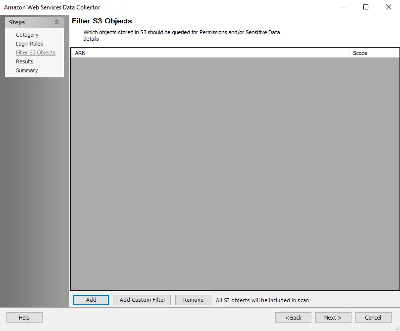
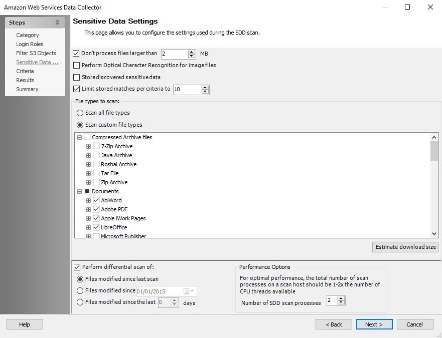

# 4.AWS_S3SDDScan Job

The 4.AWS_S3SDDScan job collects details about S3 objects containing sensitive data.

## Queries for the 4.AWS_S3SDDScan Job

The AWS S3 Sensitive Data Scan query uses the AWS Data Collector to target all AWS instances and has
been preconfigured to use the Collect SDD Data category.

The 4.AWS_S3SDDScan job has the following configurable query:

- AWS S3 Sensitive Data Scan – Scans AWS objects for sensitive data

### Configure the AWS S3 Sensitive Data Scan Query

The AWS S3 Sensitive Data Scan query in the 4.AWS_S3SDDScan job has been preconfigured to run with
the default settings with the category of Collect SDD Data. Follow the steps to set any desired
customizations.

**Step 1 –** Navigate to the **AWS** > **0.Collection** > **4.AWS_S3SDD Scan** > **Configure** node
and select the **Queries** node.

**Step 2 –** In the Query Selection view, click **Query Properties**. The Query Properties window
opens.

**Step 3 –** Select the **Data Source** tab, and click **Configure**. The Amazon Web Services Data
Collector Wizard opens.

**Step 4 –** On the Filter S3 Objects page, scope the scan to target specific S3 objects:

- Click **Add** to select from AWS Buckets in the target environment
- Alternatively, click **Add Custom Filter** to configure a custom filter as a text string
- See the [AWS: Filter S3 Objects](../../../admin/datacollector/aws/filters3objects.md) topic for
  additional information

**Step 5 –** On the Sensitive Data Settings page, configure the following options:

- Modify maximum file size to be scanned
- Add scanning offline files
- Modify file types to be scanned
- Enable differential scanning
- Modify the number of SDD scan processes

    **_RECOMMENDED:_** For optimal performance, the total number of scan processes on a scan host
    should be 1 to 2 times the number of CPU threads available.

- Enable Optical Character Recognition (OCR) scans

    **NOTE:** The OCR option is intended to work for clear scanned physical documents or documents
    directly converted to images, with standard fonts. It will not work for scanning photos of
    documents and may not be able to recognize text on images of credit cards, driver's licenses, or
    other identity cards.

**Step 6 –** On the Criteria page, add or remove criteria as desired:

- (Optional) Create custom criteria on the global **Settings** > **Sensitive Data** Node
- See
  the[Sensitive Data Criteria Editor](../../../sensitivedatadiscovery/criteriaeditor/overview.md)
  topic for additional information and instructions

**NOTE:** By default, discovered sensitive data strings are stored in the Access Analyzer database.

**Step 7 –** On the Summary page, click **Finish** to save any modifications or click **Cancel** if
no changes were made. Then click **OK** to close the Query Properties window.

If changes were saved, the 4.AWS_S3SDDScan Job has now been customized.

## Analysis Tasks for the 4.AWS_S3SDD Scan Job

View the analysis tasks by navigating to the **AWS** > **0.Collection** > **4.AWS_S3SDDScan** >
**Configure** node and selecting **Analysis**.

**CAUTION:** Do not modify or deselect the selected analysis tasks. The analysis tasks are
preconfigured for this job.

The following analysis tasks are selected by default:

- AWS Sensitive Data Latest Match Counts View – Creates a view with the most recent scans of each
  AWS file
- Match Hits View – Shows the AWS SDD match hits
- AIC AWS S3 Bucket SDD Import – Imports AWS S3 Bucket objects with sensitive data into the Access
  Information Center
