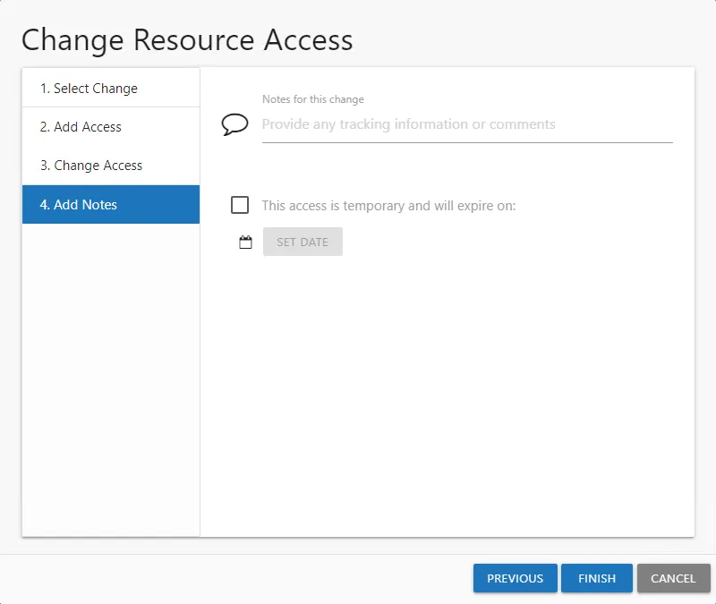
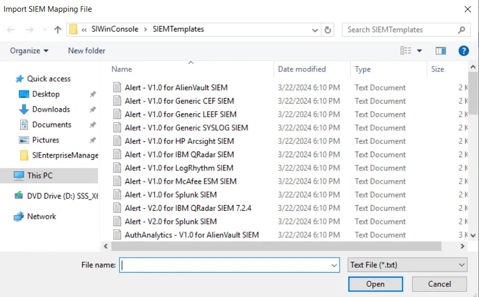
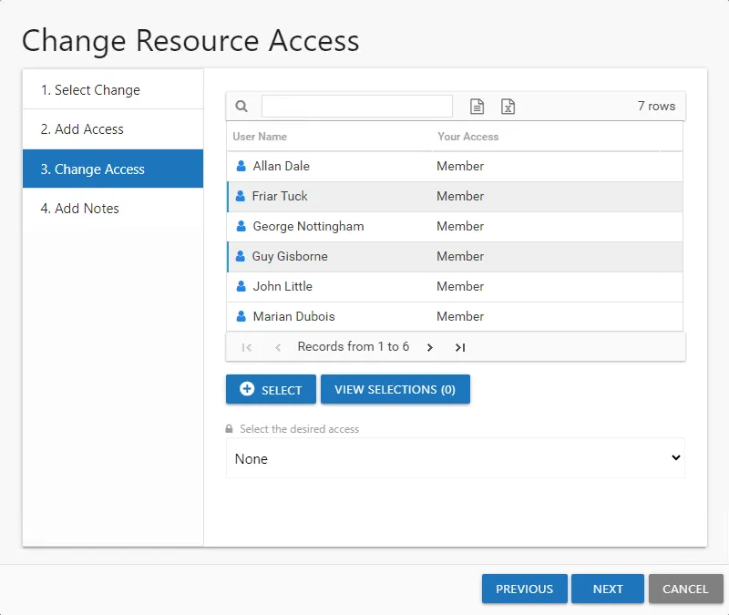
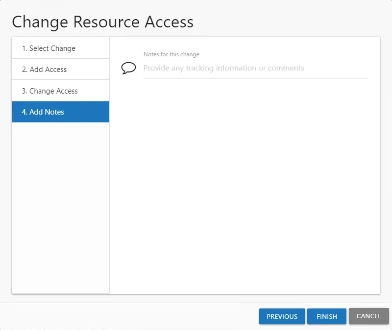

# Change Resource Access Wizard

The **Change Access** button on the Owner portal opens the Change Resource Access wizard for the
selected resource. You can make ad hoc changes to resource access when this feature is enabled for
the resource by the Ownership Administrators.

This wizard has four pages, but you will only be directed to the pages applicable to your selection
on the first page:

-   1. Select Change — Choose between adding access for a new user and changing access for an
       existing user
-   2. Add Access — Select new user and identify access level. See the Add Access topic for
       additional information.

    - New users can be imported in bulk from a CSV file. See the Import Users CSV File topic for
      additional information.

-   3. Change Access — Select users and indicate a new access level. See the Change Access topic for
       additional information.
-   4. Add Notes — Enter notes that will be included in the notification sent to the user (if
       selected) and recorded with the historical record of this change

## Add Access

Follow the steps to add new user access to the selected resource.

**Step 1 –** Select the desired resource in the Owner portal and click **Change Access**. The Change
Resource Access wizard opens.

**Step 2 –** On the Select Change page, select the **Add access for a new user** option. If
selected, the **Notify users about their change in access** option will send an email to the users
who have been granted access to the resource. Click **Next**.

**Step 3 –** On the Add Access page, indicate the new users. Entering a name or email address in the
search field to find and select users from Active Directory, which populate in a drop-down menu as
you type. You can also import a list of users by clicking **Import**, navigating to the CSV file,
and clicking **Open** to select the file. See the Import Users CSV File topic for additional
information.

**NOTE:** All users in the list will be given the same level of access. Use the **Remove** button to
remove a selected user from the list.

**Step 4 –** When the user list is complete, select the desired access level from the drop-down
menu.

- For File System or SharePoint resources – The options available are dependent upon how the
  Ownership Administrator configured the resource. Options may include **Read**, **Modify**, and
  **Full Control**.
- For groups – The only option available is **Member**, which means to grant membership in the group

**Step 5 –** Click **Next** to continue. The wizard advances to the Add Notes page.

**Step 6 –** On the Add Notes page, optionally enter the following information:

- Notes for this change — Enter any useful tracking information or description explaining the reason
  for the change
- Temporary Access — To grant only temporary access, check the box, click **Set Date**, and select
  an expiration date. The user will be automatically removed from the resource after the expiration
  date.

**Step 7 –** Click **Next**. The Access Information Center will begin to process the updates.

_Remember,_ Notes are included in the notification sent to the user (if selected) and recorded with
the historical record of this change.

**Step 8 –** The action status displays on the page. When the update has completed (100%), click
**Finish**. The Change Resource Access wizard closes.

**NOTE:** If an error is reported on the Commit page, it indicates the access changes could not be
made. Reach out to the Ownership Administrator. If an existing request is pending, approve the
request on the Pending Requests tab of the Access Requests page via the **Access Requests** link on
the Actions panel.

The access changes that completed successfully can be viewed in the History tab of the Access
Requests page via the **Access Requests** link on the Actions panel.

### Import Users CSV File

A CSV file can be created to import a list of users.

The CSV file must contain one user per row. Use the NTAccount [Domain\SamAccountName] format for the
user name, for example `NWXTECH\JSmith`.

## Change Access

Follow the steps to change or remove access for the selected resource.

**Step 1 –** Select the desired resource in the Owner portal and click **Change Access**. The Change
Resource Access wizard opens.

**Step 2 –** On the Select Change page, select the **Change access for an existing user** option. If
checked, the **Notify users about their change in access** option will send an email to the users
having access to the resource changed. Click **Next**.

**Step 3 –** On the Change Access page, select the users from the list and click **Select**. Use the
Windows ctrl-left-click key command to select multiple users. The **View Selections** button shows a
count of selected users and opens the Users selected for access change panel listing the selections.

**Step 4 –** When the user selection list is complete, select the desired access level from the
drop-down menu.

- For File System or SharePoint resources – The options available are dependent upon how the
  Ownership Administrator configured the resource. Options can include **Read**, **Modify**, and
  **Full Control**.
- For groups – The only option available is **None**, which means to remove group membership.

**Step 5 –** Click **Next** to continue.

**Step 6 –** On the Add Notes page, optionally enter any useful tracking information or description
explaining the reason for the change. Click **Next**. The Access Information Center will begin to
process the updates.

_Remember,_ Notes are included in the notification sent to the user (if selected) and recorded with
the historical record of this change.

**Step 7 –** The action status displays on the page. When the update has completed (100%), click
**Finish**. The Change Resource Access wizard closes.

**NOTE:** If an error is reported on the Commit page, it indicates the access changes could not be
made. Reach out to the Ownership Administrator. If an existing request is pending, process the
request on the Pending Requests tab of the Access Requests page via the **Access Requests** link on
the Actions panel.

The access changes that completed successfully can be viewed in the History tab of the Access
Requests page via the **Access Requests** link on the Actions panel.
