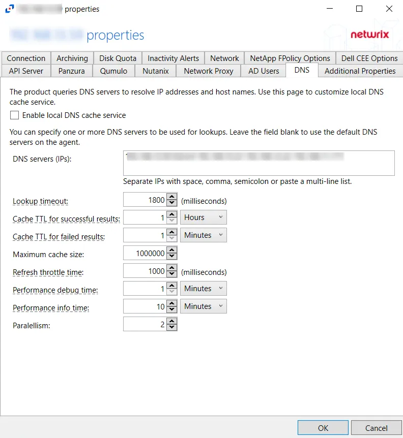

# DNS Tab

Use the DNS tab to customize how the agent queries and caches DNS results.

The configurable options are:

- Enable local DNS cache service – Select this checkbox to enable the local DNS cache service. Leave
  the option unchecked to disable the local DNS cache service. The DNS cache service proactively
  updates data, keeping DNS records up to date and available for real-time event reporting. Use this
  option if your DNS infrastructure cannot handle the load (requests take hundreds of milliseconds)
  during peak hours.
- DNS servers (IPs) – IP addresses of the DNS servers to be used for look-ups. IP addresses should
  be entered as separate addresses with space, comma (,), semicolon (;), or a multi-line list. Leave
  the box blank to use the default DNS server.
- Lookup timeout – Specify the time for look-up timeout in milliseconds. The default is 1800
  milliseconds. If a DNS request fails to complete during the specified interval, the product
  reports an empty host-name or a previous result from the cache. The product continues to wait for
  a response in the background so that further events can use the result.
- Cache TTL for successful results – Specify the caching interval (time-to-live) for successful DNS
  responses. The default is 1 hour. When a DNS query returns a valid IP address or host-name, the
  response is cached for the specified time. The choice of TTL value depends on the environment: how
  often IP addresses are reassigned; how much load the DNS server can handle. High TTL values reduce
  the load on DNS servers but may result in stale data being reported.  
  If the DNS Cache service is used, the records are automatically updated when the TTL expires.
- Cache TTL for failed results – Specify the caching interval (time-to-live) for failed DNS
  responses. The default is 1 minute. When a DNS query cannot resolve an IP address or host-name,
  the failed result is cached for the specified time. Caching of failed responses helps to reduce
  the load on DNS servers and improve performance of event processing.  
  If the DNS Cache service is used, the records are automatically updated when the TTL expires.
- Maximum cache size – Specify the maximum cache size. The default is 100000.
- Refresh throttle time – Specify the time interval between DNS queries that the DNS Cache service
  uses to update expired records. The default is 1000 milliseconds.  
  If the DNS Cache service is used, the records are automatically updated when the TTL expires. This
  option allows you to limit the number of DNS requests the service sends to update the cache. A
  throttling period of 100 milliseconds will limit the update task to 10 requests per second.
- Parallelism – Specify how many DNS requests the DNS Cache service is allowed to send in parallel.
  High values may overload DNS servers.

Click **OK** to commit the modifications. Click **Cancel** to discard the modifications. The Agent
Properties window closes.
