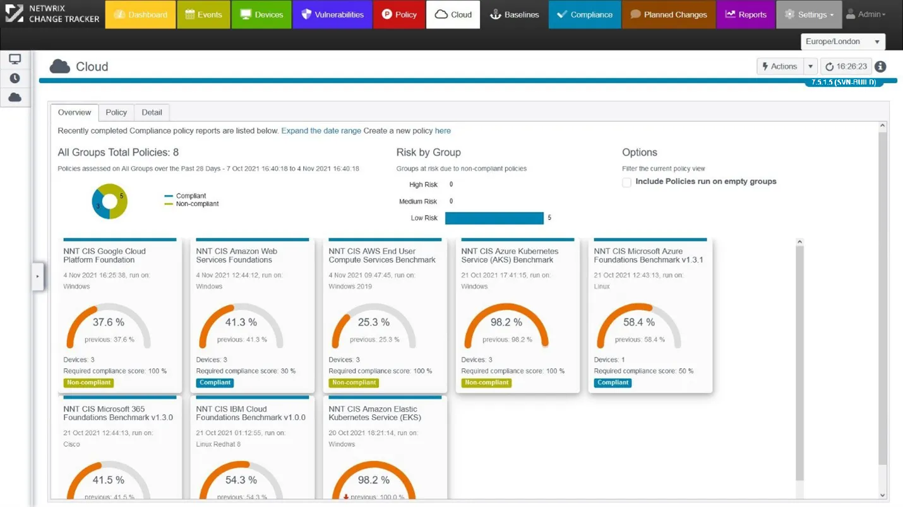

# Cloud Tracker

When it comes to Automated Container and Cloud Security Posture Management, in contrast to the
agile, super-flexible container world where deployments happen at sub-second speeds, typical
vulnerability scans take hours to complete. Scans are usually being performed out of hours to avoid
impacting business services, so they get delayed to quiet times, overnight or at the weekend. In
practice most organizations will run scans once a month at most.

Equally the notion of maintaining configuration standards or standardizing on a baseline is somewhat
at odds with the fluidity of contemporary IT strategies using cloud or hybrid cloud platforms. And
again, the container-based Kubernetes world gives us even more configuration data to control and
secure.

Despite all this, it is encouraging that the security controls mandated by NIST, PCI and the CIS
among others are still fit for purpose.

But operating them to keep pace let alone get out in front of IT operations is where automation and
technology can play a part. The most critical of all in terms of giving most bang for buck is NNT's
SecureOps™ solution which leverages intelligent Change Control for your Cloud and Container
environments. NNT SecureOps™ tends to be operated right at the center of Business-as-Usual IT
processes, and not only allows security standards to be maintained constantly but gives you ultimate
advantage in that all-crucial early breach detection that we know can otherwise be so damaging.
