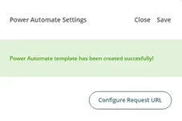
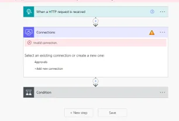

# Integrate with Power Automate

You can link an identity store in Directory Manager to Power Automate to achieve the following:

- **Trigger a flow from** Directory Manager - To achieve this, you have to link a workflow in an
  identity store to a Power Automate flow. When the Directory Manager workflow is triggered, the
  linked flow is auto triggered.

## Trigger a Flow from Directory Manager

You can link a workflow in an identity store to a flow. Both system and user-defined workflows can
be linked to flows.

- As a one-time process, connect your identity store to Microsoft Power Automate .See the Connect an
  Identity Store to Power Automate topic.
- Link a workflow to a flow by providing the URL of that flow in the workflow .See the Link an
  Identity Store Workflow to a Flow topic.

Consequently, when the identity store workflow is triggered, the linked flow is auto triggered.

NOTE: When the flow is approved in Power Automate, the identity store workflow request is auto
approved. However, if the identity store workflow request is approved first, the flow would not be
auto approved.

### Connect an Identity Store to Power Automate

To connect an identity tore to Power Automate, you must configure a Power Automate client for that
identity store. This will establish a communication channel between the Directory Manager Data
service and the Power Automate platform.

NOTE: Make sure the Directory Manager server is deployed on a machine that is exposed over the
Internet, as Power Automate needs to communicate with the Directory Manager server for processing
requests. Power Automate cannot communicate with a server deployed on a machine behind NAT.

**To configure a Power Automate client for an identity store:**

1. In Admin Center, click **Identity Stores** in the left pane.
2. On the **Identity Stores** page, click the ellipsis button for an identity store and select
   **Edit**.
3. Click **Workflows** under **Settings** in the left pane.
4. On the **Workflows** page, click the **Advanced Workflow Settings** tab.
5. In the **Power Automate Settings** section, click **Register Client**.
6. Enter the following information:

    - **Organization Code** - the unique name for the environment that stores your flows in Power
      Automate.
    - **Region** - the location of your environment.
    - **Directory Manager Data Service URL** - the URL of the Data service. Requests from Power
      Automate will communicate with the Data service endpoint. The URL is as:  
      `https://<GroupID server name>/<Data service name>` For example:  
      https://powerautomate-netwrix1.msappproxy.net/groupiddataservice
    - **Tenant ID** - the tenant ID assigned to the Directory Manager application when you
      registered it in Microsoft Entra Admin Center.
    - **Client ID** - the application ID assigned to the Directory Manager application when you
      registered it in Microsoft Entra Admin Center.

    NOTE: The Directory Manager application in Microsoft Entra Admin Center must have the following
    permissions for Power Automate:  
     

7. Click **Save** on the **Advanced Workflow Settings** page.

### Link an Identity Store Workflow to a Flow

To link an identity store workflow to a Power Automate flow, generate a flow template from an
identity store workflow and provide the URL of the flow in workflow settings. When the workflow is
triggered, the linked flow is auto triggered.

**To link a workflow to a flow:**

1. In Admin Center, click **Identity Stores** in the left pane.
2. On the **Identity Stores** page, click the ellipsis button for an identity store and select
   **Edit**.
3. Click **Workflows** under **Settings** in the left pane.
4. On the **Configure Workflows** tab of the **Workflows** page, click the ellipsis button for a
   workflow and select **Edit**.
5. On the **Edit Workflow** page, click **Power Automate Settings** in the top right corner.
6. On the **Power Automate Settings** dialog box, provide the username and password of a Microsoft
   Entra ID account for managing flows in the Microsoft Power Automate portal. This account must
   have the following permissions on the Entra tenant:

    

7. Click **Create Template**. Directory Manager creates a basic flow in Power Automate with the same
   name as the workflow, and displays the following message:

    

8. The next step is to copy the flow URL from Power Automate and provide it here. To copy the URL,
   do the following:

    1. Launch Power Automate and navigate to **Environments > GroupID application > My Flows**. This
       page displays the flow you created in Power Automate from the Directory Manager workflow.
    2. Hover the mouse over the flow to display the ellipsis button. Click it and select **Edit**.
    3. Expand the **Connections** area.

        

    4. Click **Approvals** in the **Connections** area. The approver of the Directory Manager
       workflow is auto added here. Click **Save**.
    5. Expand the **When a HTTP request is received** area and copy the URL displayed for **HTTP
       POST URL**.

9. In Directory Manager, return to the workflow being linked to the flow, and click **Configure a
   Request URL** on the **Power Automate Settings** dialog box.
10. Enter the copied HTTP POST URL in the **Request URL** box.
11. Click **Authenticate** and then **Save**.
12. Click **Update Workflow** on the **Edit Workflow** page to save the settings.
13. Click **Save** on the **Workflows** page.
14. Next, enable the linked flow in Power Automate. To do so:

    1. In Power Automate, navigate to **Environments > GroupID application > My Flows**. This page
       displays the flow you created in Power Automate from the Directory Manager workflow.
    2. Hover the mouse over the flow to display the ellipsis button. Click it and select **Turn
       on**.
