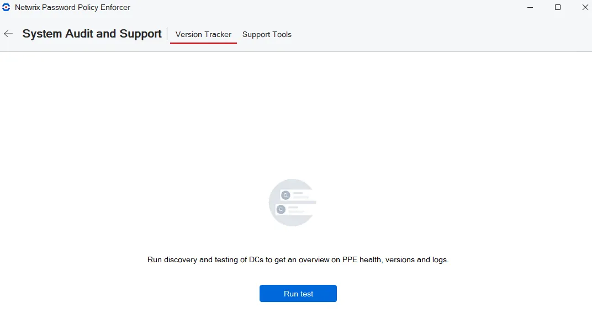
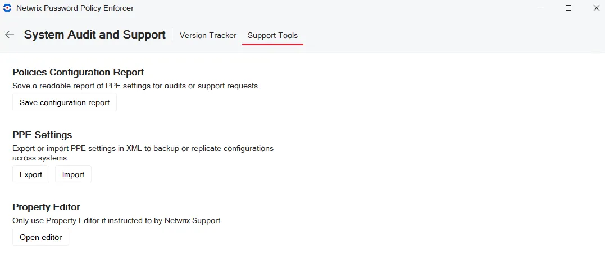
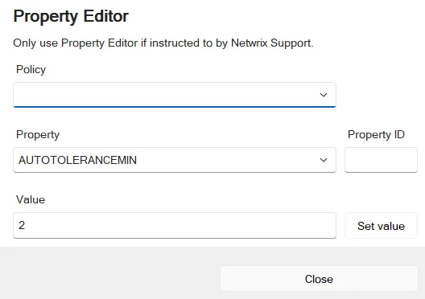

# System Audit and Support

Password Policy Enforcer can run a discovery and testing of your domain controllers for an overview
on PPE health, versions and logs.

Open the Configuration Console:

Click **Start** > **Netwrix Password Policy Enforcer** > **PPE Configuration**  
or  
Double click the **PPE Configuration** desktop shortcut.

Click the **System Audit and Support** tile on the Configuration Console dashboard. This feature is
only available when **domain** is selected with the [Connected To](configconsole.md#connected-to)
configuration setting. System Audit and Support opens on the **Version Tracker** tab.

## Version Tracker

Click **Run test**. The audit reports the discovered domain controllers and versions.

**NOTE:** If you do not see the **Configuration Timestamp**, contact your network administrator to
set up the firewall to allow Password Policy Enforcer to communicate.

You can click the export icon to download your results. The file name is
**Audit\_\_**timestamp**\_.xlxs**, it is downloaded into the default **Downloads** folder. For large
domains, you can apply filters or use the Search feature to make it easier to navigate your list.

**NOTE:** **Debug logging** should only be enabled when you are actively debugging your system.
Leaving it enabled impacts Password Policy Enforcer performance and uses free disk space to create
the logs.

## Support Tools

The **Support Tools** tab enables you to save a configuration report, export/import PPE settings,
and open the property editor.

- **Policies Configuration Report** saves the configuration as a text file. Browse to the folder
  where you want the report. The default filename is **PPEConfig.txt**.
- **PPE Settings** export your PPE settings for a backup. You can import the settings to replicate
  configurations across systems.
    - **Export** exports the PPE settings to an xml file. Browse to the folder where you want the
      file. The default filename is **PPEExport.xml**.
    - Import imports the settings from an exported xml PPE Settings file. Browse to the location of
      the **PPEExport.xml** file. Click **Open**. A status message is displayed when complete.
- **Open Property Editor** launches the Property Editor.

    **NOTE:** Properties should only be changed when advised by Netwrix Support.

### Property Editor

The Property Editor enables you to edit the Password Policy Enforcer configuration. It should only
be used instructed by Netwrix Support. It is accessed from the Configuration Console:

**Help** > **Open Property Editor**

or

**System Audit and Support** > **Support Tools** > **Open editor**

- **Policy**: select the policy to edit.
- **Property**: select the property to change.
- **Property ID**: enter the ID supplied by Netwrix Support.
- **Value**: enter the new value supplied by Netwrix Support. Click **Set value**.
