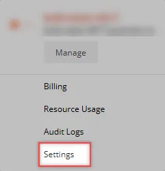
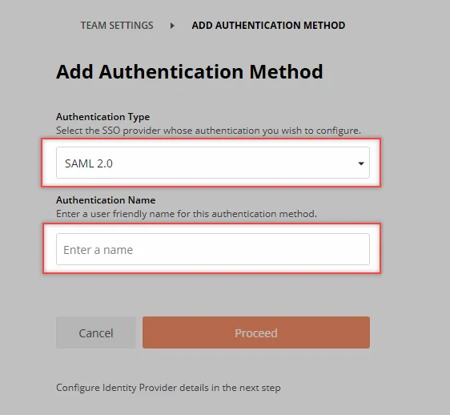
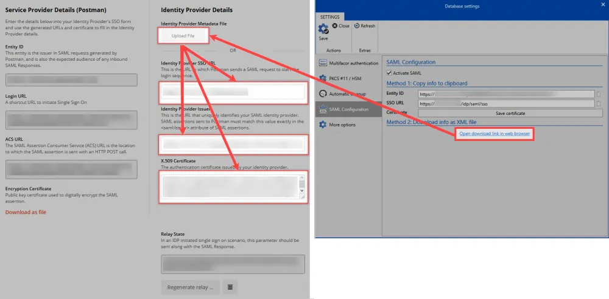

# SAML application for Postman

## SAML configuration example for Postman

This chapter explains how to configure the SAML application for **Postman**. It is assumed that
[Configuration of SAML](../../configuration_of_saml/configuration_of_saml.md) has already been
activated in the Server Manager.

- First, you register with Postman.
- After logging in, click on the avatar and select "**Settings**".

- Then click on **Authentication**. Select a new method in the upper right corner.

- Here the Authentication Type must be defined with **SAML 2.0** and any useful Authentication Name.

Then you come to the actual configuration.

- Store Provider Details
- **Identity Provider Details** The data from the Server Manager is uploaded as XML or stored
  manually.

- **Service Provider Details** The service provider details are now copied to the application in the
  Netwrix Password Secure Client.

NOTE: Please note that a **Relay State** is required. This value can be created in the **Configure
Identity Provider Details View**.
