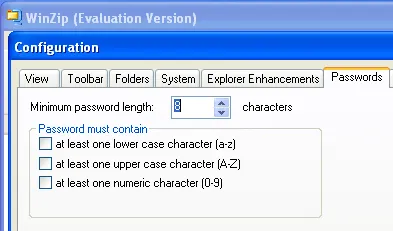
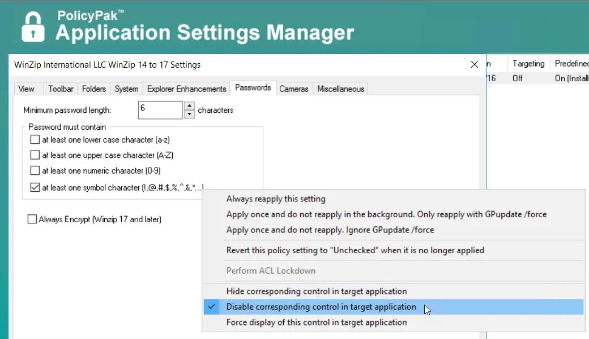
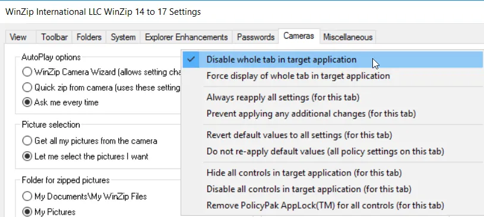

# AppLock™ Modes

Endpoint Policy Manager Application Settings Manager AppLock™ is a patent-pending technology that
enables administrators to truly lock down their applications so users cannot work around the
configured settings. For example, in an earlier example we were able to hide all the settings in the
Cameras tab for WinZip.

**NOTE:** Endpoint Policy Manager Application Settings Manager AppLock™ modes are only available
when you utilize Endpoint Policy Manager DesignStudio Capture Wizard to capture an existing user
interface from an application. If you use Endpoint Policy Manager DesignStudio and design your own
interface from scratch, Endpoint Policy Manager DesignStudio won't capture the original
user-interface (UI); therefore, it has no ability to lock it down. Note that not every UI is
capturable, and not every capturable UI is able to be locked down. See Appendix B: Endpoint Policy
Manager Application Settings Manager DesignStudio Guide for more information.

There are three Endpoint Policy Manager Application Settings Manager AppLock™ modes.

- "Hide corresponding control in target application." This removes the corresponding control in the
  application from the users' view so users cannot see that there is an element present.
- "Disable corresponding control in target application." This disables (grays out) the corresponding
  control in the application. In this mode, users will be able to see the element but will not be
  able to configure or manipulate the setting.
- "Force display of this control in target application." This should be used when you want to
  restore a setting. This can be used by an upper-level domain admin, along with the Group Policy
  Enforced property, on the GPO itself. This can ensure that a lower-level admin cannot permanently
  lock out the UI of an application.

If you right-click on any tab, you'll find two more settings.

- "Disable whole tab in target application." This disables (grays out) the entire corresponding tab
  in the application. Users will be able to see the tab, but they will not be able to access the
  contents of the tab to manipulate any settings within that tab.
- "Force display of whole tab in target application." This should be used when you want to restore a
  tab in the UI. This can be used by an upper-level domain admin, along with the Group Policy
  Enforced property, on the GPO's link. This can ensure that a lower-level admin cannot permanently
  lock out the UI of an application.

Figures 28, 30, and 32 illustrate the selection process for the various settings that can be
enforced. Figures 29, 31, and 33 show the results of the settings on the target machines.

|  Figure 28. Endpoint Policy Manager Application Settings Manager Applock™ hide mode.                  |  Figure 29. The corresponding control in the target application has been hidden.                                                 |
| ------------------------------------------------------------------------------------------------------------------------------------------------------------------------------------------------------------------------------------------------------------------------- | --------------------------------------------------------------------------------------------------------------------------------------------------------------------------------------------------------------------------------------------------------------------------------------------------- |
|  Figure 30. Endpoint Policy Manager Application Settings Manager Applock™ disable mode.               |  Figure 31. The corresponding control in the target application has been grayed out.                                           |
|  Figure 32. In the Group Policy Editor, right-click below the tab you wish to disable, as seen here. |  Figure 33. The target tab, Cameras, has been grayed out. Users cannot click it to see or modify any elements within this tab. |
