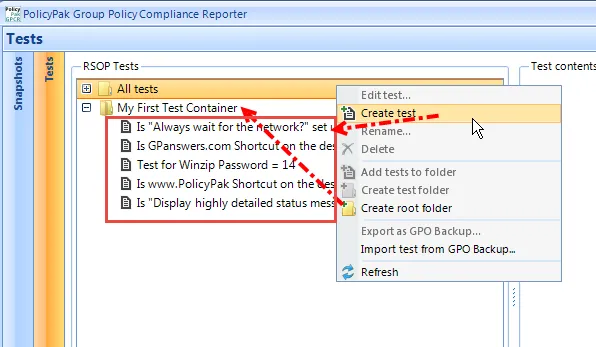
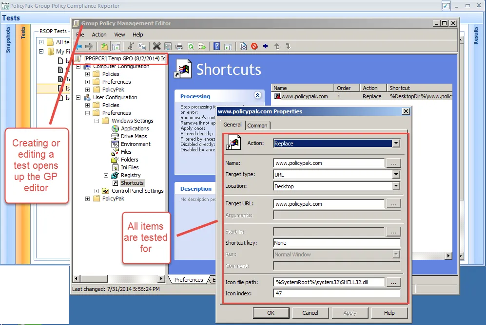
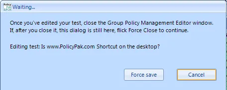
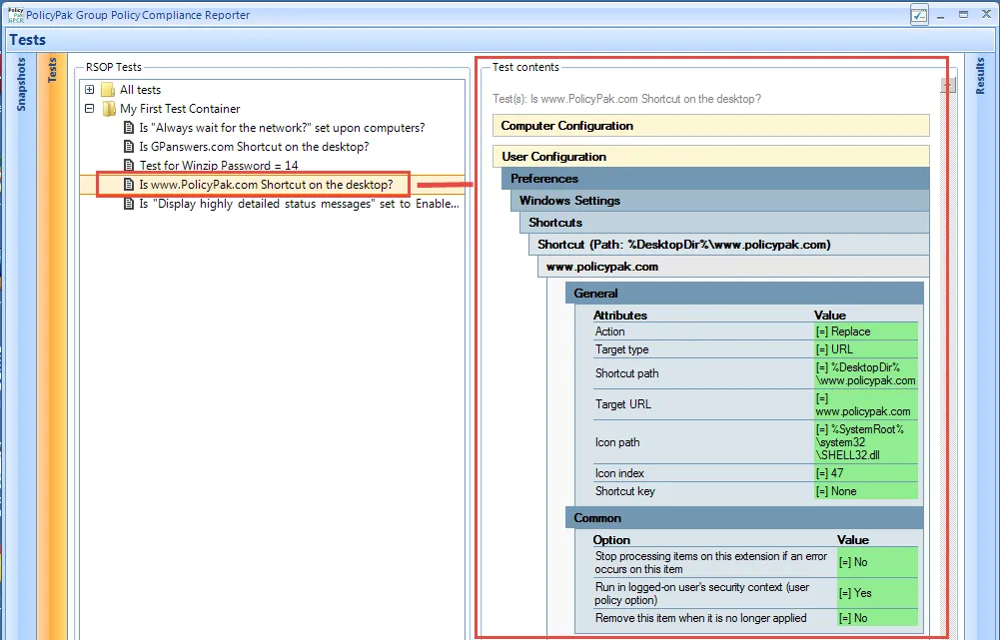

# Tests Pane

The Test pane lets you create tests. Tests are like GPOs; in fact, they're based on GPOs, and as
such have the following qualities and requirements:

- Creating a test requires GPO creation rights in the domain.
- A test can be imported from an existing GPO, or exported as a GPO (file-based backup suitable for
  import using GPMC)
- A test can contain:

    - All Microsoft Administrative Templates
    - Most Microsoft Security policies (see the table in "Supported Group Policy Settings for
      Reporting")
    - Most Microsoft Group Policy Preferences (see the table in "Supported Group Policy Settings for
      Reporting")
    - Any Endpoint Policy Manager setting

Tests may be simple or complex. We recommend that tests be as simple as possible and focus on one
specific thing you want to know. In the next section, you'll join tests together to make a final
query.

Begin a test by creating a root folder to contain your tests. Then, create a new test by
right-clicking on the "All tests" container and selecting "Create test," as shown in Figure 19.

Figure 19. Creating a root folder to contain tests.

As you create tests, decide which settings you want to ensure are actually delivered to your users
or computers. In the examples above in Figure 18, the tests are named to help you express the
questions you want to answer. When you think about specific questions you want answered, it becomes
easier to know what you're testing for and makes the test manageable. The names of those example
tests are the following:

- Is "Always wait for the network" set upon computers?
- Is GPanswers.com Shortcut on the desktop?
- Test for Winzip Password = 14
- Is www.PolicyPak Shortcut on the desktop?
- Is "Display highly detailed status messages" set to Enabled?

When you create or edit a test, a temporary GPO is created in the domain, and the Group Policy
Management Editor appears, as shown in Figure 20.

Figure 20. A temporary Group Policy Object is created.

At this point you can test for thousands of possible conditions. In Figure 19, we're using a Group
Policy Preferences item and making a test to see that [www.PolicyPak.com](http://www.PolicyPak.com)
(and all related settings within the Preference item) are tested for.

When you're done editing your test, click "OK" and close the GPO. Note, you may receive a "Waiting…"
dialog box (seen in Figure 21) flash by as the data inside the GPO (which is saved locally to your
machine or the Endpoint Policy Manager GPCR server) and the temporary GPO are deleted from the
domain. If the Group Policy Management Editor is closed but fails to tell Endpoint Policy Manager
GPCR that it has closed, you have the option to select "Force save" using the "Waiting..." dialog
box.

Figure 21. The option to force save.

Once the editor is closed, the test is saved, and you can see the test contents, as shown in
Figure 22.

Figure 22. Viewing the test contents once the test is saved.

The test contents show what you did within the Group Policy Management Editor and exactly what will
be tested for (the value is in green with an "=" next to it). Not all areas of Group Policy are
available for testing with Endpoint Policy Manager GPCR. Information on the areas of Group Policy
available for testing can be found in the section "Supported Group Policy Settings for Reporting."
If you try to test one of those unavailable Group Policy areas, Endpoint Policy Manager GPCR
indicates that the data contained in those sections is not supported. An example of this is shown in
Figure 23 where a test was made with Software Installation (on the Computer side) and Folder
Redirection (on the User side). You can see the resulting error that occurred.

**NOTE:** If a test contains supported and unsupported data, the supported data will work and the
unsupported data is will be ignored during testing.

Figure 23. Unsupported data within tests show up within the test contents reports.

Now that you have a test (or multiple tests) defined, you can continue onward to the Results pane.
