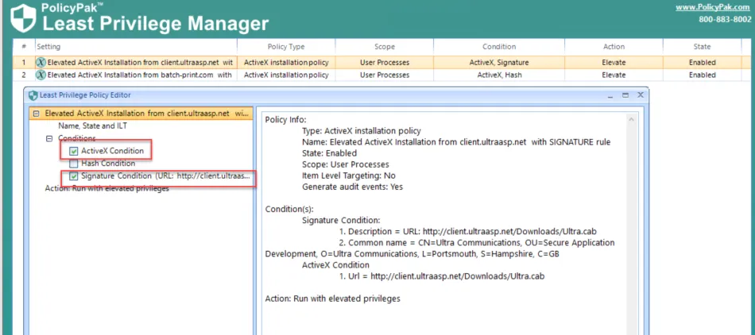
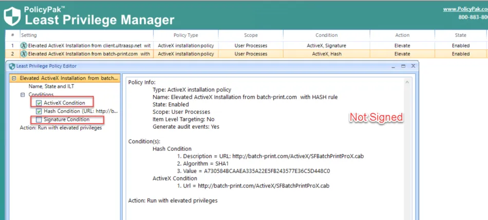
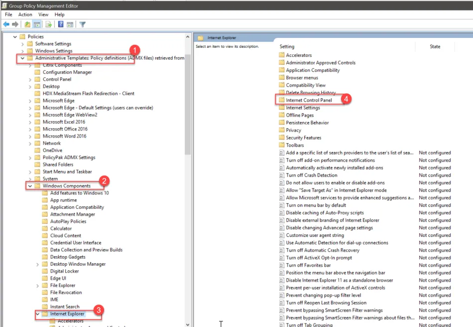
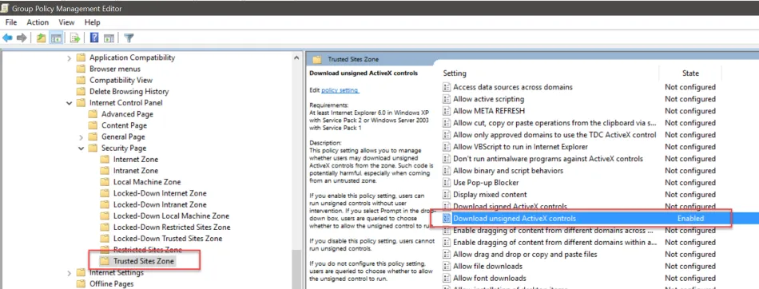
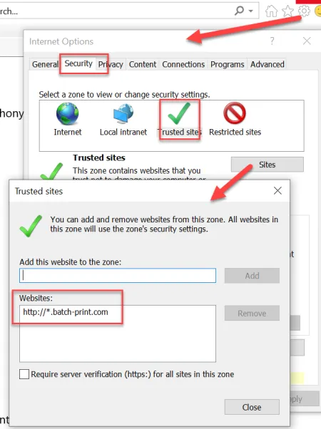
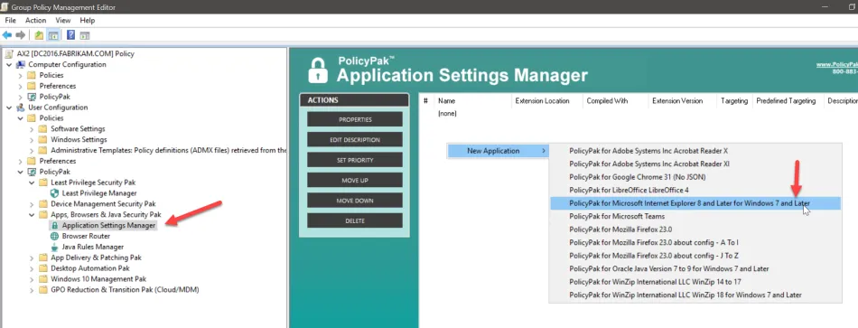
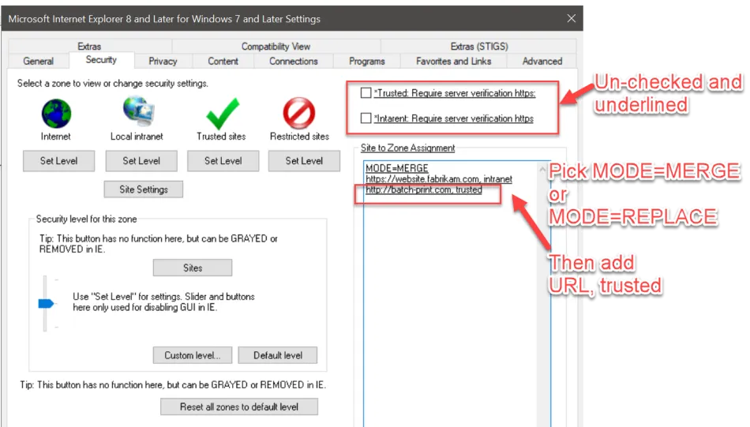

# How do I install an Active X control if it is not digitally signed?

When an ActiveX control is digitally signed, and you use Netwrix Endpoint Policy Manager (formerly
PolicyPak) Least Privilege Manager to deliver a rule to enable the ActiveX install, Internet
Explorer (or IE mode in Edge) will permit the install. Here's an example of a rule where the item
has a rule for the URL and for the Signature.

_Remember,_ When your ActiveX items are signed, you should have no problem.

However, if you attempt an ActiveX rule where there the ActiveX item is not signed (see below)…

You will get an experience like this…

To overcome this, you need to decrease the security for Internet Explorer. You do this with Group
Policy or Endpoint Policy Manager Cloud.

Go to **User** (or Computer) **Admin templates** > **Windows Components** > **Internet Explorer** >
**Internet Control Panel**

Then locate pick the Trusted Sites Zone.

**CAUTION:** Note that you are explicitly telling Internet Explorer to reducethe security here in
order to enable your unsigned ActiveX control to be installed.

Lastly, you have to add the site to be trusted. You have a few options on how to perform this:

**Step 1 –** Explain to a user how to do it this one time on their PC.

- Pro: good for one-off.
- Con: Hard to explain to a user. Bad for having to do it for lots of users.

**Step 2 –** Use GPPreferences to add it as a trusted site.

- Pro: Easy to set up.
- Con: Wipes out other trusted sites.

**Step 3 –** Use Endpoint Policy Manager Application Settings Manager to add it as a trusted site.

- Pro: Will perform a merge of the existing sites if you want.
- Con: Need to be licensed for the Apps, Browser and Java Pak along with Endpoint Policy Manager
  Least Privilege ManagerPak.

The goal is to get IE to recognize the URL to get into the Trusted Zone like this. (This is the
RESULT of performing Option 1, Option 2 or Option 3 above.)

