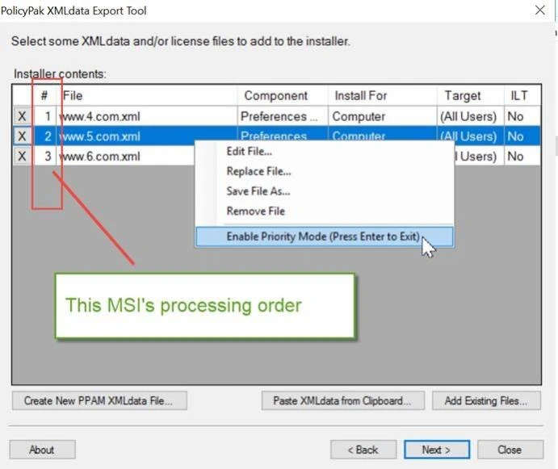
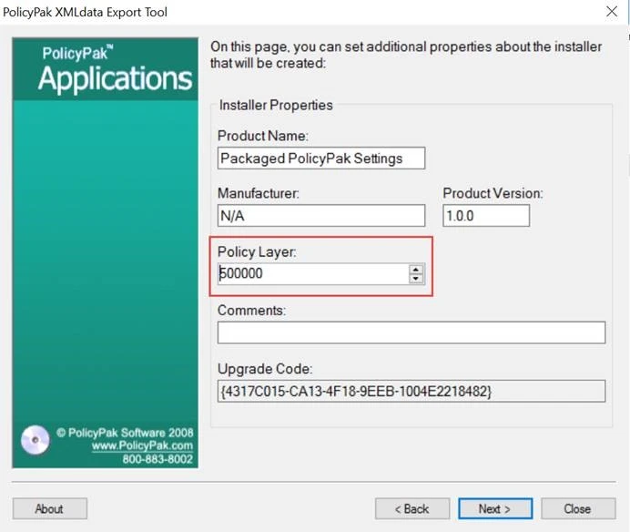
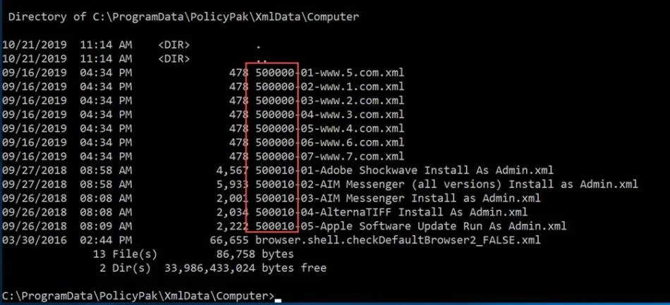

# How can I "stack" Endpoint Policy Manager MSIs so the XML items inside the MSI execute in a predictable order?

You use Netwrix Endpoint Policy Manager (formerly PolicyPak) Exporter tool to wrap up XMLs into an
MSI.

Please get familiar with this tool before continuing to read this article.

[Deploying Endpoint Policy Managerdirectives without Group Policy (Endpoint Policy Manager Exporter Utility)](../video/methods/exporterutility.md)

From time to time you might want a precise processing order of the XML items. You can do this in TWO
ways.

Way #1: Managing the order of the items WITHIN the MSI.

When you add items to your MSI, you can right-click an item to "Enable Priority Mode" then move the
item up or down (with the arrow keys) and click Enter to change the order. Items are then written in
the order as seen here.

Way #2: Managing the order of the execution of the MSIs themselves

If you have MULTIPLE MSIs, you might want the XMLs inside them to process in a PARTICULAR order… so
one MSI's contents are processed BEFORE or AFTER another MSI's contents.

Before you write the MSI you can use the "Policy Layer" field as seen here. The default value
is 50000.

The idea is that if you have multiple MSIs, they are unpacked and then processed alphabetically.
This value is pre-pended to all items in the XML.

The result is that if you have multiple MSIs, you can "layer" them by pre-pending the Policy Layer
ID. Then when the items execute, they will execute in the specific and desired order.

Underneath the hood, you can see these values in c:\ProgramData\PolicyPak\XmlData\Computer (or User,
Group, etc) like what's seen here.

In this example, we have two MSIs.. one with Policy Layer ID of 50000 and one with 50010.

As you can see, LOWER numbered Policy Layer items will process before HIGHER numbered Policy Layer
items.

