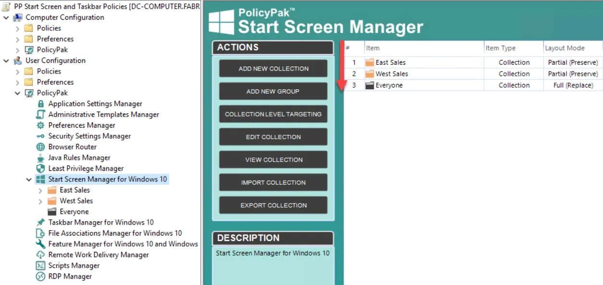
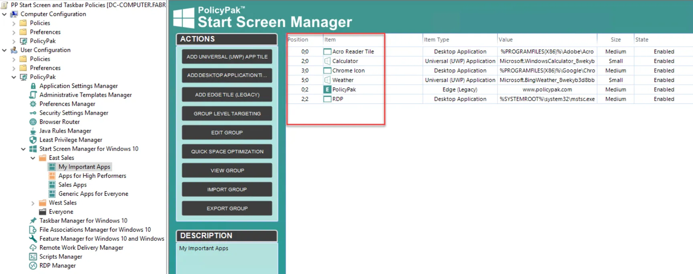

# Understanding Processing Order and Precedence

Within a particular GPO (Computer or User side), the processing order is counted in numerical order.
So lower-numbered collections attempt to process first, and higher-numbered collections attempt to
process last as shown in Figure 46. Then, within any collection, each policy is processed in
numerical order from lowest to highest, as seen in Figure 47.

Figure 46. The order in which collections are processed.

Figure 47. Within collections, group policies are processed in order, starting with the lowest
number.

Then finally, within a Group, all the icons are placed according to their position (column followed
by row). Note the final placement might not be exactly as expected because of the icons sizes. You
might need to adjust the Position fields to get it to look precisely how you want (as shown in
Figure 48).

Figure 48. The processing order of multiple policy items within a group contained within a
collection.

## Merging and Conflicts

Endpoint Policy Manager Start Screen & Taskbar Manager will merge all GPOs and collections, unless
there is a conflict. That means that instead of having one flat Start Menu and Taskbar XML file that
everyone must use and agree upon, you can distribute the directives across Endpoint Policy Manager
collections or GPOs, and everything that doesn't conflict will merge perfectly.

For example, consider that you have the following two GPOs:

- GPO1—Browser Apps Group: Chrome, Firefox, Internet Explorer
- GPO2—Office Apps: Word, Excel, PowerPoint

You will get two unique groups on the Start Menu: Browser App Group and Office Apps. This works the
same for multiple collections (within a GPO or between GPOs). However, you still need to be aware of
conflicts between Endpoint Policy Manager Start Screen policies and Endpoint Policy Manager Taskbar
Manager policies.

For Endpoint Policy Manager Start Screen policies, the following general rules apply:

- If you are using "Partial (Preserve)" or "Merge" mode and you create a group with the same name as
  a user group (or a pre-created operating system default group, like Play, Create, and so on), your
  group will end up removing the existing group.
- If you are using "Partial (Preserve)" and "Merge" mode, and you specify an icon in a group, your
  icon placement will end up removing the icon from the existing group.
- When using a GPO, multiple policies can affect the machine due to natural Group Policy precedence.
  When a conflict occurs, the general rule is that the GPO that was applied last will have highest
  precedence. Then after that, the mode of the group ("Create," "Replace," "Update," or "Delete")
  will be evaluated.
- You can have multiple GPOs with Endpoint Policy Manager Start Screen contents (and also get
  Endpoint Policy Manager policies from other sources like MDM, Microsoft Endpoint Manager [SCCM and
  Intune], etc.) and these policies will all be merged together, unless there is a conflict. See the
  next section "Precedence" for details.

For Endpoint Policy Manager Taskbar Manager, the following general rule applies: in "Merge" mode,
all items are merged together. That means that the operating system defaults, the user-pinned items,
and the items you've pinned will all be merged together. In the case of a conflict, the policy
written last wins.

## Precedence

Policies can be delivered by Group Policy and non-Group Policy methods such as Microsoft Endpoint
Manager (SCCM and Intune) via Endpoint Policy Manager Exporter or Endpoint Policy Manager Cloud. As
such, the Endpoint Policy Manager engine needs to make a final determination whether there is any
overlap of policies. Here is how the precedence works:

- Policies delivered through Endpoint Policy Manager Cloud have the lowest precedence.
- Policies delivered through Endpoint Policy Manager files have the next highest precedence.
- Policies delivered through Endpoint Policy Manager Group Policy directives have the highest
  precedence.
