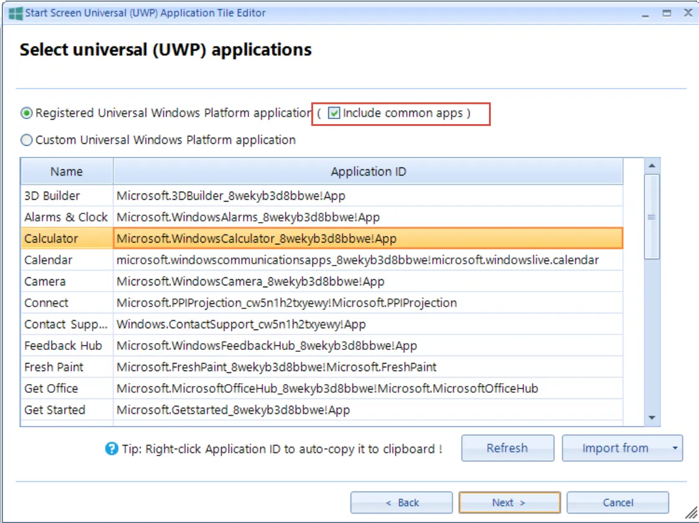
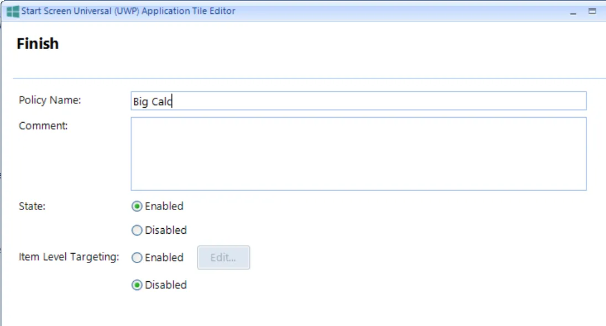

# Adding UWP Applications

**Step 1 –** First, you'll add a UWP application, Windows Calculator. To do this, right-click the
policy and select Add | New Universal (UWP) Application Tile. Clicking "Next" will display one of
two things:

- If your management station has zero or few UWP applications installed (typically when your
  management station is a 2012R2 2016 or later server), then you'll see a list of common UWP
  applications.
- If your machine is running Windows 10, then you will see the commonly installed UWP apps, plus a
  list of the UWP applications installed on your machine (and available to your user account).

**Step 2 –** An example of the UWP applications picker can be seen in Figure 14. If you are on a
server with few UWP applications, click "Include common apps" to see many Windows 10 built-in apps.
For this Quickstart example, select Calculator, as seen in Figure 14.

Figure 14. Picking UWP applications from a common list or from your machine.

**NOTE:** Optionally, if you don't have the application installed on your management station, but
you know the ID of the UWP (also known as the UWA or Universal Windows Application Identifier) you
can select "Custom Universal Windows Platform application," then input the ID.

**Step 3 –** Next, in the tile settings window, you'll see that UWP applications have four possible
sizes. For this Quickstart, select the largest tile size, as shown in Figure 15, and click "Next."

Figure 15. UWP applications have four icon tile sizes.

**Step 4 –** Next, type a policy name, as seen in Figure 16, and click "Finish."

Figure 16. Specifying the UWP policy name.

**Step 5 –** You'll see the UWP application icon entry, as shown in Figure 17.

Figure 17. The UWP application icon entry.
