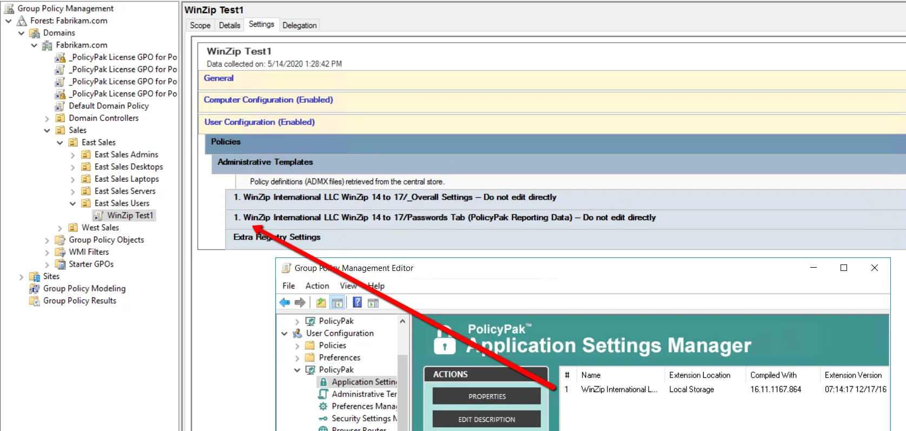
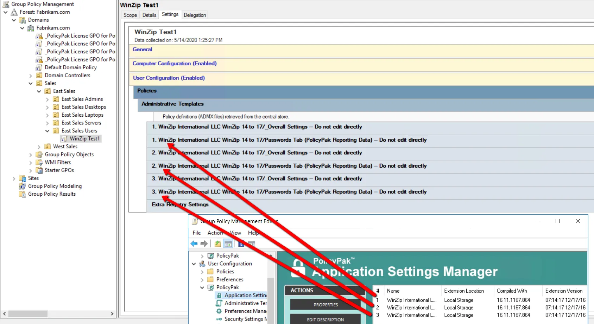
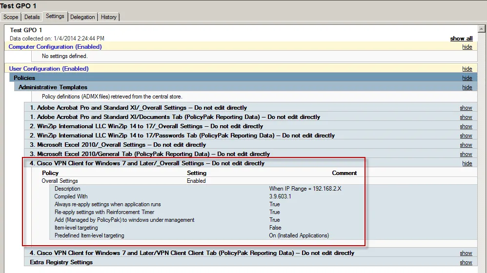
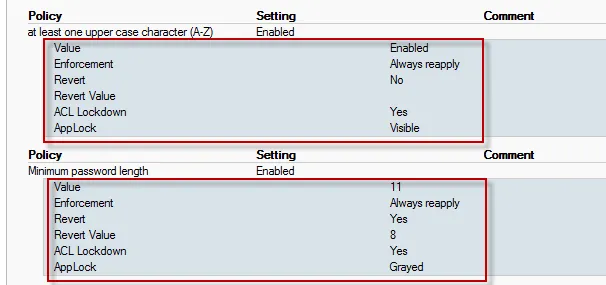

# Reporting

Endpoint Policy Manager Application Settings Manager supports all GPMC report types. This includes
Group Policy Object Settings reports (seen in our examples), Group Policy Results reports, and Group
Policy Modeling reports.

Endpoint Policy Manager Application Settings Manager's reports are also available inside third-party
group policy object (GPO) change management tools such as NetIQ GPA, Microsoft AGPM,
Dell/Quest/Scriptlogic GPOadmin, and Quest ActiveAdministrator.

**NOTE:** Video: For an overview of Endpoint Policy Manager and Change Management utilities like
GPA, AGPM, etc, see
[https://www.policypak.com/integration/policypak-group-policy-change-management-utilities.html](http://www.policypak.com/videos/policypak-using-shares-to-store-your-paks-share-based-storage.html).

Whenever you add a new AppSet to a GPO and create settings, those settings appear in the GPMC
reports. In Figure 92, you can see the report generated when one AppSet is listed inside the GPO.

Figure 92. The GPMC reports showing the new Pak that was added to a GPO.

In Figure 93, you can see what is reported inside the GPMC when three AppSets have settings within a
GPO.

Figure 93. Three Paks reported within the GPMC.

Each AppSet's report has two sections: an overall settings section and the representation of the
data within each of the AppSet's tabs. You can see an example of overall settings for the AppSet in
Figure 94. This section also shows the description field (if used) version of Endpoint Policy
Manager DesignStudio that compiled the AppSet and any special flags on the AppSet, including whether
Item-Level Targeting is enabled or not.

Figure 94. The settings in a Pak's report.

As you can see in Figure 95, the settings themselves are reported, as well as any special cases for
the data settings. For instance, you can see that the value of "Minimum password length" is set to
11, the Enforcement mode is set to "Always reapply," and the AppLock™ state is set to "Grayed"

Figure 95. Examples of special settings displayed in the settings details.

However, note that only items with settings that are being delivered appear in the reports, not
every single value that is under AppLock. For instance, in the previous example, you might have only
two values set such as "at least one lower case character" and "at least one numeric character" and
then have performed "ACL Lockdown" over "at least one lower case character." In the reports, you
would not see any other settings, because none of the other settings have any changed values.
