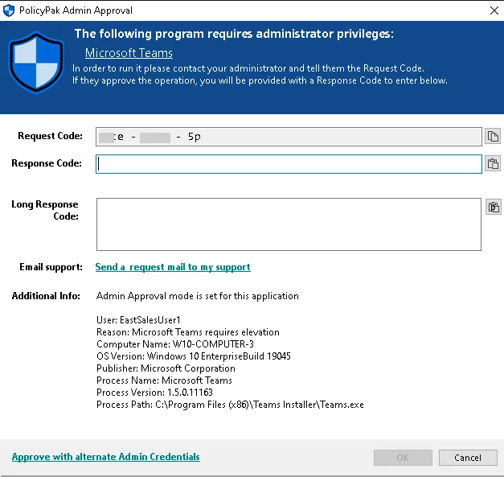
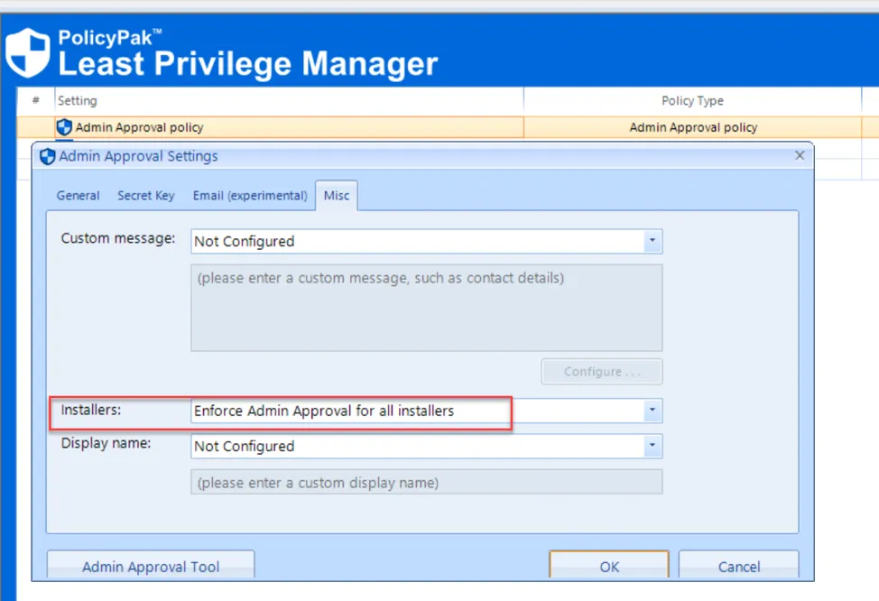
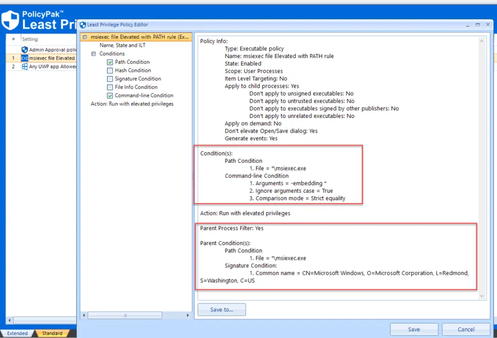
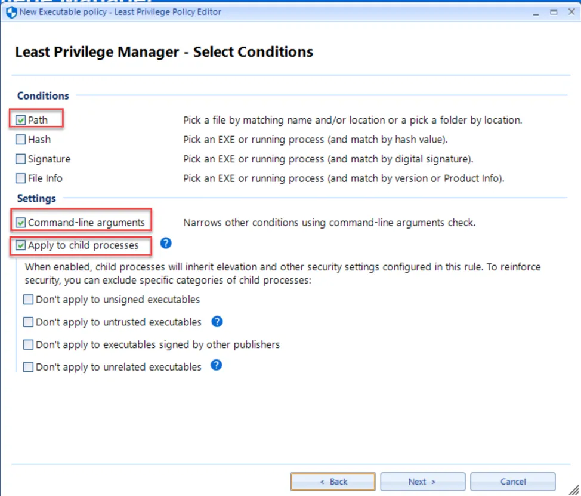
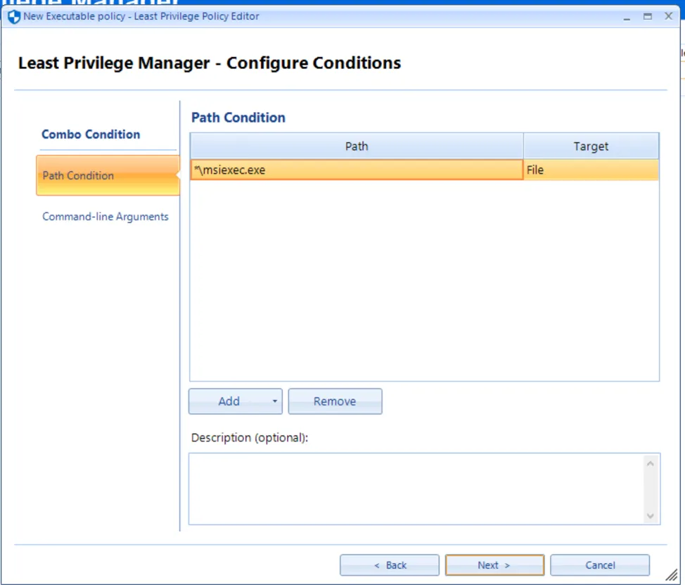
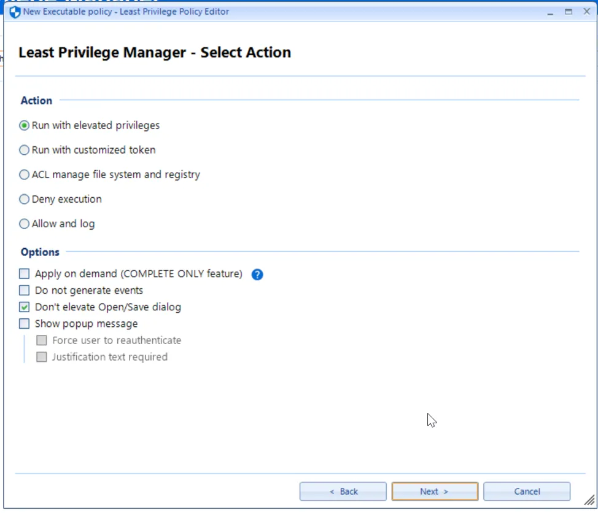
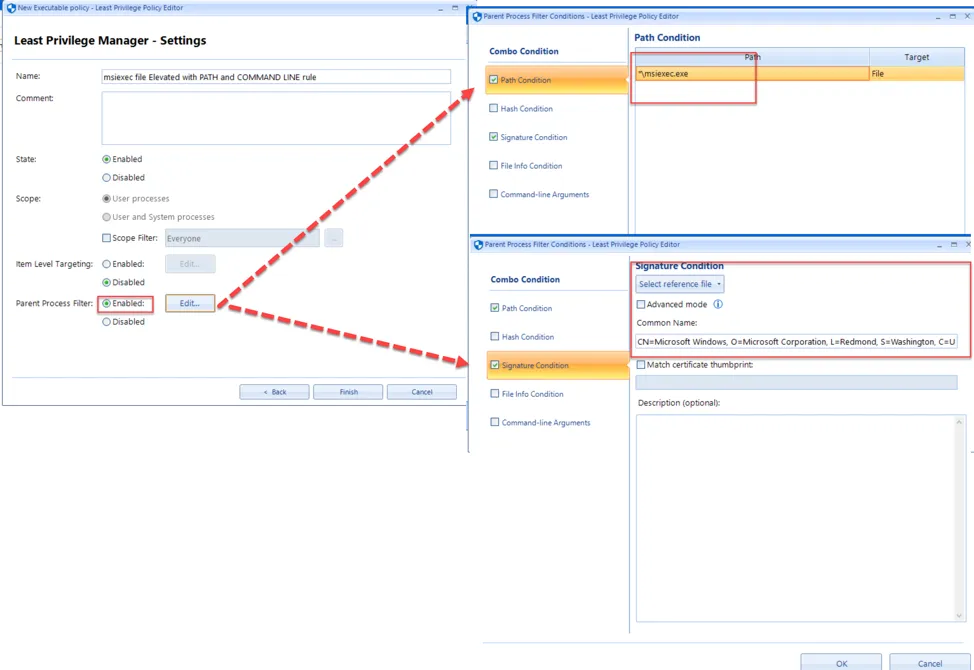
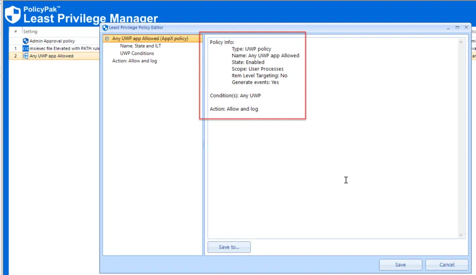
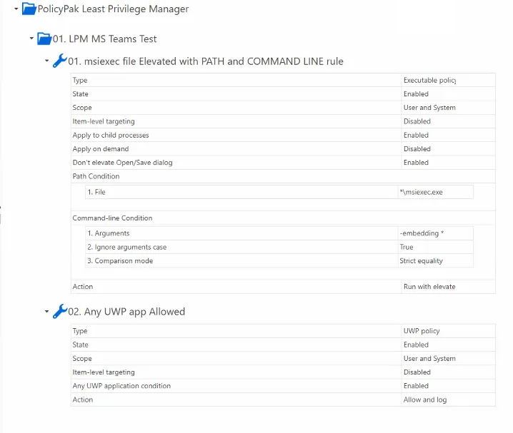

# Upgrading MS Teams to latest version displays prompts for Admin Approval

PROBLEM:

When updating Microsoft Teams to the latest version you receive an Admin Approval message like the
one below.

CAUSE:

Customer has enabled AA + Enforce Admin Approval for installers

But when MS Teams attempts to update, Windows runs a helper process (msiexec.exe without any
arguments as SYSTEM). This msiexec.exe creates another child process (msiexec -embedding `{GUID}`),
and Admin Approval correctly classifies it as installer and intercepts it as expected.

### WORKAROUND 1: (Recommended)

**NOTE:** Works only for Endpoint Policy Manager Least Privilege Manager versions 24.4 and later

Using Endpoint Policy Manager Least Privilege Manager, now has a parent process condition to the
Endpoint Policy Manager Least Privilege Manager explicit policy. Therefore you can instruct Endpoint
Policy Manager Least Privilege Manager to securely to elevate a command like msiexec -embedding \*,
if it is known that its parent is also msiexec.exe, and signed by Microsoft.

The manual steps to generate the XML are:

Additionally, you will need a Endpoint Policy Manager Least Privilege Manager UWP Policy which
specifies that "Any UWP app allowed" as follows:

Or you can specify some applications which appear to be required during a Teams upgrade.

You can use this XML which is coded for Computer-side policy to accomplish the goals stated in this
Workaround #1.

IMPORTANT: If using this XML, you must be running PolicyPak Admin Console (MMC) version 24.4.x and
higher otherwise the Parent Process filter will be missing from the imported policy.

Code Snippet:
[https://raw.githubusercontent.com/PolicyPak/snippets/master/kb-articles/1306/out2.xml](https://raw.githubusercontent.com/PolicyPak/snippets/master/kb-articles/1306/out2.xml)

### WORKAROUND 2: (Also Recommended)

Using PolicyPak Scripts and Triggers, create the 2 separate PowerShell policies as shown in the
screen shots below.

**NOTE:** If you are not licensed for Endpoint Policy Manager Scripts & Triggers you can still use
Workaround 1 by creating the policies below in Microsoft Group policy using regular computer or user
side scripts.

Policy 1: PowerShell script scoped to MACHINE that remove all versions of MS Teams that are
currently installed on endpoint.

Policy 2: PowerShell script scoped to USER that Installs the latest version of MS Teams.

Code Snippet:
[https://raw.githubusercontent.com/PolicyPak/snippets/master/kb-articles/1306/Script2.ps1](https://raw.githubusercontent.com/PolicyPak/snippets/master/kb-articles/1306/Script2.ps1)

**NOTE:** You will need to update the path to the latest version of MS Teams file for your
environment in policy #2, see below.

[https://www.policypak.com/pp-files/PPScripts\_\_MS_Teams_update_to_resolve_issue_with_Admin_Approval_prompts.xml](https://www.policypak.com/pp-files/PPScripts__MS_Teams_update_to_resolve_issue_with_Admin_Approval_prompts.xml)

### WORKAROUND 3: For CSEs previous to 24.4 (Not recommended - as any MSIEXEC command line with "-embedding \*" will be elevated - use at own risk)

Using Endpoint Policy Manager Least Privilege Manager create the 2 separate policies as shown in the
screen shot below.

