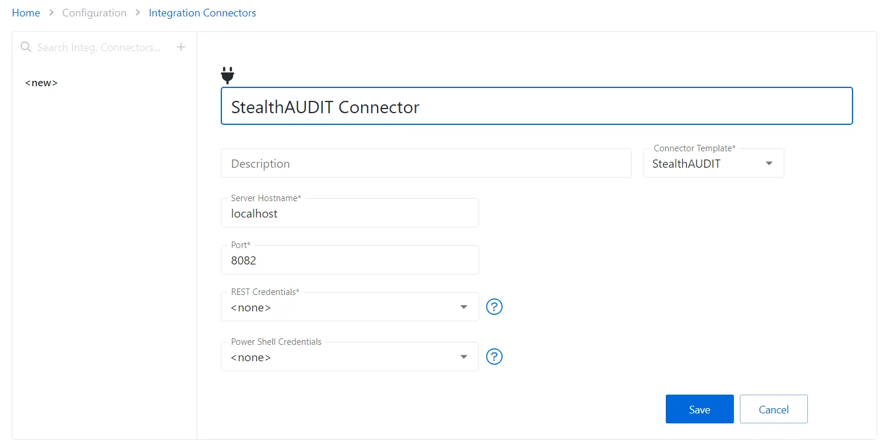
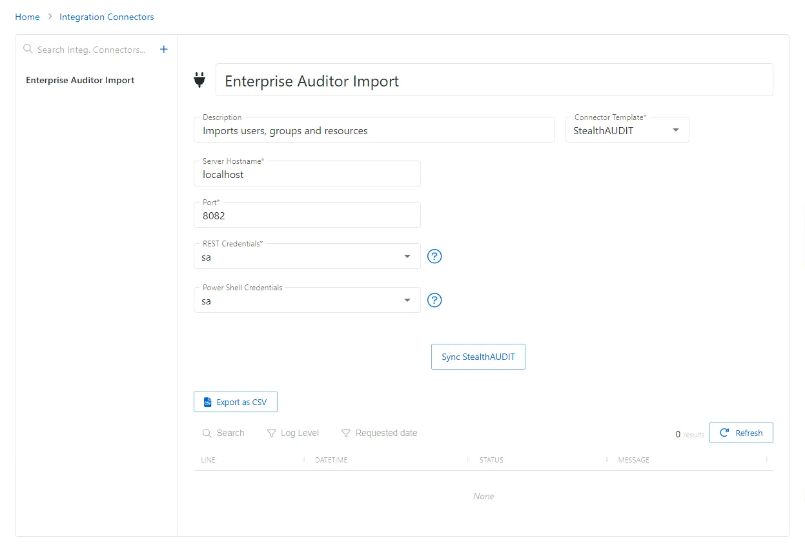

# Enterprise Auditor Integration

Netwrix Access Analyzer (formerly Enterprise Auditor) can be configured to send administrator
information to Privilege Secure. For integration, the following Access Analyzer job groups must be
successfully run before Privilege Secure can import the data:

- .Active Directory Inventory Job Group
- Windows > Privileged Accounts > Local Administrators Job Group

See the
[Netwrix Access Analyzer Documentation](https://helpcenter.netwrix.com/category/accessanalyzer) for
additional information.

## Configure the Access Role

Follow the steps to configure the access role in Access Analyzer. See the Access Role section of the
Web Service REST API for Applications Access Data Remotely topic of the
[Netwrix Access Analyzer Documentation](https://helpcenter.netwrix.com/category/accessanalyzer) for
additional information.

**Step 1 –** In Access Analyzer, navigate to the Access Node and click the Add Access link in the
upper-right corner of the Access view. The Access Role wizard opens.

**Step 2 –** Select the An application accessing data remotely through Web Service radio button,
then click Next. The Application Access page opens.

**Step 3 –** The Application Access page displays a list of available objects in the database.
Select Tables and click Add to open the Select Database Objects window.

**Step 4 –** Select the following Objects:

- Tables:

    - SA_ADInventory_Domains
    - SA_SG_LocalAdmins_Details

- Views:

    - SA_ADInventory_ComputersView
    - SA ADInventory_UsersView

    **NOTE:** Type in the Filter Objects by Name box to filter the list of objects by the characters
    entered.

**Step 5 –** Click OK to return to the Application Access page.

**Step 6 –** Review tables and views and click Next.

**Step 7 –** On the Application Details page, define the name of the application and generate the
app token:

- Application name – Enter “Privilege Secure”
- Access Expiration – Set the desired expiration for the client secret:

    - Access expires within – Select a timeframe from the drop-down list. The default is 72 hours.
    - Access expires on specified date – Select a date from the drop-down list

- Generate – Click this button to generate the Client ID and Client secret
- Client ID – Copy the Client ID for use in Privilege Secure
- Client secret – Copy the Client Secret for use in Privilege Secure

**Step 8 –** Click Finish to close the wizard and click Save in the Access view accept the changes.

**NOTE:** Access Analyzer must be restarted after a new access role is configured.

The next step is to use the Client ID and Client Secret to obtain an access token. This token is
used to get data from the Access Analyzer endpoint.

## Add Service Account for Enterprise Auditor Connector

Follow the steps to add the service accounts for the Access Analyzer integration connector. See the
[Add Service Account](serviceaccount.md) topic for additional information.

**Step 1 –** In the Privilege Secure Console, navigate to the Configuration > Service Accounts page.

**Step 2 –** In the Service Account list, click the Add Service Account icon.

**Step 3 –** Enter the following information:

- Enter Name –Access Analyzer API
- Enter Description – (Optional) Brief description to identify the service account
- Domain – This field is not required
- Username – Enter the Client ID from the Access Role wizard in Access Analyzer
- Password – Enter the Client Secret from the Access Role wizard in Access Analyzer
- Platform – Select Windows from the drop-down list

**Step 4 –** Click the Save icon to create the new service account.

**Step 5 –** Follow the steps again to add a service account with administrator credentials for
theAccess Analyzer server. Enter the following information:

- Enter Name – Access Analyzer Admin
- Enter Description – (Optional) Brief description to identify the service account
- Domain – The domain the Access Analyzer server is on
- Username – A local admin account for the Access Analyzer server
- Password – The password for the local admin account
- Platform – Select Windows from the drop-down list

The next step is to configure the integration connector.

## Add a Connector for Enterprise Auditor

Follow the steps to add the Access Analyzer Connector.

**Step 1 –** In the Privilege Secure Console, navigate to the Configuration > Integration Connectors
page.

**Step 2 –** In the Integration Connector list, click the Add Integration Connector icon.

**Step 3 –** Enter the following information:

- Connector Name – Enter a name to uniquely identify the connector
- Connector Description (Optional) – Enter a brief description to identify the service account
- Connector Template – A selection of templates for connector configurations. Select StealthAUDIT
  from the drop-down list.
- Server Hostname – The hostname of the server that Privilege Secure needs to connect to the server
  that Access Analyzer is installed on
- Port – The port used by the service that Privilege Secure needs to connect to
- REST Credentials – Enter the Client ID from the Access Role wizard in Access Analyzer
- PowerShell Credentials – Enter the Client Secret from the Access Role wizard in Access Analyzer

**Step 4 –** Click the Save icon to create the new integration connector.

The next step is to import the data from Access Analyzer.

## Import Data from Enterprise Auditor

Follow the steps to import the users, groups, and resources associated with administrator accounts
from Access Analyzer.

**Step 1 –** In the Privilege Secure Console, navigate to the Configuration > Integration Connectors
page in the menu.

**Step 2 –** In the Integration Connector list, select the previously created Enterprise Auditor
Import connector.

**Step 3 –** Click **Sync** **StealthAUDIT** to begin the data collection. This may take some time.

To view the import progress, navigate to **Service Nodes** > Action Services. See the
[Action Service](../servicetype/action.md) topic for additional information.
