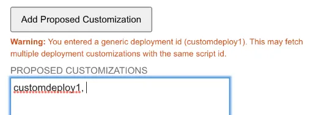
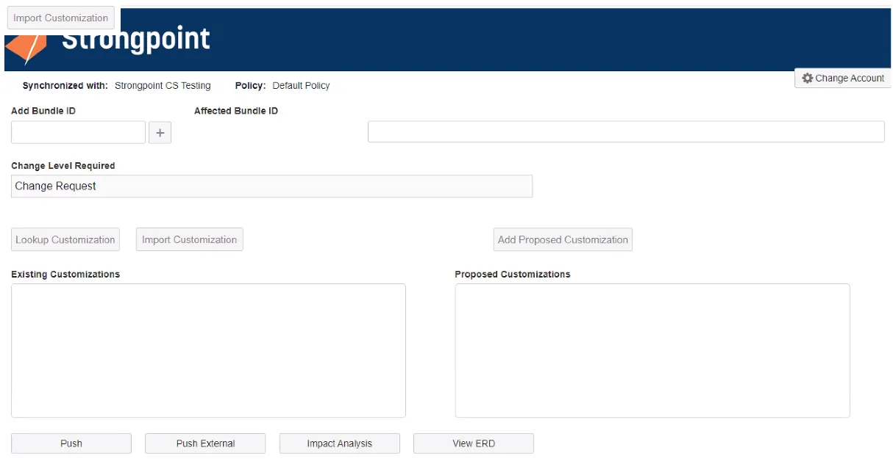
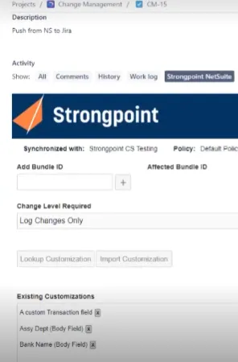
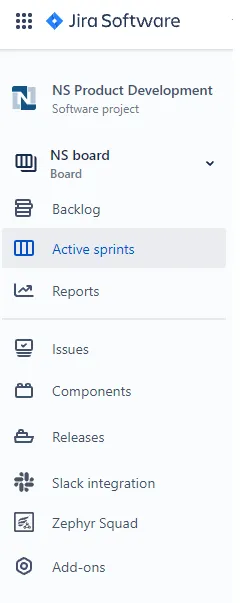
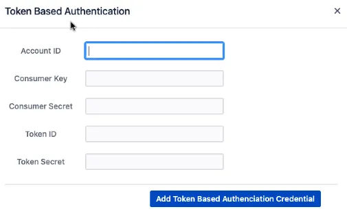

# Netwrix Strongpoint for Netsuite 7.0 Release Notes

## Core 7.0.3

July 28, 2023

- Improved handling of searches used in script deployments. Changes are now evaluated as scripted
  objects to check for deployment dependencies.
- Added a warning on the change request for generic deployment script IDs. Using the generic ID
  fetches all deployment customizations that share this non-unique ID.

    

- **Bill of Materials** and **Inventory Number** fields are deprecated and inactive in the policy
  record and list views.

## Core 7.0.2.1

June 23, 2023

- Clarified handling of User Role Assignment changes with associated scripts. Assignments are now
  reported more accurately in the Change Log and not noted as Scripted Object changes.

## Core 7.0.2

June 16, 2023

- **Autospider**, **Manual Spider** and **ReSpider Now** now support French (both France and Canada)
  for Strongpoint customers using French in NetSuite.
- **Changed By No HTML** and **Diff No HTML** result options are available for customizing your
  Searches. Specifying these options enable you to export the Change Management Reports with the
  fields in plain text, removing the HTML tags to improve readability.

    - Open **Strongpoint** > **Change Management Reports** > _report_name_ > **Customize**.
    - Click **Edit this Search**.
    - Open the **Results** tab.
    - Click **Add Multiple**.
    - Click to select a **Field**. Use Ctrl-Click to select subsequent fields.
    - Click **Add**.

        

    - Click **Save**.

## Core 7.0.1

May 16, 2023

- Updated handling of system changes due to a NetSuite change in user base permissions. System
  changes are now handled as platform changes, and do not generate non-compliant change logs for
  user roles.

    You must manually resolve any of the non-compliant changes system generated prior to this
    release. This update is not retroactive.

- Added a **Print** button to all Change Request screens.

## Core 7.0

April 21, 2023

### **Reset Strongpoint scripts to Low Priority**

This change ensures the Strongpoint scripts do not impact your performance. This change affects both
new installs and updates to existing Strongpoint for NetSuite installations.

There is an exception for customers using the **Agent** module to run **Large Controls**. These
scripts are set to **Standard** priority. Contact your Customer Success Manager for assistance if
you are considering changing these associated scripts to a lower priority.

### **Mass Update Type Available as a Change Request Proposed Customization**

**Mass Update** can be selected as a **Type** under **Proposed Customizations**. Specify the
**Name** of the Mass Update you want to create.

### **NetSuite Make Copy Creates Content and Resets Status**

Strongpoint ensures the **Make Copy** command found under the **Actions** option only copies the
content, not the status. Copied change requests are set to the **Not Started** status.

## Jira 1.2.14

- Added the ability to receive and store images attached in the Jira description by Jira ticket ID.

    

## Jira 1.2.13

Here are the enhancements for the release:

- Change customization name to allow Single quotes (').
- Added **Location** to the **Type** drop down on the **Add Proposed Customization** form.

## Jira 1.2.11

Here are the enhancements for the release:

- Import Customizations from Jira
- Enable Allow NS to Jira Push (must be done prior to creating a ticket from NetSuite to Jira)
- Create Ticket from NetSuite to Jira
- Change customization name to allow Single quotes (').
- Added **Group** to the **Type** drop down on the **Add Proposed Customization** form.

### Import Customizations from Jira

An **Import Customization** button has been added to the Jira Strongpoint form. You can import an
xml file exported from a Jira ticket.  

### Enable Allow NS to Jira Push

This feature must be enabled before you can create tickets from NetSuite to Jira.

1. Open **Strongpoint** > **Strongpoint Support** > **Installation Settings**
2. Open the **Jira Integration** tab
3. Check **Allow NS to Jira Push** to enable pushing NetSuite change requests into Jira.

    

### Create Ticket from NetSuite to Jira

Create Ticket from NetSuite to Jira must be enabled before you can create tickets from NetSuite to
Jira.

1. Create or open a change request in Strongpoint.
2. Add your information and customizations.
3. Click **Push to Jira**.
4. Select your Jira project.  
   
5. Click **Push**. A Change Request Pushed message is displayed. Click **Close**.
6. Open the **Related Change Records** tab. The ticket number is added as an **External Change
   Request Number**. **CM-15** in this example.  
   
7. Open Jira.
8. Navigate to **CM-15** ticket.  
   
9. Click **Strongpoint NetSuite**. The customizations from the change request are added.  
   

## Jira 1.2.10

Here are the enhancements for the release:

- Credentials are now persistent, and do not need to be entered every time.
- Strongpoint Settings page added to Jira

### Strongpoint Settings for Jira

The Strongpoint Settings app is accessed through Jira. This is where you create your Token Based
Authentication (TBA) credentials for your account. Once created, they are available to you for easy
selection when performing your tasks.

Token-Based Authentication is set up through NetSuite. Refer to
[Setting up Token-Based Authentication](../integrations/jira_integration.md).

1. Open **Jira**.
2. Open your **Projects** page:

    

3. Expand **Add-ons**.
4. Select **Strongpoint Settings**.

    

5. Click **New Token Based Authentication** to add your credentials. This needs to be done once for
   each of your accounts.

    

6. Enter your credentials and click **Add Token Based Authentication Credential**.
