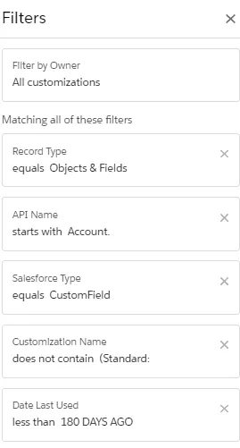
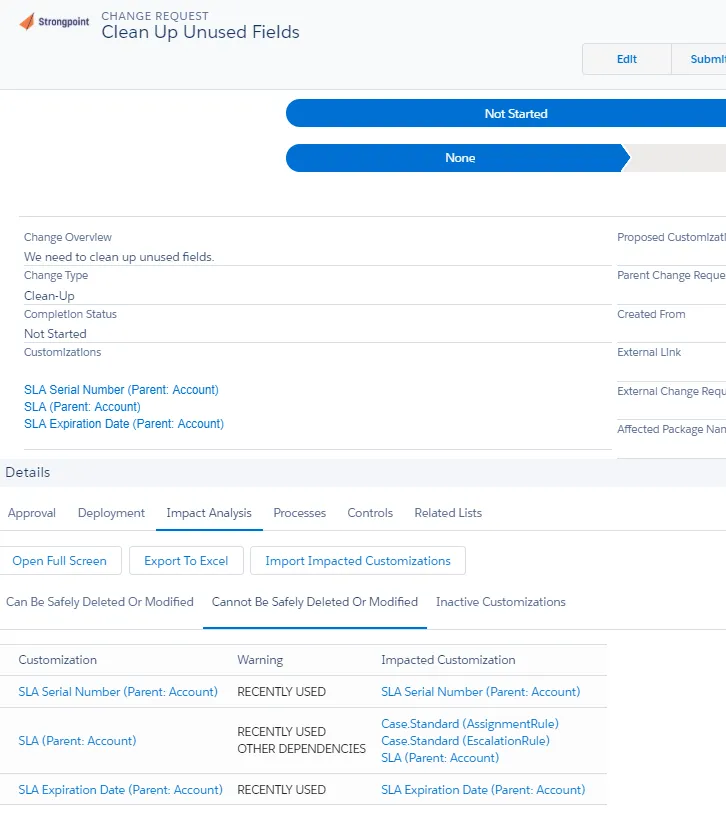

# Org Clean Up Example

Here is an example using the simplest clean up case:

- Unused custom fields on Account object
- No risky dependencies

Using the steps outlined Org Clean Up, we can proceed quickly, efficiently and with confidence.

## Step 1: Identify and Prioritize Targets for Clean Up

We are going to use the out-of-the-box Default Clean Up List View with these filters:

- Filter on the single Record Type **Objects & Fields** to enable editing the Customizations
  directly from the List View. This filter selects all Objects and their related Fields.
- Filter for API Names starting with **Account** (for example, **Account.\_**my*custom_field*)
  limits results to the **Account** object. We could use a similar technique to focus on a specific
  App.
- Filter on **Salesforce CustomField** to return all Custom Fields.
- Filter to exclude **Standard** fields. The Salesforce metadata type for all fields is CustomField.
  Platform Governance for Salesforce identifies standard fields and appends **Standard:
  object_name** to the Customization Name so they can be filtered out of your results.
- In our example, **unused** means _not used within the last six months_, so we finish up with a
  Date Last Used filter.

Specify the fields to show:

- Name
- Base Record: the parent for fields on an Object and the Base Object for other Customizations.
- Owner
- Date Last Used
- Clean Up Comments: freeform area to add notes about your investigation.
- Clean Up Classification - freeform area to organize clean up projects. For example, _Account
  Spring Clean Up_.
- Clean Up Status: specific tracking of the stages of a clean up project.
- Reports
- Scripts
- Workflows / Approvals
- Extended Types
- % Populated

## Step 2: Assess the Risk of Downstream Problems and Add Related Customizations

You now have a list of unused, custom fields on the Account object. Examine the dependencies to
determine what to do next. For this example, we are going to clean up fields without these
complications.

1. Set the **Clean Up Status** on any field without dependencies to **To Be Cleaned Up**. In the
   List View, click the
   
   icon and edit the **Clean Up Status** and other Clean Up Fields. You can select multiple fields
   using the checkboxes to set the values for the group.
2. For easy reference later, set a project name in the **Clean Up Classification** field such as
   _Simple Account Clean Up_. You can filter on this later when you send for approval.
3. If you have questions, send an email or Chatter request to the owner and set the **Clean Up
   Status** to _Send Request Info Email_ as a reminder you are awaiting a response.
4. As you find unused fields with complex dependencies, such as Scripts or Workflows / Approvals,
   set the **Clean Up Status** to **Under Investigation**. As an example, you can also assign the
   **Clean Up Classification** to be _Scripted Account Fields_ to group them for your investigation
   later.
5. These fields need investigation to see if they can be cleaned up and, more importantly, if the
   scripts and workflows are still useful, need to be fixed, or cleaned up. What are the scripts or
   workflows doing if there is no data in the field?
6. As you work through the list, note your findings in the **Clean Up Comments** field.
7. To keep an unused field, set the **Clean Up Status** to **Ignore**. Alternatively, you can set
   the **Date Last Used** to a date in the future. Platform Governance for Salesforce will not
   override the manually set date with an earlier date so you can retain the Customization. To view
   ignored Customizations, select:  
   **Strongpoint** > **Reports** > **Clean Up** > **Customizations Excluded From Clean Up**

> **PRO TIP**
>
> If you are cleaning up a very large object, add a filter for **Clean Up Status** equals **“”**.
> This shortens your list as you work your way through the fields and set an appropriate **Clean Up
> Status**. Remove the filter later when you want to work through the fields.
>
> - **Archived**: tracks automatically cleaned up Reports.
> - **Deleted**: tracks Customizations that have been deleted.
> - **Reassign Owner**: reassigns the Owner of one or more Customizations.

## Step 3: Track the Progress of the Clean Up Process

You now have a list of unused fields on the Account object grouped into fields that are relatively
simple to clean up and fields with code and other critical dependencies.

> **TIP**
>
> If you have a blank List View, remove the filter on the **Clean Up Status** or set it to **To Be
> Cleaned Up**. If you set a **Project Name** in the **Clean Up Classification**, you can filter for
> it in the search box at the top of the List View.

Some of the fields may have associated Reports or List Views. If you open the DRD in the
Customization Record, you can drill into the details to see if removing the field is likely to cause
a problem. Some things to consider:

- List Views do not track Date Last Used. Be careful cleaning up them up. Reports do track DLU.
- Cleaning up fields used in **Report Filters** can change the scope of the report. You can check
  whether the field is used in the report filter by looking at the **Search Filters** check box
  field.
- Fields on actively used Reports should have **Clean Up Status** set to **Under Investigation** and
  a plan for cleaning up the Report documented in the **Clean Up Comments** field. You might want to
  email or Chatter with the owner to determine whether it is safe to clean up. Set the status to
  **Send Request Info Emails** as a reminder.

## Step 4: Group Customizations for Approval and Clean Up

Now that you have identified what you can clean up, you can proceed with the Approval process. Some
Customizations may require different levels of approval or different approvers. If you are using
Intelligent Change Enablement, you can group related Customizations for approval and assign them to
a Change Request directly from the List View:

1. Click the **Change Request** tab and click **New**.
2. Enter the name and a brief description of the clean up project. Set the **Change Type** to
   **Clean Up**. If you are using an external change approval system such as Jira or ServiceNow, you
   can enter the **External Change Request Number**.

    

3. On your List View, set the **Add To Change Request** field for the Customizations you are
   planning to clean up with this Change Request.

    

4. Open your Change Request and view the Impact Analysis for the Customizations you want to clean
   up. You are warned if there are SOQL, code, workflow, role, profile filter report or List View
   dependencies or if the field affects actively used Reports.

    

5. If you need to make changes to the Customizations, **Edit** the Change Request and select **View
   All** in the Customizations field. You can **Add** or **Remove** Customizations to the **Selected
   Customizations** list. **Save** when you are finished.
6. When you are ready, Submit your Change Request for Approval.

> **PRO TIP**
>
> You can add additional approvers (beyond what is required for the policy) to the Change Request.
> Initially, only the approvers from your default policy are required. There are two methods to add
> additional approvers:
>
> - Create a Process Record and specify approvers. Add the Process Record to the Change Request
>   under the **Affected Processes** field. The additional approvers are added to this Change
>   Request and can be reused on future Change Requests. **Process Owner Approvals** must be enabled
>   on the applicable Policy.
> - Manually specify one or more approvers in the **Additional Approvers** field.

If you are not using Change Enablement, you can export the results to Excel by clicking the **Export
To Excel** on the Change Request **Impact Analysis** tab. You can also create a report of
Customization Records (there are third party apps that enable List View export). You must double
check the impact and manually route your list for approval.

## Step 5: Archive the Customization Definition / Data

Your metadata is automatically archived for the field. Best practice is to create a Report with all
of the non-empty fields you are cleaning up, and store it on the Change Request before you clean up
the fields.

## Step 6: Clean Up Approved Customizations

As with any change, you are strongly encouraged to clean up the fields in a sandbox first, run your
test sets, and review the changes with the affected business owners prior to making the change in
production.

You currently cannot delete items using Platform Governance for Salesforce tools. To actually remove
objects in bulk, you can use
[Destructive Change Sets](https://developer.salesforce.com/docs/atlas.en-us.daas.meta/daas/daas_destructive_changes.htm).
You can also remove them manually. We are working with customers to understand the controls required
to automate this process, taking into account the judgment required to safety proceed in various
sized orgs.

## Step 7: Validate Your Change Approval Process Was Followed

To ensure that your change approval process is being followed, there is an **Unresolved
Non-Compliant Changes** report. This report summarizes all changes where a Change Request was
required by policy, but either not created or not approved. The report includes these details:

- Customization Name and API Name
- Metadata Type (for example, **CustomField**, **WorkflowAlert**, **ApexClass**)
- Change Overview (for example, **Custom Field Created**, **WorkflowAlert Changed**, **ApexClass
  Created**)
- Diff Summary (detailed comparison of before and after)
- Related Change Requests, if they exist

The [Change Enablement Reports](../change_management/change_management_reports.md) and List Views
give you visibility into the changes occurring in your orgs.

**Next Technical Debt Topic:**
[Specific Clean Up Approaches](tech_debt_org_specific_clean_up_approaches.md)
