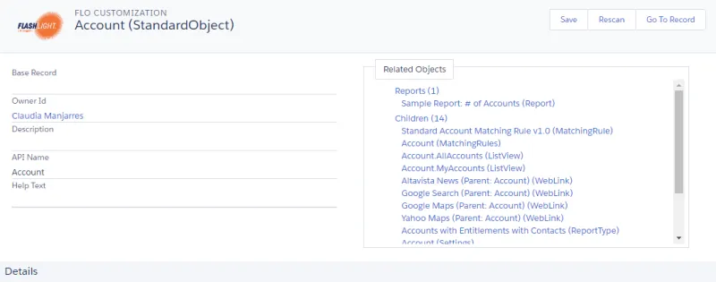

# Understanding the Customization Record

The customization detail contains general information about the customization record. The
customization name appears in the banner with function buttons:

- **Save**: saves the customization record.
- **Rescan**: runs the scanner on the record. You are prompted to refresh the page.
- **Go To Record**: brings up the customization record for editing or to view additional details.
- **Update Description and Help Text**: editor to add or modify the **Description** and **Help
  Text** fields.

Customization record fields include:

- **Base Record**: Link to the base record for the customization.
- **Owner ID**: Link to the current owner.
- **Description**: Details added to the record. Click **Update Description and Help Text** to
  update.
- **Salesforce Type**: Customization type.
- **API Name:** APIs associated with the record.
- **Help Text**: Helpful information detailing function and use of each customization. Click
  **Update Description and Help Text** to update.
- **Related Objects**: Links to related objects.
- **Details**: Tabs to access details about the customization. Tabs include **Metadata**,
  **Improvement**, **Permissions**, **Control**, **DRD**, **Raw Data** and **Related Lists**.

## Customization Record Tabs

These are the tabs inside a customization record:

> Metadata
>
> Improvements
>
> Control
>
> DRD
>
> Raw Data
>
> Related Lists

### Metadata

The metadata tab provides the metadata information about the customization, including:

- **Date Last Used**: date the customization was last used. Refer to
  [DLU](../clean_up/date_last_used.md) for more information.
- **Data type**: data type of the custom field.
- **Last Modified Date**: last date the customization was modified.
- **Active**: indicates whether the customization is a active.
- **Package**: indicates the package (if any) of the customization.
- **List**: Custom/Standard list used as a data source by the customization.
- **Last Modified File Date**: last date the file was modified
- **Customization Created By**: user who created the customization.
- **Customization Created Date**: date the customization was created.
- **Customization Last Modified By**: user who last modified the customization.
- **Script File Date**: date the script file was last modified.
- **Script File**: primary script file for a script customization.
- **Functions**: functions used in the script.
- **Script Fields**: fields used in the script file.
- **Attempt #**: number of times the script has tried to execute.
- **# of Lines**: number of lines in the script.
- **Manageable State**: the current state if it is from a managed/unmanaged package.

### Improvements

The improvement tab provides information about improvements that can be made on a customization such
as clean up:

- **Clean Up Status**: This is the clean-up status of customizations that are to be deleted.
- **Change/Approval Policy**: This field designates the approval policy related to a customization.
- **Clean Up Comments**: This field is used to make notes during clean up and improvements.
- **Clean-up Classification**: This field shows an overview of the clean-up classification.
- **Add to Change Request**: Lookup tool to associate the clean up to an existing change request.

- : This is one or more Customization records representing the data source(s) for this particular
  field.

### Control

The control tab describes assigned controls on a customization record for example controls assigned
on a financial report.

- **Control**: determines if the customization is a control.
- **Control Frequency**: frequency at which a control should be checked.
- **Track Duplicates**: specifies whether duplicate issues are to be tracked or not.
- **Control Type**: select count to record numbers, issues, tasks etc.
- **Control Assignee**: assign tasks, issues or alerts to someone other than the owner, if blank the
  control alerts the owner of the customization.
- **Controlled Process**: process this customization controls.
- **Control Count**: custom field created for the account.
- **Alert Control Owner**: check box to alert owner of the control.
- **Next Control Date Time**: notes the date and time when to start monitoring.
- **Risk/Requirement**: process issue associated with the customization.
- **Last Control Run Date**: This is the last date the control was run.
- **Alert Process Owner**: check box to alert the process owner whenever an incident is detected.
- **Alert/Task Message**: The message that will be sent to the assignee on tasks or recipients of
  alerts.
- **Instructions for Resolution**: instructions for resolving the issue.
- **Control Error/Warning**: errors or warnings encountered when control was last run. Blank
  indicates no errors/warnings.

### DRD

Dependency Relationship Diagram ([DRD](../tools/viewing_drd.md)) displays objects, customizations
and their relationships and dependencies.

### Raw Data

This tab describes and list the XML code contained in a customization.

- **Last Scanner Date**: Last date in which the scanner ran and evaluated the current customization.
- **Rescanner**: information for rescanning the customization and evaluating progress of Apex
  Batches to show **In Progress**.
- **Make Join Date**: date customization was last passed to Make Join script.
- **Incomplete Object**: checked if the object is incomplete.
- **Suppress Changelog**: prevent changes from being made.
- **Script Fields (Raw)**: fields in the relevant script file.
- **Scripts (Raw)**: scripts used by other customizations.
- **Workflow/Approval Fields (Raw)**: data workflow fields.
- **Workflow Scripts (Raw)**: data workflow scripts.
- **Extended Types Fields (Raw)**: CSV of fields used by a customization.
- **Report/Search Fields (Raw)**: fields used in filter criteria or columns for a search.
- **Layout (Raw)**: custom field to hold custom fields of ListView, visual pages and layouts.
- **List (Raw)**: references related to this field.
- **Scanner Read**: check box to indicate if the retrieve and the customization was executed and
  read.
- **Folder File Name**: name of the folder and file where Salesforce has the Metadata component.
- **Encoded API Name**: field to note the retrieve with encoded API name.
- **XML/Code**: XML/code representation of the page for a customization.

### Related Lists

Links to related lists: Change Logs, Notes & Attachments and Customization History.
