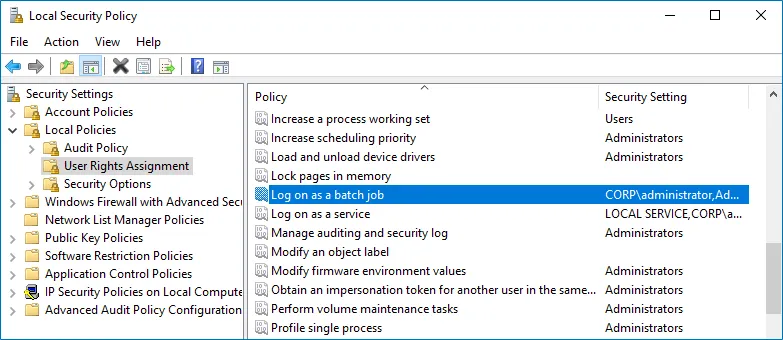

# Define Log On As a Batch Job Policy

During the source addition, the Log on as a batch job policy is automatically defined for the Data
Processing Account as a local security policy. However, if you have the Deny log on as a batch job
policy defined locally or on the domain level, the local Log on as a batch job policy will be reset.
In this case, redefine the Deny log on as a batch job policy through the Local Security Policy
console on your computer or on the domain level through the Group Policy Management console.

You can configure this policy via the **Local Security Policy** snap-in or using the Group Policy
Management console.

## To configure the Log On As a Batch Job policy via the **Local Security Policy** snap-in

**Step 1 –** On any domain controller in the target domain, open the **Local Security Policy**
snap-in: navigate to Start →Windows Administrative Tools (Windows Server 2016 and higher) or
Administrative Tools (Windows 2012) and select Local Security Policy.

**Step 2 –** Navigate to **Security Settings → Local Policies → User Rights Assignment** and locate
the **Log on as a batch job** policy.

**Step 3 –** Double-click the **Log on as a batch job** policy, and click **Add User or Group**.
Specify the account that you want to define this policy for.

## To configure the Log On As a Batch Job policy using the Group Policy Management console

Perform this procedure only if the account selected for data collection is not a member of the
Domain Admins group.

**Step 1 –** Open the Group Policy Management console on any domain controller in the target domain:
navigate to Start → Windows Administrative Tools (Windows Server 2016/2019) or Administrative Tools
(Windows 2012 R2 and below) → Group Policy Management.

**Step 2 –** In the left pane, navigate to Forest: `<forest name>` → Domains → `<domain name>` →
Domain Controllers. Right-click the effective domain controllers policy (by default, it is the
_Default Domain Controllers Policy_), and select Edit .

**Step 3 –** In the Group Policy Management Editor dialog, expand the Computer Configuration node on
the left and navigate to Policies → Windows Settings → Security Settings → Local Policies.

**Step 4 –** On the right, double-click the User Rights Assignment policy.

**Step 5 –** Locate the Log on as a batch job policy and double-click it.

**Step 6 –** In the Log on as a batch job Properties dialog, click Add User or Group and specify the
user that you want to define this policy for.

**Step 7 –** Navigate to Start → Run and type "_cmd_". Input the `gpupdate /force` command and press
Enter. The group policy will be updated.

**Step 8 –** Type `repadmin /syncall` command and press Enter for replicate GPO changes to other
domain controllers.

**Step 9 –** Ensure that new GPO settings applied on any audited domain controller.
