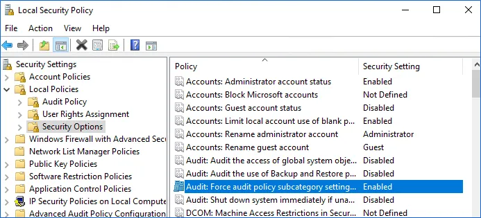

# Configure Advanced Audit Policies

Configure advanced audit policies to limit the range of events tracked and recorded by the product, thus preventing your AuditArchive and the Security event log from overfilling. Perform procedures below instead of those discussed in the [Configure Local Audit Policies](localpolicy.md) topic.

## Enforce Advanced Policies Over Local Policies

Setting up both basic and advanced audit policies may lead to incorrect audit reporting. To force basic audit policies to be ignored and prevent conflicts, enable the _Audit: Force audit policy subcategory settings_ policy.

Follow the steps to enforce advanced policies.

__Step 1 –__ On the audited server, open the Local Security Policy snap-in and navigate to Start > Windows Administrative Tools > Local Security Policy.

__Step 2 –__ Navigate to Security Settings > Local Policies > Security Options and locate the Audit: Force audit policy subcategory settings policy.

__Step 3 –__ Double-click the policy and enable it.

## Configure Advanced Audit Policy on Windows Server 2016 / Windows 12 and Above

In Windows Server 2016 and above, Advanced audit policies are integrated with Group Policies, so they can be applied via Group Policy Object or Local Security Policies. The procedure below describes how to apply Advanced policies via Local Security Policy console.

__Step 1 –__ On the audited server, open the __Local Security Policy__ snap-in and navigate to Start > Windows Administrative Tools > Local Security Policy.

__Step 2 –__ In the left pane, navigate to Security Settings > Advanced Audit Policy Configuration > System Audit Policies.

__Step 3 –__ Configure the following audit policies.

| Policy Subnode | Policy Name | Audit Events |
| --- | --- | --- |
| Object Access | - Audit File System - Audit Handle Manipulation | "Success" and/or "Failure" depending on the type of events you want to track. |
| - Audit Detailed File Share | "Failure" |  |
| - Audit File Share | "Success" |  |
| Policy Change | - Audit Policy Change | "Success" |
| Logon/Logoff | - Logon | "Success" |
| - Logoff | "Success" |  |
| System | - Security State Change | "Success" |
