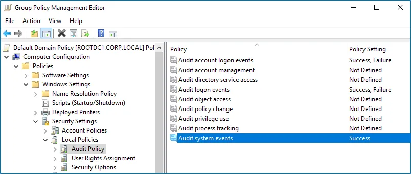

# Configure Basic Domain Audit Policies

Basic local audit policies allow tracking changes to user accounts and groups and identifying
originating workstations. You can configure advanced audit policies for the same purpose too. See
[Configure Advanced Audit Policies](advancedaudit.md)

**Step 1 –** Open the **Group Policy Management** console on any domain controller in the target
domain: navigate to Start > Windows Administrative Tools (Windows Server 2016 and higher) or
Administrative Tools (Windows 2012) > **Group Policy Management.**

**Step 2 –** In the left pane, navigate to **Forest: `<forest_name>`** > **Domains >
`<domain_name>` > Domain Controllers**. Right-click the effective domain controllers policy (by
default, it is the **Default Domain Controllers Policy**), and select **Edit** from the pop-up menu.

**Step 3 –** In the **Group Policy Management Editor** dialog, expand the **Computer Configuration**
node on the left and navigate to **Policies** > **Windows Settings** > **Security Settings** >
**Local Policies > Audit Policy.**

**Step 4 –** Configure the following audit policies.

| Policy                     | Audit Events                |
| -------------------------- | --------------------------- |
| Audit logon events         | _"Success"_ and _"Failure"_ |
| Audit account logon events | _"Success"_ and _"Failure"_ |
| Audit system events        | _"Success"_                 |

**Step 5 –** Set the Audit system events policy to **Success**.

**Step 6 –** Navigate to **Start** > **Run** and type _"cmd"_. Input the `gpupdate /force` command
and press **Enter**. The group policy will be updated.
