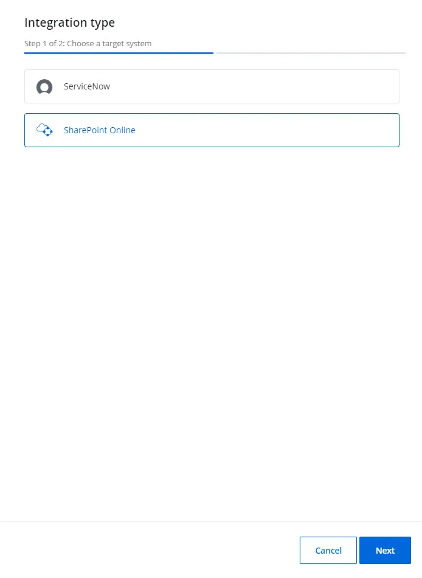

# SharePoint Online

You can use the SharePoint Online integration for the report (Activity and Risk Assessment
Dashboard) subscriptions. This way, the required reports shall be delivered to a specific folder in
SharePoint Online.

| Icon                                                                                          | Description                                                                  |
| --------------------------------------------------------------------------------------------- | ---------------------------------------------------------------------------- |
|  | Edit Icon. Click the Edit Icon to edit the settings of the integration type. |
|        | Bin Icon. Click the Bin icon to delete the SharePoint Online integration.    |

## Add a SharePoint Online Integration in a System

Follow the steps to add the SharePoint Online integration in Netwrix 1Secure.

**Step 1 –** Go to Configuration > **Integrations** and click the **Add** icon to add the SharePoint
integration.

**Step 2 –** In the displayed Integration type window, click **SharePoint Online** and click
**Next**.

**Step 3 –** In the Configure connection window, specify the required fields:

- Client ID – The client ID of the app registered in Microsoft Entra ID. See the
  [App Registration and Configuration in Microsoft Entra ID](../configuration/entraid/registerconfig.md) topic
  for additional information.
- Tenant ID – The tenant ID of the app registered in Microsoft Entra ID. See the
  [App Registration and Configuration in Microsoft Entra ID](../configuration/entraid/registerconfig.md) topic
  for additional information.
- Client Secret – The client secret of the app registered in Microsoft Entra ID. See the
  [App Registration and Configuration in Microsoft Entra ID](../configuration/entraid/registerconfig.md) topic
  for additional information.

See the
[App Registration and Configuration in Microsoft Entra ID](../configuration/entraid/registerconfig.md)
topic for additional information.

**Step 4 –** Click **Finish**.

**NOTE:** You must firstly add a Sites.ReadWrite.All permission in your Microsoft Entra admin
center. See the [ Microsoft 365 Permissions](../configuration/entraid/permissions.md) topic for
additional information.

The SharePoint Online integration is added now. The status displays "Ok" in green.

You can click the **Edit** icon or the **Bin** icon to edit or delete the integration.

See the [Subscriptions](../admin/searchandreports/subscriptions.md) and
[Risk Assessment Dashboard](../admin/riskprofiles/riskassessmentdashboard.md) topics to learn how to
add subscriptions and deliver it to SharePoint Online folder.
