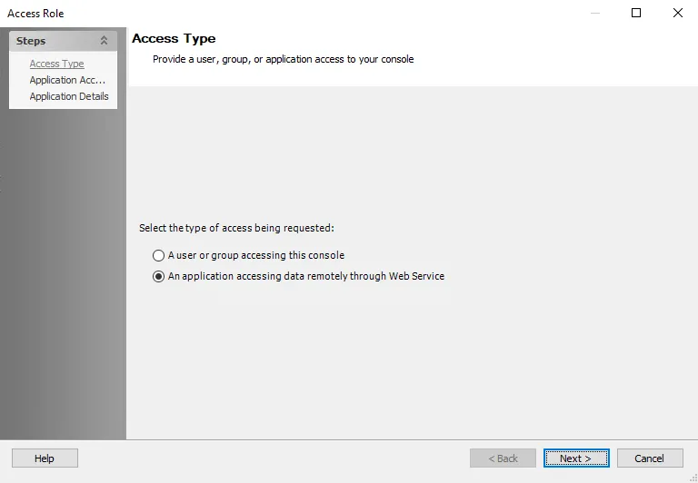
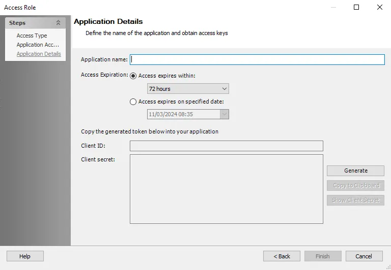

# Assign Application Access through the Web Service

An application can be assigned to access data remotely through the Web Service. Follow the steps to
assign roles in the Console.

**Step 1 –** Navigate to **Settings** > **Access** and click **Add Access**. The Access Type wizard
opens.

**Step 2 –** Select the **An application accessing data remotely through Web Service** option. Click
**Next**. The Application Access window opens.

**Step 3 –** The Application Access window displays a list of objects available in the database that
are available for access. Select the database objects the application will access and click **Add**
to open the Select database objects window.

**Step 4 –** Select the database objects to access and then click **OK** to return to the
Application Access page.

- Selecting a parent node in the tree automatically selects all children in addition to the parent
- Selecting a child automatically selects the parent
- Deselecting a child when the parent is selected automatically puts the parent into an
  indeterminate state
- Selecting any child puts the parent into an intermediate state

Click Next to proceed.

**NOTE:** Only select items that the application needs to access. Type in the **Filter objects by
name** box to filter the list of objects by the characters entered.

**Step 5 –** On the Application Details page, define the name of the application and generate the
app token.

- Application name – The name of the application accessing that data
- Access Expiration – The expiration for the client secret. Select an option for the desired access
  expiration:

    - Access expires within – Select a time frame from the drop-down list. The default is 72 hours.
    - Access expires on specified date – Select a date from the drop-down list

- Generate – Click this button to generate the Client ID and Client secret
- Client ID – Copy the Client ID into the application accessing data remotely through the Web
  Service
- Client secret – Copy the Client secret into the application accessing data remotely through the
  Web Service

**Step 6 –** Click **Finish** to confirm the changes.

The application is added to the table on the Access page.
