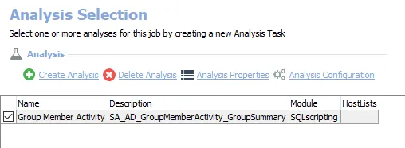

# AD_GroupMemberActivity Job

The AD_GroupMemberActivity Job analyzes the AD actions taken by the effective members of a group.
Monitoring authentication can provide a more accurate method of determining staleness than last
logons.

## Analysis Tasks for the AD_GroupMemberActivity Job

Navigate to the **Jobs** > **Active Directory** > **6.Activity** > **Group Usage** >
**AD_GroupMemberActivity** > **Configure** node and select **Analysis** to view the analysis tasks.

The default analysis task is:

- Group Member Activity – Creates the SA_AD_GroupMemberActivity_GroupSummary table accessible under
  the job’s Results node

In addition to the tables created by the analysis tasks, the AD_GroupMemberActivity Job produces the
follow pre-configured report:

| Report                | Description                                                                                | Default Tags                                               | Report Elements                                                                   |
| --------------------- | ------------------------------------------------------------------------------------------ | ---------------------------------------------------------- | --------------------------------------------------------------------------------- |
| Group Member Activity | This report identifies actions taken by the members of each group within your environment. | CCPA GDPR SOX HIPPA PCI-DSS GLBA ITAR FERPA FISMA ISO27001 | This report is comprised of one element: - Table – Displays group member activity |

### Configure the Group Member Activity Analysis Task

Customizable parameters enable you to set the values used to include the SIDs for admin groups
during this job’s analysis. The parameters can be customized and are listed in a section at the
bottom of the SQL Script Editor. Follow the steps to customize an analysis task’s parameters.

**Step 1 –** Navigate to the **Active Directory** > **6.Activity** > **Group Usage** >
**AD_GroupMemberActivity** > **Configure** node and select **Analysis**.

**Step 2 –** In the Analysis Selection view, select the Group Member Activity analysis task and
click on **Analysis Configuration**. The SQL Script Editor opens.

**CAUTION:** Do not change any parameters where the Value states `Created during execution`.

**Step 3 –** In the parameters section at the bottom of the editor, find the Value column. Select
the cell for the temporary table called #admingroups, and click **Edit Table** to modify the value.

- The new value should include SIDs for admin groups to be considered administrative groups beyond
  the default admin groups.

**Step 4 –** Click **Save and Close** to finalize the customization and close the SQL Script Editor
window.

The analysis task now includes custom parameters for the updated values.
