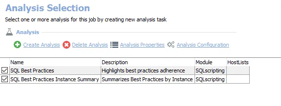

# SQL_BestPractices Job

The SQL_BestPractices Job analyzes SQL and Azure SQL server configuration settings and reports any
findings that deviate from recommended Microsoft Best Practices when it comes to creating,
maintaining, and securing SQL and Azure SQL servers.

### Analysis Tasks for the SQL_BestPractices Job

Navigate to the **Databases** > SQL > 4.Configuration > SQL_BestPractices > Configure node and
select Analysis to view the analysis tasks.

**CAUTION:** Do not modify or deselect the selected analysis task(s). The analysis task(s) are
preconfigured for this job.

The default analysis tasks are:

- SQL Best Practices – Creates the SA_SQL_BestPractices table accessible under the job’s Results
  node
- SQL Best Practices Instance Summary – Creates the SA_SQL_BestPractices_Summary table accessible
  under the job’s Results node

In addition to the tables and views created by the analysis tasks, the SQL_BestPractices Job
produces the following pre-configured report:

| Report                    | Description                                                                             | Default Tags | Report Elements                                                                                                                                                         |
| ------------------------- | --------------------------------------------------------------------------------------- | ------------ | ----------------------------------------------------------------------------------------------------------------------------------------------------------------------- |
| SQL Server Best Practices | Evaluates settings on SQL and Azure SQL Instances and Databases for SQL Best Practices. | None         | This report is comprised of three elements: - Pie Chart – Displays best practice adherence - Table– Displays configuration settings - Table – Displays instance summary |
