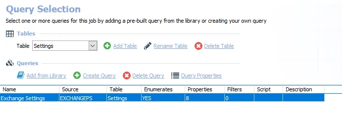
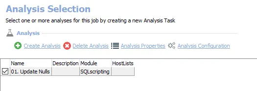

# EX_ASPolicies Job

The EX_ASPolicies Job provides insight into what policies are enabled for which users.

## Queries for the EX_ASPolicies Job

The EX_ASPolicies Job uses the ExchangePS Data Collector.

The following query is included in the EX_ASPolicies Job.

- Exchange Settings – Collects user policy information

    - By default set to search all mailboxes. However, it can be scoped.
    - See the [Scope the ExchangePS Data Collector](#scope-the-exchangeps-data-collector) topic for
      additional information

### Scope the ExchangePS Data Collector

The ExchangePS Data Collector can be scoped if desired.

Follow the steps to scope the ExchangePS Data Collector:

**Step 1 –** Navigate to job’s **Configure** node and select **Queries**.

**Step 2 –** In the Query Selection view, select the Exchange Settings query and click **Query
Properties**. The Query Properties window opens.

**Step 3 –** Select the **Data Source** tab, and click **Configure**. The ExchangePS Data Collector
Wizard opens.

**CAUTION:** Do not modify other wizard pages. The wizard pages are pre-configured for this job.

**Step 4 –** Navigate to the Scope page, and select the desired scoping method from those available.
See the [ExchangePS: Scope](../../../admin/datacollector/exchangeps/scope.md) topic for additional
information.

- Scope by Database – Select the **Scope by Database Target Host: Local Host** option. Then, click
  **Next** and identify the desired databases on the Scope by Databases page. See the
  [ExchangePS: Scope by DB](../../../admin/datacollector/exchangeps/scopedatabases.md) topic for
  additional information.
- Scope by Mailbox – Select the **Scope by Mailbox Target Host: Local Host** option. Then, click
  **Next** and identify the desired mailboxes on the Scope by Mailboxes page. See the
  [ExchangePS: Scope by Mailboxes](../../../admin/datacollector/exchangeps/scopemailboxes.md) topic
  for additional information.
- Scope by Server – Select the **Scope by Server Target Host: Exchange MB Server** option. The job
  returns results for specific servers selected in job’s **Configure** > **Hosts** node.
- Scope by Public Folder – Select the **Scope by Public Folder** option. Then, click **Next** and
  identify the desired mailboxes on the Scope by Public Folders page. See the
  [ExchangePS: Scope by Public Folders](../../../admin/datacollector/exchangeps/scopepublicfolders.md) topic
  for additional information.
- _Remember,_ the scoping options available vary based on the pre-defined query configurations.

**Step 5 –** Navigate to the Summary page. Click **Finish**.

The job applies the modification to future job executions.

## Analysis Tasks for the EX_ASPolicies Job

View the analysis tasks by navigating to the **Exchange** > **2. CAS Metrics** > **EX_ASPolicies** >
**Configure** node and select **Analysis**.

**CAUTION:** Do not modify or deselect the selected analysis task. The analysis task is
preconfigured for this job.

The following analysis task is selected by default:

-   1. Update Nulls – Updates the NULLs in the table to show information

In addition to the tables and views created by the analysis task, the EX_ASPolicies Job produces the
following pre-configured report:

| Report                                         | Description                                                                                                                                              | Default Tags | Report Elements                                                                                                                     |
| ---------------------------------------------- | -------------------------------------------------------------------------------------------------------------------------------------------------------- | ------------ | ----------------------------------------------------------------------------------------------------------------------------------- |
| User ActiveSync Policies (ActiveSync Settings) | Exchange introduced many ActiveSync policies and settings which can be applied to users. This report identifies which users have these settings enabled. | None         | This report is comprised of two elements: - Pie Chart – Displays ActiveSync Policies - Table – Provides details ActiveSync Policies |
