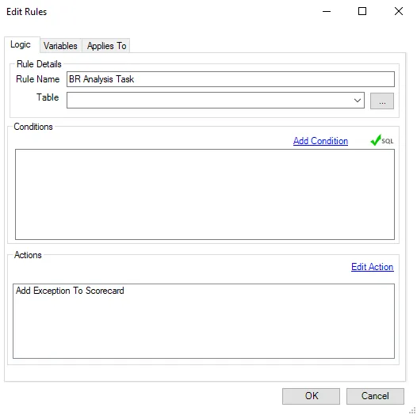
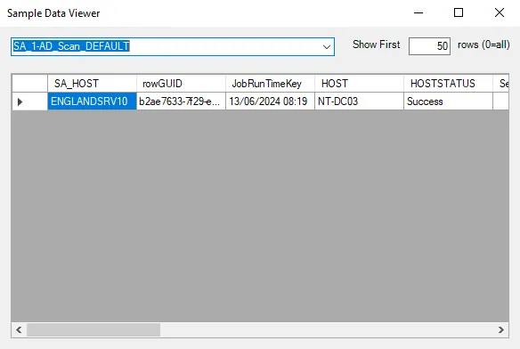
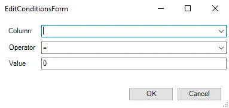
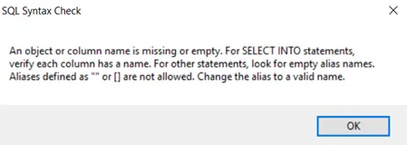
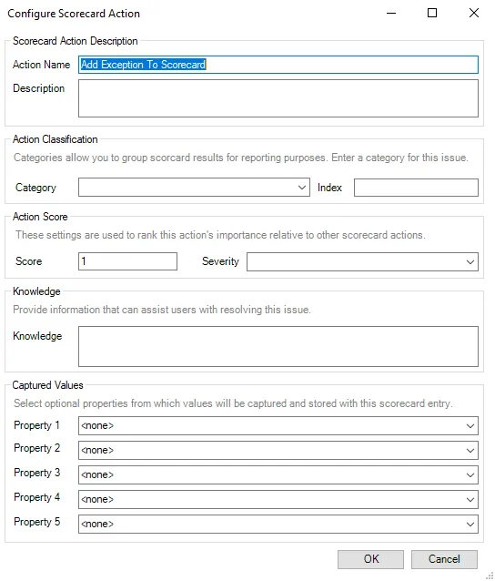

# Logic Tab

Use the Logic tab to specify conditions and actions for the Business Rule.

The Logic tab contains the following sections and options:

- Rule Details – Create a title for the rule and select a source table:

    - Rule Name – The field defaults with the name on the Analysis Properties page and is manually
      editable
    - Table – Select a table from the drop-down menu containing the baseline values to evaluate

        - To view data from a selected table, click the ellipsis (**…**) to open the Sample Data
          Viewer window, or select a table within the viewer. See the
          [Sample Data Viewer Window](#sample-data-viewer-window) topic for additional information.

- Conditions – Apply conditions to the table

    - Click **Add Condition** to open the EditConditionsForm window and add a condition to the
      Conditions list. See the [EditConditionsForm Window](#editconditionsform-window) topic for
      additional information.
    - Exceptions textbox – Lists added conditions. By default, it says `Add Exception to Scorecard`
      but updates with any conditions selected.
    - To check the SQL statement executed, click the green checkmark SQL symbol. This opens the SQL
      Extract Preview window. See the
      [SQL Extract Preview Window](#sql-extract-preview-window) topic for additional information.

- Actions – Add exceptions to the scorecard action

    - Select **Edit Action** or double click **Add Exception To Scorecard** to open the Configure
      Scorecard Action window. See the
      [Configure Scorecard Action Window](#configure-scorecard-action-window) topic for additional
      information.

## Sample Data Viewer Window

Use the Sample Data Viewer window to examine data in a selected table.

The Sample Data Viewer window provides the following options:

- Use the drop-down menu to select a table to view the table’s data. The field defaults with the
  table selected in the Logic tab if previously selected.
- Show First [Number] rows – Adjusts the presentation of the number of rows of the selected table.
  The default value is 50. It can be manually adjusted with values between 0 and all.

## EditConditionsForm Window

Use the EditConditionsForm to configure conditions to be applied to the table.

The EditConditionsForm contains the following options:

- Column – Use the drop-down menu to select a column from the table selected in the Logic tab
- Operator – Use the dropdown to select an operator:

    - `<` – Search for items in the selected column with values less than a selected value
    - `>` – Search for items in the selected column with values greater than a selected value
    - `=` – Search for items in the selected column of equal value to the selected value
    - `!=` – Search for items in the selected column not equal to the selected value
    - `like` – Search for items in the selected column of similar or value to the selected value

- Value – Manually set a comparator value. The default is 0.

## SQL Extract Preview Window

The SQL Extract Preview window previews results of the conditions added to the table in the
Conditions section.

The SQL script requires the table have these columns: `HOST`, `SA_Host`, and `JobRunTimeKey`. If
there is a mismatch between table and SQL script, a SQL Syntax Check window describes any detected
issue.

For example, this SQL Syntax Check window is reporting an error of missing information of an object
or column.

## Configure Scorecard Action Window

Use this window to add exceptions to the scorecard.

The Configure Scorecard Options window provides the following options:

- Scorecard Action Description – Use this section to label the scorecard action

    - Action Name – Enter a name for the action
    - Description – Enter a description for the action

- Action Classification – This section allows you to group scorecard action results for reporting
  purposes

    - Category – Enter a desired category name in the field or use the dropdown to select from
      previously titled categories
    - Index – Enter a desired index value for the scorecard action

- Action Score – This section allows you to rank the action’s importance relative to other scorecard
  actions

    - Score – Enter a desired score value for the scorecard action
    - Severity – Enter a desired severity value or use the dropdown to select from previously
      selected values

- Knowledge – This section provides information that may assist with resolving this issue

    - Knowledge – Enter information to assist issue resolution, for example a website URL

- Captured Values – This section allows you to select up to five optional properties whose values
  will be captured and stored with the scorecard entry. For each property selected, a name column
  and value column appear in the scorecard.

    - Property [1-5] – Select a property from the selected table using the drop-down menu to capture
      and store its values with the scorecard
