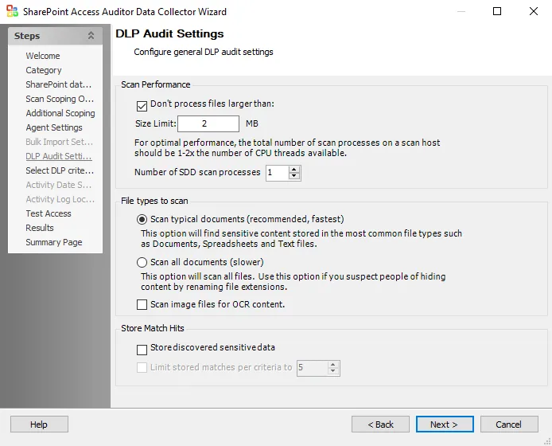

# SPAA: DLP Audit Settings

The DLP Audit Settings page is where sensitive data discovery settings are configured. It is a
wizard page for the category of Scan For Sensitive Content.

**CAUTION:** Users should not change scans in a way that would result in less data being returned on
a subsequent scan (i.e. scanning fewer web applications, scanning fewer site collections, or a
shallower depth scan). Those resources not included in a subsequent scan are marked as deleted in
the Tier 2 database and subsequently removed from the Tier 1 database.

Configure the **Scan Performance** options:

- Don’t process files larger than: Size Limit [number] MB – Limits the files to be scanned for
  sensitive content to only files smaller than the specified size. The checkbox is selected by
  default. The default size is 2 MB.
- Number of SDD scan processes [number] – Increases the number of SDD scanner processes that spawn
  as part of a scan, increasing parallel scanning. The value should not exceed 2x the number of CPU
  threads available.

Use the radio buttons to select the **File types to scan**:

- Scan typical documents (recommended, fastest) – Scans most common file types
- Scan all document types (slower) – Scans all file types except those excluded
- Scan image files for OCR content – Use optical character recognition to scan image files for
  sensitive data content

    **NOTE:** The OCR option is intended to work for clear scanned physical documents or documents
    directly converted to images, with standard fonts. It will not work for scanning photos of
    documents and may not be able to recognize text on images of credit cards, driver's licenses, or
    other identity cards.

Use the checkboxes to select to **Store Match Hits**:

- Store discovered sensitive data – Stores match hits for sensitive data in the SPAA Tier 2
  database. If this option is not selected, then the match hits for sensitive data are still
  reported but the data columns are masked in the database.
- Limit stored matches per criteria to [number] – Enabled when the Store discovered sensitive data
  checkbox is selected. Limits the number of stored matches per criteria to the specified number.
