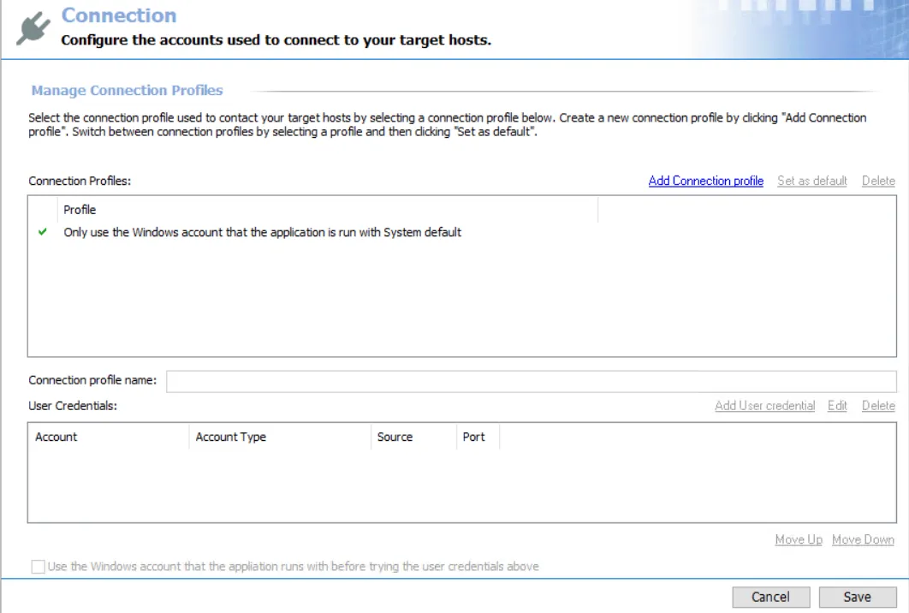
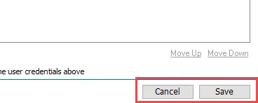

# Connection

The Connection node contains objects referred to as Connection Profiles. A Connection Profile houses
the information Access Analyzer uses to connect to the target hosts during job execution.

There are two methods for authentication to a targeted host:

- Use Local Login Credentials
- Use a Connection Profile

## Use Local Login Credentials

This method is traditionally assigned through the **Only use the Windows account that the
application is run with System default** option. It is generally referred to as the System Default
or trusted method. When used, Access Analyzer authenticates to the target hosts during host
inventory or job execution with the Windows account used to launch Access Analyzer. This can be:

- Account which was used to log on to the Access Analyzer Console server and start the application
- Account which was used to launch the Access Analyzer application through the run-as security
  context
- Account which was used to provision a Windows scheduled task when running a job group or job via a
  scheduled task

## Use a Connection Profile

This method allows you to define a Connection Profile which houses one or several sets of
credentials to be used for authentication on the target hosts during host inventory or job
execution. The credentials specified in a Connection Profile could be any of the following:

- Local machine account
- Active Directory account
- Unix account
- SQL account
- Microsoft Entra ID (formerly, Azure Active Directory) key
- Dropbox access token
- Web service JWT
- Oracle account

For the majority of auditing scenarios, domain-based accounts are preferred if not required by the
nature of the auditing task. The credentials must have the permissions required by the data
collector being used.

### Password Storage Options

The password for the credential provided can be stored in Access Analyzer application or Access
Analyzer Vault. Certain types of credentials can be stored in CyberArk®.

Choosing to store passwords in either the Access Analyzer application or the Access Analyzer Vault
is a global setting configured in the **Settings** > **Application** node. See the
[Application](../application/overview.md) topic for additional information.

The Access Analyzer vault provides enhanced security through enhanced encryption to various
credentials stored by the Access Analyzer application. See the [Vault](../application/vault.md)
topic for additional information.

CyberArk integration stores supported credentials in the CyberArk Enterprise Password Vault.
CyberArk Privileged Account Security Solution offers components designed to discover, secure,
rotate, and control access to privileged account passwords used to access systems through the
enterprise IT environment. See the [CyberArk Integration](cyberarkintegration.md) topic for
additional information.

The **Cancel** and **Save** buttons are in the lower-right corner of the Connection view. These
buttons become enabled when modifications are made to the Connection global setting.

Whenever changes are made at the global level, click **Save** and then **OK** to confirm the
changes. Otherwise, click **Cancel** if no changes were intended.
