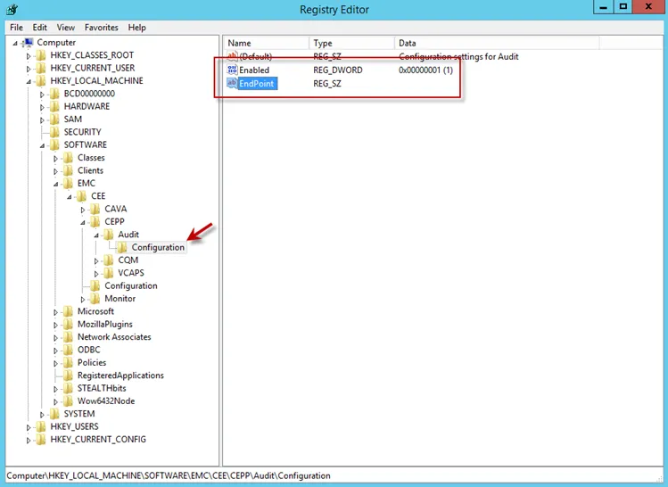
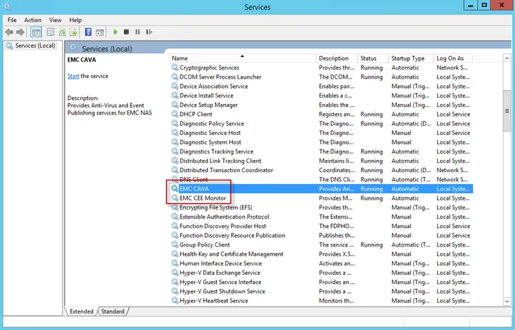

# Install & Configure Dell CEE

Dell CEE should be installed on a Windows or a Linux server. The Dell CEE software is not a Netwrix
product. Dell customers have a support account with Dell to access the download.

_Remember,_ the latest version is the recommended version of Dell CEE.

**_RECOMMENDED:_** The Dell CEE package can be installed on the Windows server where the Activity
Monitor agent will be deployed (recommended) or on any other Windows or Linux server.

Follow the steps to install the Dell CEE.

**Step 1 –** Obtain the latest CEE install package from Dell and any additional license required for
this component. It is recommended to use the most current version.

**Step 2 –** Follow the instructions in the Dell
[Using the Common Event Enabler on Windows Platforms](https://www.dell.com/support/home/en-us/product-support/product/common-event-enabler/docs)
guide to install and configure the CEE. The installation will add two services to the machine:

- EMC Checker Service (Display Name: EMC CAVA)
- EMC CEE Monitor (Display Name: EMC CEE Monitor)

**_RECOMMENDED:_** The latest version of .NET Framework and Dell CEE is recommended to use with the
asynchronous bulk delivery (VCAPS) feature.

See the [CEE Debug Logs](../dellunity/validate.md#cee-debug-logs) section for information on
troubleshooting issues related to Dell CEE.

After Dell CEE installation is complete, it is necessary to
[Connect Data Movers to the Dell CEE Server](#connect-data-movers-to-the-dell-cee-server).

## Configure Dell Registry Key Settings

There may be situations when Dell CEE needs to be installed on a different Windows server than the
one where the Activity Monitor activity agent is deployed. In those cases it is necessary to
manually set the Dell CEE registry key to forward events.

**Step 1 –** Open the Registry Editor (run regedit).

**Step 2 –** Navigate to following location:

HKEY_LOCAL_MACHINE\SOFTWARE\EMC\CEE\CEPP\AUDIT\Configuration

**Step 3 –** Right-click on **Enabled** and select Modify. The Edit DWORD Value window opens.

**Step 4 –** In the Value data field, enter the value of 1. Click OK, and the Edit DWORD Value
window closes.

**Step 5 –** Right-click on **EndPoint** and select Modify. The Edit String window opens.

**Step 6 –** In the Value data field, enter the StealthAUDIT value with the IP Address for the
Windows proxy server hosting the Activity Monitor activity agent. Use the following format:

StealthAUDIT@[IP ADDRESS]

Examples:

StealthAUDIT@192.168.30.15

**Step 7 –** Click OK. The Edit String window closes. Registry Editor can be closed.

**Step 8 –** Open Services (run `services.msc`). Start or Restart the EMC CEE Monitor service.

The Dell CEE registry key is now properly configured to forward event to the Activity Monitor
activity agent.

## Connect Data Movers to the Dell CEE Server

The `cepp.conf` file contains information that is necessary to connect the Data Movers to the Dell
CEE server. An administrator must create a configuration file which contains at least one event, one
pool, and one server. All other parameters are optional. The `cepp.conf` file resides on the Data
Mover.

**Step 1 –** Log into the Dell Celerra or VNX server with an administrator account. The
administrative account should have a $ character in the terminal.

**NOTE:** Do not use a # charter.

**Step 2 –** Create or retrieve the `cepp.conf` file.

If there is not a `cepp.conf` file on the Data Mover(s), use a text editor to create a new blank
file in the home directory named `cepp.conf`. The following is an example command if using the text
editor ‘vi’ to create a new blank file:

$ vi cepp.conf

> If a `cepp.conf` file already exists, it can be retrieved from the Data Movers for modification
> with the following command:

$ server_file [DATA_MOVER_NAME] -get cepp.conf cepp.conf

**Step 3 –** Configure the `cepp.conf` file. For information on the `cepp.conf` file, see the Dell
[Using the Common Event Enabler for Windows Platforms](https://www.dellemc.com/en-us/collaterals/unauth/technical-guides-support-information/products/storage-3/docu48055.pdf)
guide instructions on how to add parameters or edit the values or existing parameters.

**NOTE:** The information can be added to the file on one line or separate lines by using a space
and a ”\” at the end of each line, except for the last line and the lines that contain global
options: `cifsserver`, `surveytime`, `ft`, and `msrpcuser`.

The Activity Monitor requires the following parameters to be set in the `cepp.conf` file:

- `pool name= `
    - This should equal the name assigned to the configuration container. This container is composed
      of the server(s) IP Address or FQDN where the Dell CEE is installed and where the list of
      events to be monitored is located. It can be named as desired but must be a pool name.
- `servers= `
    - This should equal the IP Address or FQDN of the Windows server where the Dell CEE is
      installed. If several servers are specified, separate them with the vertical bar (|) or a
      colon (:).
- `postevents= `
    - The following events are required (separated with the vertical bar):
      `CloseModified|CloseUnmodified|CreateDir|CreateFile|DeleteDir|DeleteFile|RenameDir|RenameFile|SetAclDir|SetAclFile `
    - If "Directory Read/List" operations are needed, append `OpenDir` to the list.
- `msrpcuser= `

    - This should equal the domain account used to run the Dell CEE Monitor and Dell CAVA services
      on the Windows server. This parameter is a security measure used to ensure events are only
      sent to the appropriate servers.

        All unspecified parameters use the default setting. For most configurations, the default
        setting is sufficient.

    Example cepp.conf file format:

    msrpcuser=[DOMAIN\DOMAINUSER]

    pool name=[POOL_NAME] \

    servers=[IP_ADDRESS1]|[IP_ADDRESS2]|... \

    postevents=[EVENT1]|[EVENT2]|...

    Example cepp.conf file format for the Activity Monitor:

    msrpcuser=[DOMAIN\DOMAINUSER running CEE services]

    pool name=[POOL_NAME for configuration container] \

    servers=[IP_ADDRESS where CEE is installed]|... \

    postevents=[EVENT1]|[EVENT2]|...

    Example of a completed cepp.conf file for the Activity Monitor:

    msrpcuser=example\user1

    pool name=pool \

    servers=192.168.30.15 \

    postevents=CloseModified|CloseUnmodified|CreateDir|CreateFile|DeleteDir|DeleteFile|RenameDir|RenameFile|SetAclDir|SetAclFile

**Step 4 –** Move the `cepp.conf` file to the Data Mover(s) root file system. Run the following
command:

$ server_file [DATA_MOVER_NAME]‑put cepp.conf cepp.conf

**NOTE:** Each Data Mover which runs Celerra Event Publishing Agent (CEPA) must have a `cepp.conf`
file, but each configuration file can specify different events.

**Step 5 –** (This step is required only if using the `msrpcuser` parameter) Register the MSRPC user
(see Step 3 for additional information on this parameter). Before starting CEPA for the first time,
the administrator must issue the following command from the Control Station and follow the prompts
for entering information:

/nas/sbin/server_user server_2 -add -md5 -passwd [DOMAIN\DOMAINUSER for msrpcuser]

**Step 6 –** Start the CEPA facility on the Data Mover. Use the following command:

server_cepp [DATA_MOVER_NAME] -service –start

Then verify the CEPA status using the following command:

server_cepp [DATA_MOVER_NAME] -service –status

Once the `cepp.config` file has been configured, it is time to configure and enable monitoring with
the Activity Monitor. See the
[Netwrix Activity Monitor Documentation](https://helpcenter.netwrix.com/category/activitymonitor)
for additional information.
