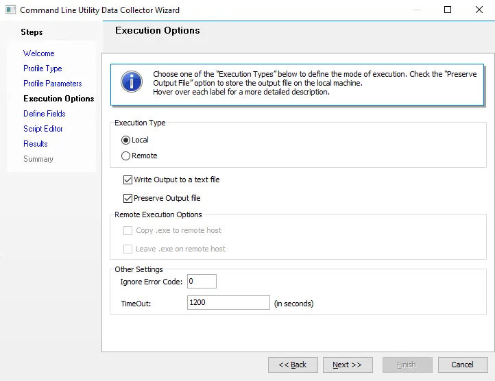

# CLU: Execution Options

The Execution Options page provides options to define the mode of execution. It is a wizard page for the __Edit Profile__ and __Create a New Profile__ selections on the Profile Type page.



The available options on the page vary depending on the selected profile type. The possible options are as follows:

Execution Type

The Execution Type section identifies the mode of execution:

- Local – Execute the utility within the Access Analyzer Console
- Remote – Execute the utility on the target host

Output options

The output options include:

- Write Output to a text file – Writes task output to a text file which is thenprocessed to collect properties
- Preserve Output file – Stores the output file on the local machine
- .Exe Present in Installed CLU Directory – Select the checkbox if the .exe utility is present in the installed CLU directory. The path on the Profile Parameters page should be the utility name instead of the full path. See the [CLU: Profile Parameters](profileparameters.md) topic for additional information.

Remote Execution Options

The Remote Execution Options apply to the Remote mode of execution:

- Copy .exe to remote host – Copies the executable from the local machine to the remote machine before executing it
- Leave .exe on remote host – Keeps the executable on the remote machine after execution

Other Settings

The Other Settings section provides additional options:

- Ignore Error Code – Error code to skip while executing the command line utility using the task scheduler

  - The ```0``` code is always skipped during execution
  - If no error code is required, enter ```0```
- Timeout – Timeout limit in seconds for the task to finish

  - The default value is 1200 seconds, or 20 minutes
