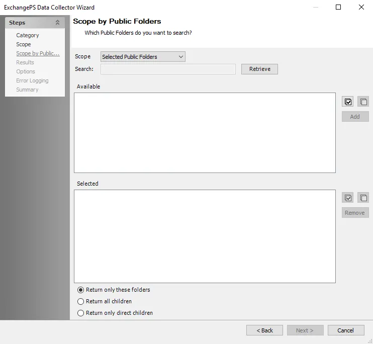
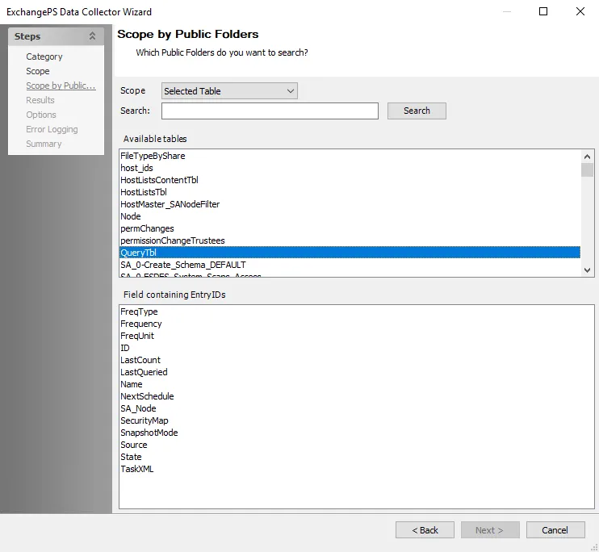

# ExchangePS: Scope by Public Folders

The Scope by Public Folders page is used to define specific public folders to search. This page is
enabled when the **Scope by Public Folder** option is selected on the Scope page. See the
[ExchangePS: Scope](scope.md) topic for additional information.

Configure the **Scope** option using the drop-down. The available options are:

- Selected Public Folder
- Selected Table

The option selected changes how the public folders are identified for scoping.

## Selected Public Folder

The **Selected Public Folders** scope option retrieves all public folders in the Exchange
organization, populating them in the Available list.

The **Search** feature filters this list. Select the desired public folders and click **Add**. The
selected public folders are added to the Selected list. Use the **Remove** option to delete selected
public folders from the list. The Select All or Deselect All buttons can be used for quick
selection. Additional scoping options include:

- Return only these folders – Audits only the selected public folders
- Return all children – Audits the selected public folders and all sub-folders
- Return only direct children – Audits the selected public folders and one folder deeper

## Selected Table

The **Selected Table** scope option populates the Available tables list with tables from the Access
Analyzer database.

The **Search** feature filters this list. Select the table that houses the list of public folders
for which this query will be scoped. The Field containing EntryIDs list is populated with columns
from the selected table. Select the appropriate column from the list.
