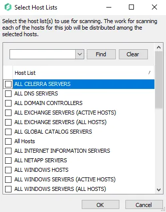

# FSAA: Scan Server Selection

The Scan Server Selection page is where the server that executes the scan is configured. It is a
wizard page for the categories of:

- File System Access/Permission Auditing Scan
- File System Activity Scan
- Sensitive Data Scan

Using the radio buttons, select where the execution of the applet will take place:

- Automatic (Local for NAS device hosts, Remote for Windows hosts) – Applet is deployed to all
  targeted Windows servers. Other targeted devices, for example NAS, are scanned locally by the
  Access Analyzer Console server.

    - The scan identifies Windows servers through the host inventory field OSType

- Local Server – Assigns all scanning to the Access Analyzer Console server
- Specific Remote Server – Assign a specified server for scanning by entering a server name in the
  textbox. This option uses proxy architecture and requires the targeted server to have the File
  System Proxy deployed.

    - See the [File System Proxy Service Installation](../../../install/filesystemproxy/wizard.md)
      topic for additional information

- Specific Remote Servers by Host List – Assign hosts from a custom created host list for scanning.
  This option uses proxy architecture and requires the targeted servers to have the File System
  Proxy deployed

    - See the [File System Proxy Service Installation](../../../install/filesystemproxy/wizard.md)
      topic for additional information

    

- Select Host Lists – Opens the Select Host Lists window displaying all the available hosts to
  choose from. If more than one list is selected, scanning is distributed across each host.

**_RECOMMENDED:_**

It is best practice in global implementations to utilize a specific remote server or proxy scanner
that is located in the same data center as the target hosts. This is particularly beneficial if the
Access Analyzer Console server is in a different data center. See the
[Proxy Scanning Architecture](../../../install/filesystemproxy/overview.md#proxy-scanning-architecture)
topic for additional information.

In the bottom section, the checkbox options affect the execution of the applet:

- Fallback to local mode if applet can't start – If the applet cannot be deployed on the target
  host, it is deployed locally on the same server as the Access Analyzer Console and the scan
  collects data across the network
- Run remote applet with normal priority (non-proxy applet server uses background priority by
  default) – Select this option to run the applet with normal priority. Running at low-priority
  allows other normal priority applications to take precedent over the scan when consuming
  processing power and system resources. Running at low priority allows the scan to run with little
  or no impact on the applet host.
