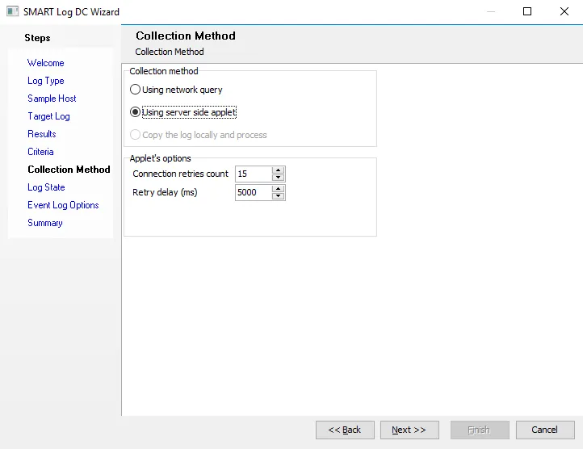

# SMARTLog: Collection Method

The Collection Method page is used to select the collection method employed by the data collector.
It is a wizard page for all log types.

Select the collection method from the following options to set how the collection routine is
executed to collect the data from the target.

- Using network query – Connects to the target log over the network via RPC and reads events
- Using server side applet – Deploys a remote executable to the target host and then runs as a
  process on the target host. It connects to the log, retrieves information, and returns it to the
  Access Analyzer Console.

    **NOTE:** The applet cannot be used to target the local host.

- Copy the log locally and process (Not available for all query scenarios) – Extract events from an
  offline log by moving the log to the Access Analyzer Console and having it processed on the local
  host instead of the target host. In order to use this option, the log type selected for the query
  must be **Windows Event Log (Archived)**.

The Applet Options section is only visible when the **Using server side applet** collection method
is selected.

- Connection retries count – The number of times to retry a failed connection. The default is 15.
- Retry delay (ms) – The time between retries of a failed connection. The default is 5000
  milliseconds (5 seconds).
