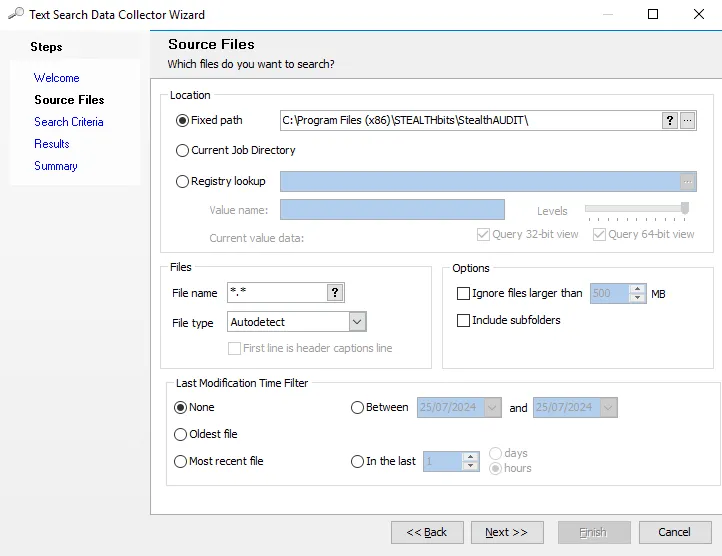
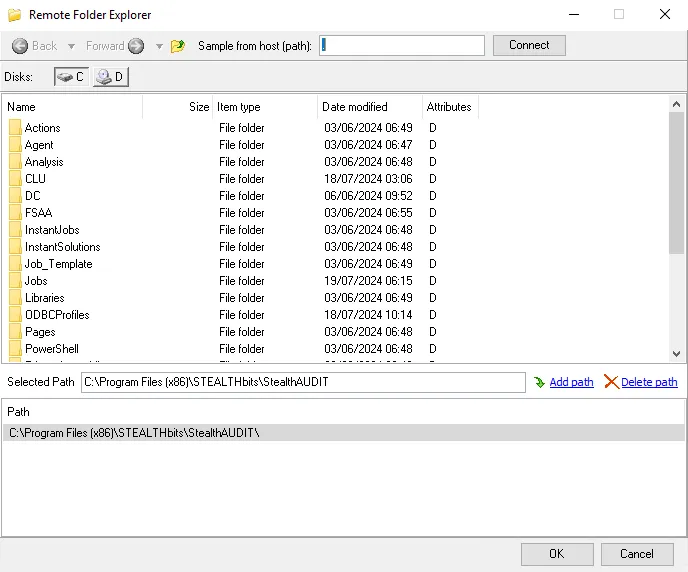

# TextSearch: Source Files

The Source Files page provides options to specify which files to search.



Location

The Location section provides options to scope the search.

- Fixed path – Supply a fixed path or use wildcards and system variables. Fixed paths are typically entered in the following format: ```drive\filepath``` (for example, ```C:\WINNT\System32```). Click the ellipsis to open the Remote Folder Explorer and browse to add file paths to the search scope. See the [Remote Folder Explorer](#remote-folder-explorer) topic for additional information.
- Current Job Directory – Search the job’s root folder for the specified file
- Registry Lookup – Select this option to programmatically obtain a file path from a registry key that exists on the target host in the environment. Click the ellipsis to open the Access Analyzer Registry Browser and connect to a host to select a registry key and path to be used for the lookup.

  - Value Name – This value is automatically populated from the registry key
  - Levels – The Levels slider can be used to truncate the path for the key value in the Adjust Path dialog box
  - Current value data – Displays the current value for the registry key
  - Query 32-bit – Select this checkbox to query a 32-bit view
  - Query 64-bit – Select this checkbox to query a 64-bit view

Files

The Files section provides options to define the object or set of objects to find.

- File name – Enter file names to search in the following format: ```filename.extension```. Separate multiple file names with a semicolon and no spaces between the names. Wild cards can be used.
- File type – Select the extension type of the file name entered above to tell the collection routine how the data within the underlying file is structured and should be handled:

  - Autodetect – Select this when the data type is unknown. The data collection routine will attempt to figure out what type of data it is and handle it appropriately.
  - Plain Text
  - CSV
  - TSV
  - Binary
  - Space Separated Text
- First line is header captions line – Enabled when CSV, TSV, or Space Separated Text is selected

Options

The Options section provides options to scope the search.

- Ignore files larger than [number]MB
- Include subfolders

Last Modification Time Filter

The Last Modification Time Filter section provides options to apply time filters to the search.

- None
- Oldest file
- Most recent file
- Between [date] and [date]
- In the last [number] [days] or [hours]

## Remote Folder Explorer

Clicking the ellipsis in the Location section of the Source Files page opens the Remote Folder Explorer search window. In the Remote Folder Explorer window, navigate to the file folder location and add the path to the scope. Multiple paths can be added to the scope.



The Remote Folder Explorer functions are:

- Sample from host (path) – If the desired file does not exist on the local Access Analyzer Console, enter the name of the host that contains the file and click __Connect__ to browse that host
- Selected Path – Displays the path selected in the box above
- Add path – Click __Add path__ to add the selected path to the Path box. This adds the path to the search scope.
- Delete path – Select a path in the Path box and click __Delete path__ to delete the path from the search scope
- Path – Displays the paths that have been added to the search scope
