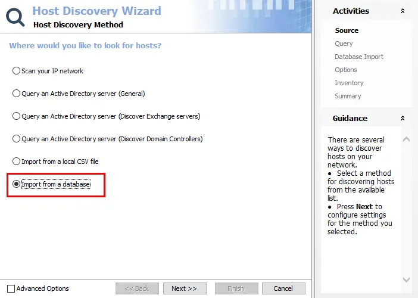
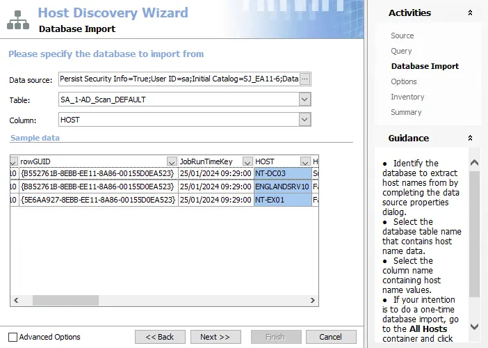
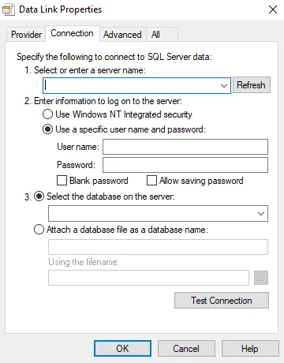
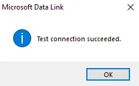
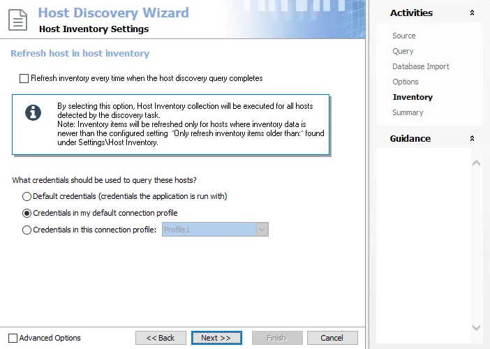

# Import From a Database

Follow the steps to create a Host Discovery query using the **Import from a database** source
option.

**CAUTION:** Each time a query refresh occurs for a query with an import option set as the source,
it re-imports the host list. Therefore, deleting, renaming, or moving the import source file causes
the query to fail.

**Step 1 –** Open the Host Discovery Wizard. On the Source page, select the **Import from a
database** option. Click **Next**.

**Step 2 –** On the Query page, name the query and select the credentials used to access the source.

- Query Name – Provide a unique descriptive name for this query by typing over the `NEWQUERY`
  default name. Two queries cannot have the same name. If you use an existing name, a number is
  automatically appended to the query name, for example `NEWQUERY` becomes `NEWQUERY1`.
- Credentials – Select a Connection Profile. These credentials require the appropriate permissions
  for querying the source:

    - Default credentials (credentials the application is run with) – Applies the credentials used
      to launch the Access Analyzer application
    - Credentials in my default connection profile – Applies the default Connection Profile
      configured at the global level (**Settings** > **Connection**)
    - Credentials in this connection profile – Use the dropdown list to select a Connection Profile
      from those preconfigured at the global level (**Settings** > **Connection**)

    See the [Connection](../../settings/connection/overview.md) topic for additional information on
    Connection Profiles.

Click **Next** to continue.

**Step 3 –** On the Database Import page, identify the database, table, and column where the host
names are located:

- Data source – Identify the database. Click the ellipsis (**…**) to open the Data Link Properties
  window. Then provide the required information on the Connection tab.

    

    - Server name – Use the drop-down menu to select the server. The **Refresh** button refreshes
      the list of available servers.
    - Credentials – Select the credentials to use to log on to the server:

        - Use Windows NT Integrated security – This option applies the credentials used to run the
          Access Analyzer application
        - Use a specific user name and password – Provide the user name and password and select the
          **Allow saving password** option
        - If selected, the **Blank password** option indicates that no password is required

        

    - Click **Test Connection** to confirm a connection has been established. Click **OK** on the
      confirmation window.
    - Database – Select the **Select the database on the server** option and use the drop-down menu
      to select the database
    - The other tabs in the Data Link Properties window should not be modified

        - Provider tab – The database connector, dictated by the source of the data and the data
          sources that are available on the Access Analyzer Console server. This is set by default
          to the **Microsoft OLE DB Provider for SQL Server**.
        - Advanced tab – Allows modifications of the connection timeout to the database server in
          case the server is slow or far away
        - All tab – Do not modify this tab

    - Click **OK** to close the Data Link Properties window

- Table – Use the drop-down menu to select a table from the database
- Column – Use the drop-down menu to select the column where the host names are located. The
  selection is highlighted in the Sample data box.
- Sample data Box – Displays a preview of the selected database table

Click **Next** to continue.

**Step 4 –** On the Options page, configure the query options as required.

- Run the query when jobs that reference it are run – Select this option to automatically execute
  the Host Discovery query prior to executing a job that has the host list generated by this query
  assigned. This ensures any new hosts have been discovered and are available for auditing.

    **_RECOMMENDED:_** Use this setting only for host lists tied to specific jobs that require
    up-to-date host lists.

- Query Result Retention – Select how to maintain the host list generated by this discovery query:

    - Yes, grow the host list by appending newly discovered hosts – The host list includes every
      host the query has ever discovered
    - No, only show hosts that were found during the most recent run – The host list generated by
      this query includes only hosts found in the most recent query execution. This option removes
      hosts from the generated host list, but does not remove hosts from the Host Master Table.

Click **Next** to continue.

**Step 5 –** On the Inventory page, the host inventory process can be automatically included with
the discovery query.

- Refresh inventory every time when the host discovery query completes – Automates the host
  inventory process and is dependent on the **Settings** > **Host Inventory** node configuration for
  the age of previously inventoried records. Leaving this option deselected applies the global
  settings for host inventory.
- Credentials – Select a Connection Profile. These credentials require the appropriate permissions
  for gathering inventory information from the discovered hosts:

    - Default credentials (credentials the application is run with) – Applies the credentials used
      to launch the Access Analyzer application
    - Credentials in my default connection profile – Applies the default Connection Profile
      configured at the global level (**Settings** > **Connection**)
    - Credentials in this connection profile – Use the dropdown list to select a Connection Profile
      from those preconfigured at the global level (**Settings** > **Connection**)

    See the [Connection](../../settings/connection/overview.md) topic for additional information on
    Connection Profiles.

Click **Next** to continue.

**Step 6 –** The Summary page displays all the selected query configuration settings. To make
changes, click **Back** to navigate to the relevant wizard page. Click Finish to complete the
configuration process.

**Step 7 –** A Confirm dialog box opens. Click **Yes** to run the query now or **No** to run the
query at another time.

Both options close the Host Discovery Wizard and return to the Host Discovery Queries view on the
Host Discovery node. If **Yes** is selected, the **Query State** indicates the running query.
