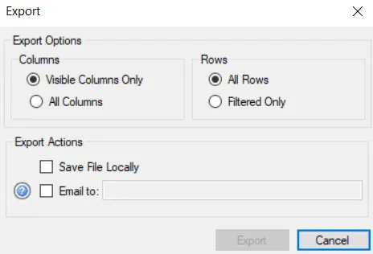
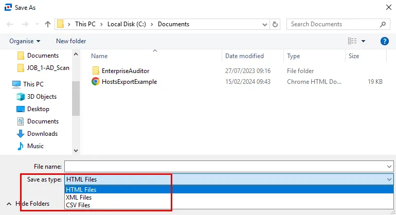
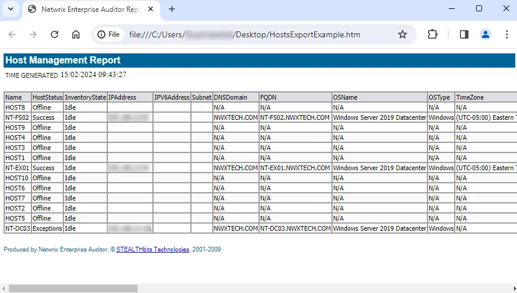

# Export Data

Use the __Export Data__ option to export all information available in the current grid view for the selected host list to a HTML, XML , or CSV file. Follow the steps to export data.

__Step 1 –__ Select the Host Management or individual host list node to export data from, and configure the data grid to contain all the columns you want to export. See the [Host Inventory Data Grid](../datagrid.md) topic for additional information.

__Step 2 –__ When the data grid contains all columns desired for export, click __Export Data__. A Save As window opens.

__Step 3 –__ On the Save As window, select the required format (HTML Files, XML Files, or CSV Files) and provide a name and location for the export file.

This export is now shareable. Unlike the [View/Edit Host](viewhost.md) export option, this file will be in the same format as the data grid.

## Export Examples

The following examples show the different export format options.

Example HTML File Export

Example XML File Export

Example CSV File Export

