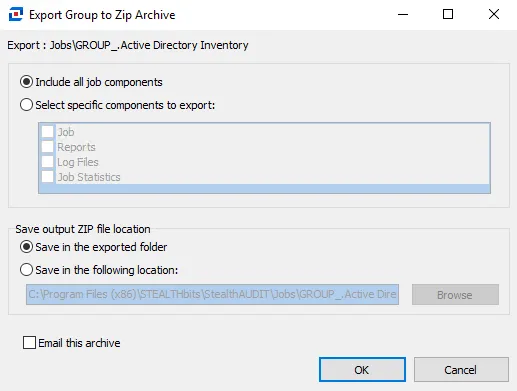
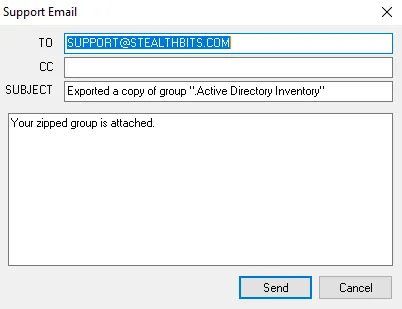
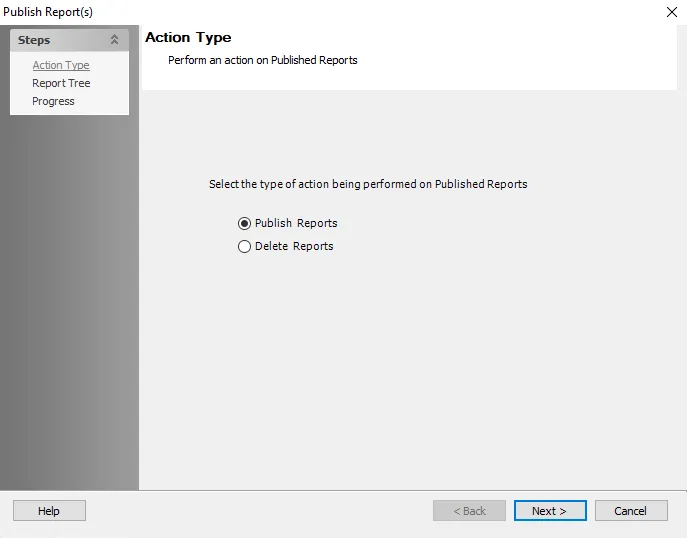
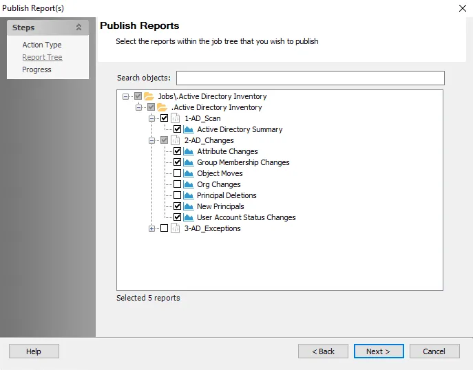

# Special Features & Functions

There are several special features and functions available for jobs and job components with which Access Analyzer users should be familiar.

View XML Files

Job, query, analysis, and action property windows all have the __View XML__ option. These provide the ability to edit through an XML text window.

Open Explore Folder

Access Analyzer users can directly open a selected job or job group folder from the Jobs tree using the __Explore Folder__ option in the right-click menu.

Publish Reports after Report Generation

Reports that have been generated but not published can be sent to the Web Console using the __Publish__ option in the right-click menu from the selected Jobs tree, job group, or job node. See the [Publish Reports Window](#publish-reports-window) topic for additional information.

Job Configuration Change Tracking

Jobs configuration changes can be tracked using the __Changes__ option in the right-click menu from the selected Jobs tree, job group, or job node. See the [Changes Window](overview.md#changes-window) topic for additional information.

Job Export

Jobs can be exported to a ZIP file using the __Export__ option in the right-click menu from the selected job group or job node. See the [Export Job to Zip Archive Window](#export-job-to-zip-archive-window) topic for additional information.

See the [Jobs Tree Right-click Menus](../navigate/pane.md#jobs-tree-right-click-menus) section for additional features.

## Export Job to Zip Archive Window

The Export Job to Zip Archive window opens from the __Export__ option in the right-click menu from the selected job group or job node.


Select __Export__ from the right-click menu to open the Export Group to Zip Archive window.



The __Include all job components__ option will zip the job’s directory, the reports, the job log, and the SA_Debug log. The __Select specific components to export__ option allows Access Analyzer users to select which components to include in the ZIP file.

There are two options for where to save the ZIP file:

- Save in the exported folder – Saves the file in the job’s directory, for example ```%sainstalldir%Jobs\GROUP_.Active Directory Inventory\.Active Directory Inventory.zip```
- Save in the following location – Allows you to either type or browse to the desired save location

The __Email this archive__checkbox provides the opportunity to send an email notification with the attached ZIP file.



When the archive has been created, the Access Analyzer Support Email window opens. By default, the recipient is set to [Netwrix Support](https://www.netwrix.com/support.html) but it can be modified prior to sending. Additional recipients can be added, and the Subject and email body can be modified.

## Publish Reports Window

The __Publish Reports__ wizard allows you to better manage the list of reports published to the Web Console.

When you right-click on a job group or job and select __Publish__, the Publish Reports wizard opens. You can choose the list of reports to be published or removed from the Web Console.

Follow the steps to publish the reports.

__Step 1 –__ Right-click on a job group or job and select __Publish__ from the drop-down list.



__Step 2 –__ On the Action Type page, select the type of action to be performed on the reports and click __Next__:

- Publish Reports
- Delete Reports



__Step 3 –__ On the Report Tree page, select the reports to be published or removed (depending on the Action Type selected in the previous step). Click __Next__ to proceed with the action.

__Step 4 –__ The Progress page shows you the status of the action. When it has completed, click __Finish__ to exit the wizard.

Published reports can be viewed under the __[Job]__ > __Results__ node or through the Web Console. See the [Reporting](../report/overview.md) topic for additional information.
