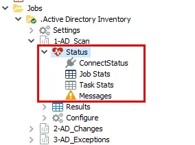

# Status Node

Once a job has been executed, it always generates the tables providing information on host
connection status, job statistics, job task statistics, and error and warning messages can be viewed
under the job’s Status node:

The Status node tables are:

- ConnectStatus table – Lists all hosts queried during job execution and the access status of the
  scan, unless the System Default is being used
- Job Stats table – Provides information on the selected job’s runtime details, according to the
  global configuration set in the **Settings** > **Application** node. By default, this is set to
  not filter the data.
- Task Stats table – Provides information for each task run during job execution, according to the
  global configuration set in the **Settings** > **Application** node. By default, this is set to
  filter to the most recent data.

    **NOTE:** The Job Statistics Retention settings in the **Settings** > **Application** node
    control how long the job statistics history is kept in the database and displayed Job Stats and
    Task Stats tables. See the [Application](../../settings/application/overview.md) topic for
    additional information.

- Messages table – Provides a list of any warning or error messages that occurred during the
  execution of the job. For example, a frequently generated message is
  `WARNING: No Host found for processing`.

    - If this message is generated by an analysis or reporting job, then there is no problem as that
      type of job does not need a host list assigned
    - However, if this message is generated by a job running a data collection query, this warning
      would explain why the native data table is empty
