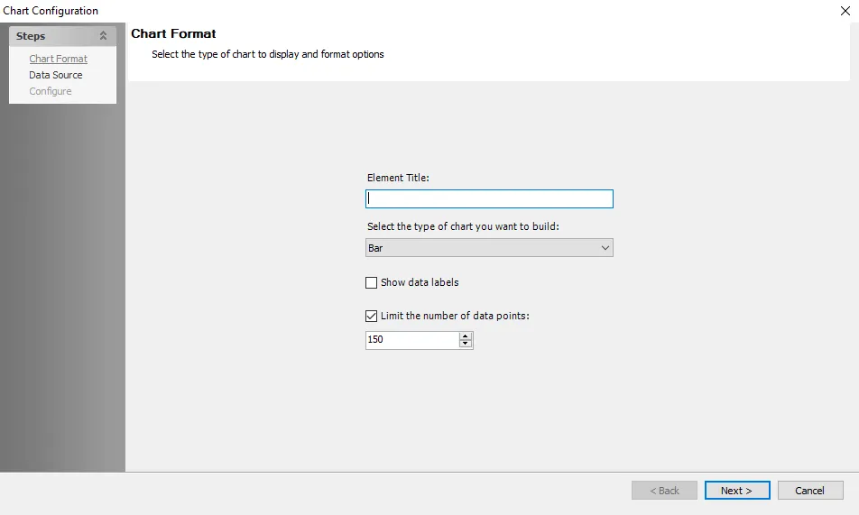

# Chart Format

The Chart Format page of the Chart Configuration wizard is where you can select the chart type and configure additional format options.

The Chart Format page has the following options:

- Element Title – Enter a title for the element in the text box. This will be displayed in the element's header on the generated report. It can contain characters, numbers, or both.
- Select the type of chart you want to build – Select the chart type using the dropdown from the following options:

  - Area – Shaded region beneath line to indicate a group’s proportion within a column
  - Bar – Horizontal rectangles that represent discrete units of measurement
  - Column – Vertical bar chart
  - Line – Vertical line chart
  - Pie – Circular statistical graphic that demonstrates numerical proportion. First grouped column can be numeric or string, but the second column should always be numeric.
  - Stacked – Consolidated bar chart for comparing values
- Show Data Labels – Select this option to show data labels on the generated chart
- Limit the number of data points – Select this option to limit the number of data points displayed on the chart to the specified number. The default limit value is 20 for pie charts and 150 for all other chart types. You can customize this value, but the value must not exceed the default value for the chart type. If a value greater than the default is entered, then the value automatically resets back to the default.

Once you have configured the options as required, click __Next__ to proceed to the Data Source page. See the [Data Source](datasource.md) topic for additional information.
