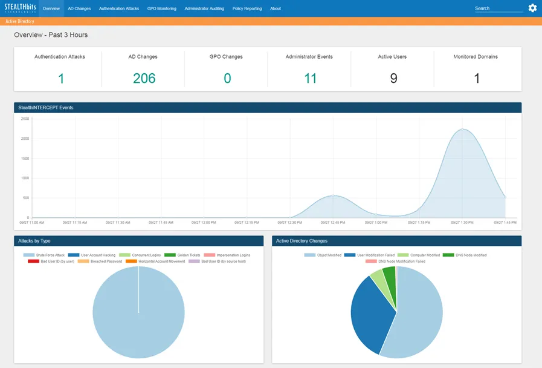
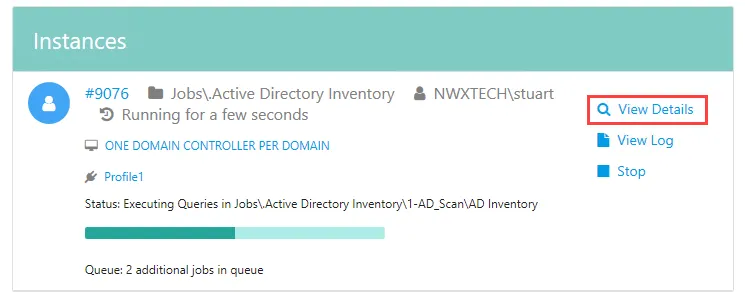
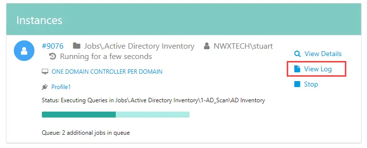
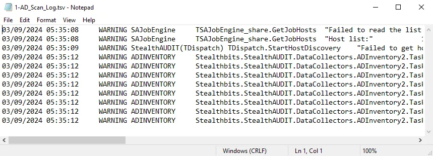
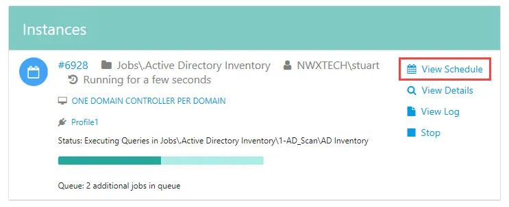
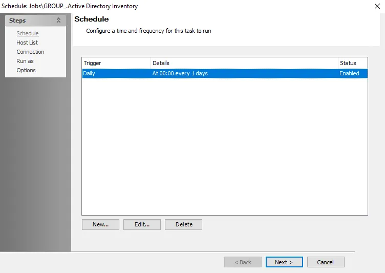

# Running Instances Node

The Running Instances node displays progress for all running jobs. This includes jobs that are run by a scheduled task, interactively within the open Access Analyzer instance, or interactively in any other running instance of Access Analyzer. The Running Instances node displays the instance name, its status and position in the queue, run times for all instances, and detailed views of each instance.

This is the primary view of the Running Instances node that displays the progress of all jobs running.

## Overview

The Overview page displays information about all running jobs on the current server.

For each instance this screen provides :

- Job path
- Credential used
- Running time of the job
- Status of the running job
- Number of jobs scheduled in queue

It also has hyperlinks for:

- Process ID
- Host Name
- Connection Profile
- View Details
- View Log
- Stop
- View Schedule

Clicking on any of the hyperlinks displays more information about the running job. The __ProcessID__, __View Details, View Log__, and __Stop__ links only work while the job is running. Once the job is complete, these links are disabled. The host and Connection Profile links continue to work. The __View Schedule__ link only displays and is valid for jobs that are running via a scheduled task and is not enabled for interactive job executions.

The number of jobs currently being run can be found in the lower-left-hand corner of the Access Analyzer Console.

## View Host

This view identifies the host list associated with the running job.

Click the host list link to display the hosts assigned to the running job.

This view displays the host list table with host inventory data.

## Process ID

The Process ID correlates to the Process ID of the running instance of Access Analyzer in Task Manager. In addition, the Process ID comes coupled with the file path of associated scheduled tasks, an identifier for the account running the current instance of Access Analyzer, and a timestamp for the length of the instance.

Click the Process ID link for additional details of the job status and queue.

The Process ID link displays a page with three tabs of information with details about the running job. See the [Running Job Details](jobdetails.md) topic for additional information.

## View Details

Additional details on the status of the tasks the job is running are available.

Click the __View Details__ link to display additional details of the job status and queue.

The View Details link opens the running job's details with three tabs of information. See the [Running Job Details](jobdetails.md) topic for additional information.

## View Log

The log for this running job can be opened in a text editor, such as Notepad.

Click __View Log__ to display the current job log. The View Log link is only enabled while a job is running.

The Log displays such details as errors, aborts, and terminations.

## View Schedule

The Access Analyzer Console can only run one job at a time. However, with the Schedule Service Account, the StealthAUDIT application can run multiple jobs simultaneously via Windows Task Scheduler.

Click the __View Schedule__ link to display the corresponding Scheduled Task for the running job or job group. This link is only enabled for jobs that are running via scheduled task and will not be enabled for interactive job executions.

The Schedule wizard for the running task opens. See the [Schedule Wizard](../schedule/wizard.md) topic for additional information.

## Stop

The job execution can be stopped if needed.

Click __Stop__ to abort all instances in the job queue. This link is only enabled while a job is running.
