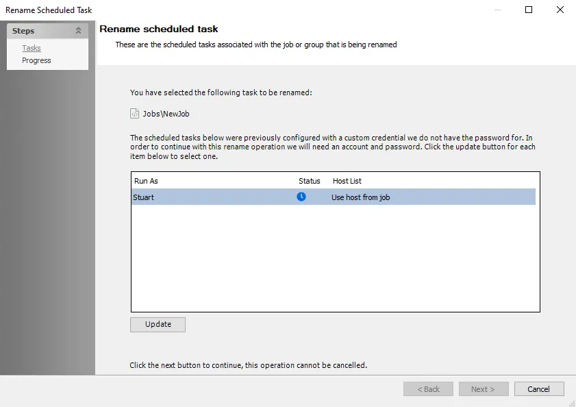
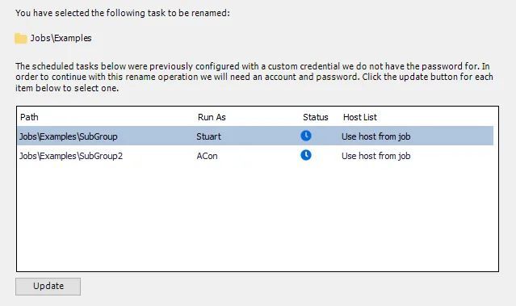
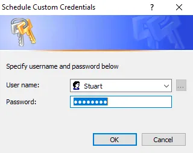
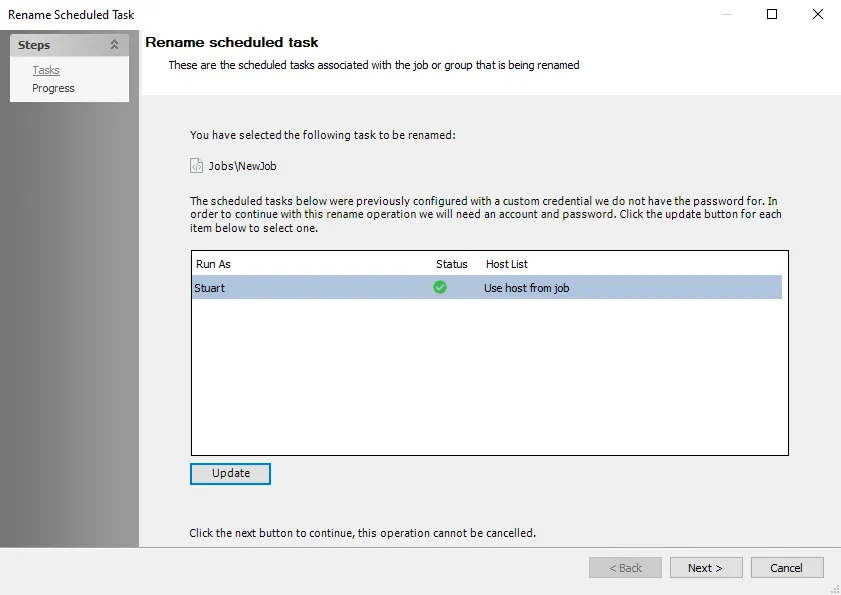
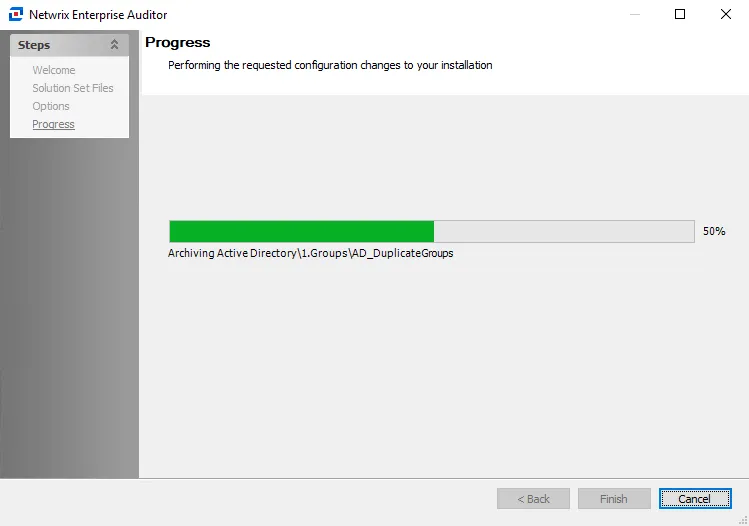

# Rename Scheduled Task Wizard

If a scheduled task has custom credentials set, then the Rename Scheduled Task wizard displays when
renaming the associated job, job group, inventory query, or discovery query. The wizard forces you
to provide the credentials needed for the scheduled task, so that the task is still able to run
after it has been renamed. Custom credentials are configured on the Run as page of the Schedule
wizard. See the [Run As](wizard.md#run-as) topic for additional information.

If a scheduled task does not contain custom credentials, then the job, job group, inventory query,
or discovery query can be renamed and the scheduled task is automatically renamed without requiring
the wizard.

Follow the steps to update the credential for a scheduled task.

**Step 1 –** The Rename Scheduled Task wizard opens on the Tasks page , which displays the task that
is to be renamed and a table containing the credentials that need updating. The table shows you the
account the task is set to run as, the status as a blue clock icon to indicate it is waiting for
credential, and the host list set in the scheduled task. Select the account to provide credentials
for and click **Update**.

- If you are renaming a group that has sub-groups that use custom credentials, then the wizard
  displays these accounts even if the parent group does not use custom credentials. For sub-groups,
  the table additionally shows the path to the sub-group, and only the sub-groups that have custom
  credentials set are displayed in the wizard. If there are multiple groups requiring credentials,
  then all of them must be updated.
- For discovery queries that also have an Inventory query scheduled task created through the Host
  Management node, the wizard displays if either of the two scheduled tasks uses custom credentials

**Step 2 –** On the Set Account window, click **Change User**.

**Step 3 –** On the Schedule Custom Credentials window, reenter the Password for the selected user,
and Click **OK**. Then, click **OK** again on the Set Account window. The Status icon updates to a
green checkmark to indicate the credential has been provided.

**Step 4 –** Repeat Steps 1 to 3 for each credential that needs updating. Once all the credentials
show a green checkmark, click **Next**.

**NOTE:** At this stage you can click **Cancel** to close the wizard and the task will not be
renamed.

**Step 5 –** The Progress page shows a progress bar and message. Once the scheduled tasks have been
renamed successfully, click **Finish** to close the wizard.

The scheduled tasks have now been renamed and will run as before . The modified task name shows in
the Jobs tree, Host Management, or Host Discovery node, the Scheduled Actions grid, and in the
corresponding task's argument in the Windows Task Scheduler.
