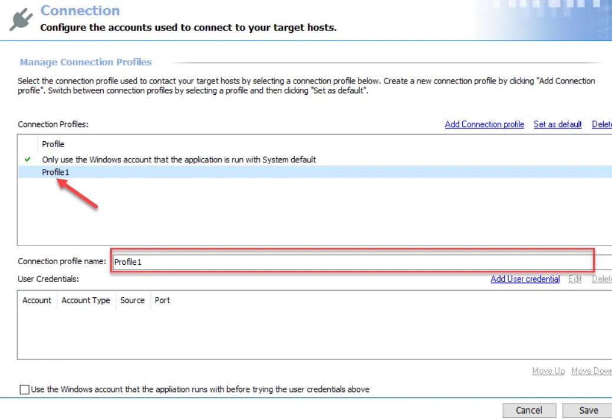
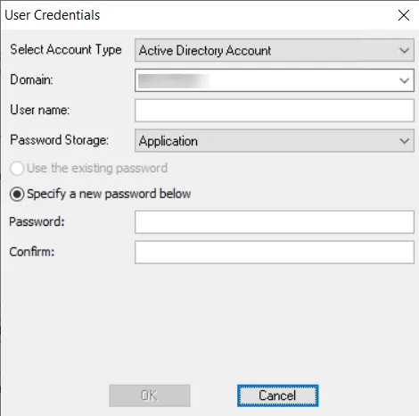
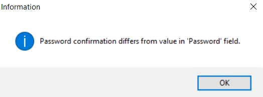
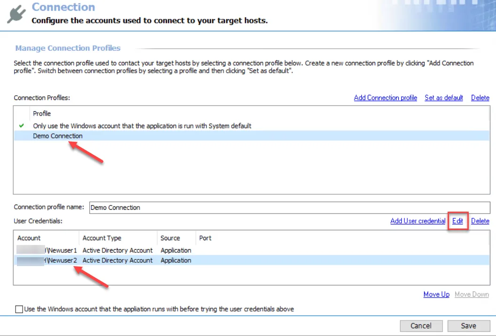
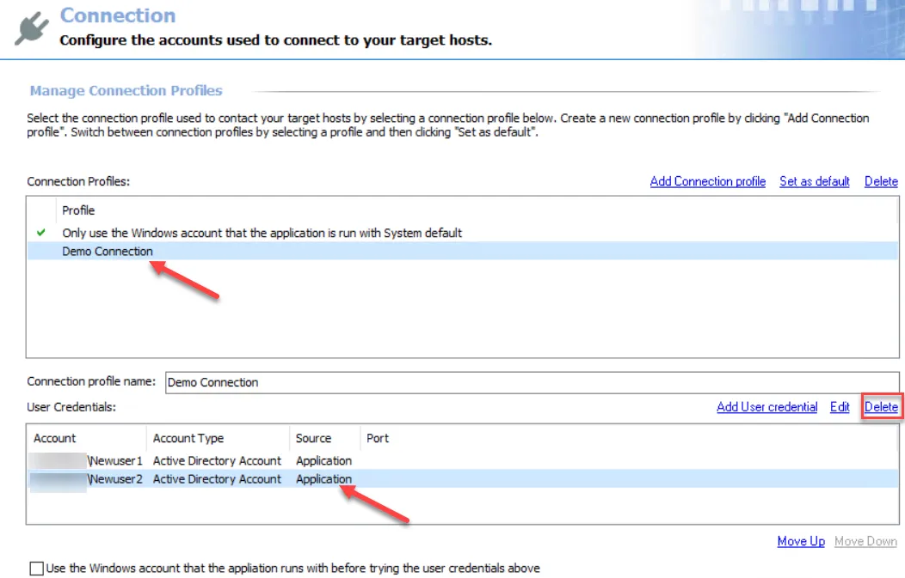
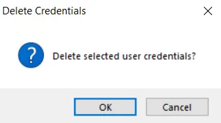
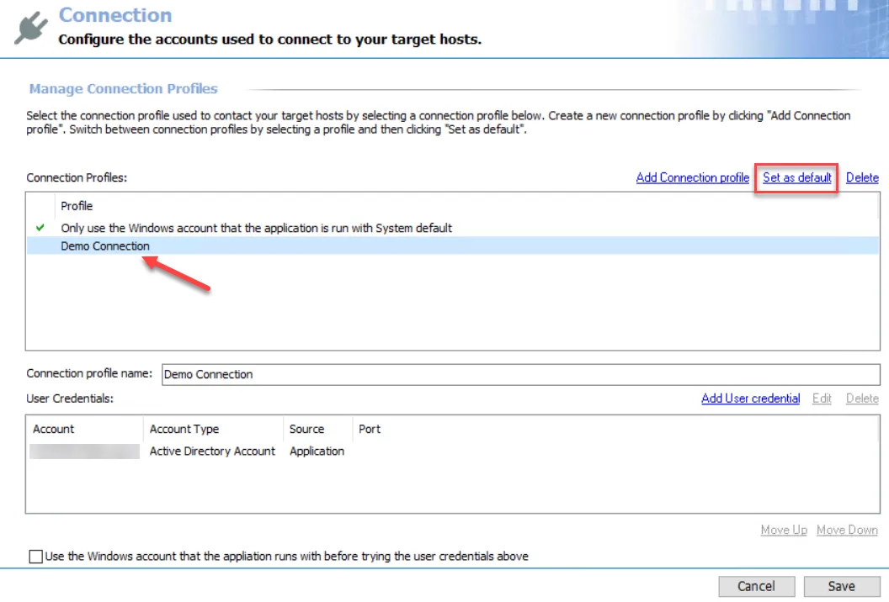
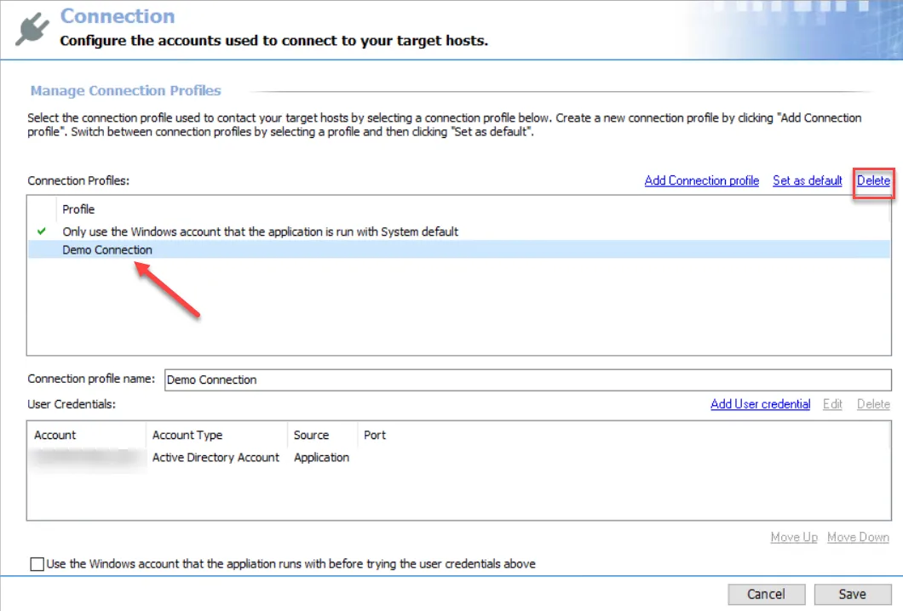

# Create a Connection Profile

Follow the steps to create a Connection Profile.

__Step 1 –__ Click Add Connection profile at the top of the Connection view.

__Step 2 –__ A new profile displays in the list with a generic name. Provide a unique, descriptive name in the Connection profile name textbox.

__NOTE:__ A good profile name should be chosen so that it does not need to be changed at a later time. If the profile name is changed after being applied to job groups or jobs, it requires the user to go back through all of those job groups or jobs and re-apply the Connection Profile.

__Step 3 –__ Now it is time to add credentials to this profile. Click Add User credential and the User Credentials window opens.

__Step 4 –__ The window options change according to the value for the Selected Account Type field. Select the appropriate account type and then provide the required information. The account types are:

- [Active Directory Account for User Credentials ](activedirectory.md)
- [Local Windows Account for User Credentials](localwindows.md)
- [Unix Account for User Credentials](unix.md)
- [SQL Authentication for User Credentials](sql.md)
- [Task for User Credentials](task.md)
- [Azure Active Directory for User Credentials](entraid.md)
- [Dropbox for User Credentials](dropbox.md)
- [Web Services (JWT) for User Credentials](webservices.md)
- [Oracle for User Credentials](oracle.md)
- [Exchange Modern Authentication for User Credentials](exchangemodernauth.md)

See the individual account type sections for information on the fields. Then click OK.

__NOTE:__ If the entered passwords are not the same, an error message will pop-up after clicking OK on the User Credentials window. Click OK on the error message and re-type the passwords.

__Step 5 –__ Repeat Steps 3-4 until the User Credentials list for this profile is complete.

When Access Analyzer authenticates to a target host, it looks at the value of the WindowsDomain field in the Host Inventory for the target host. It then matches the first credential in the Connection Profile which matches that domain. If authentication fails, it moves consecutively through the User Credentials list. It will first match to all credentials listed for target host’s domain, and then proceed through all other credentials until authentication is successful or there are no more credentials to try.

___RECOMMENDED:___ Limit the User Credentials list to a minimal number per profile, especially when considering that a successful authentication does not automatically mean that particular credential has the appropriate level of permissions in order for the data collection to occur.

There are Move Up and Move Down buttons for arranging priority within the User Credentials list.

__Step 6 –__ (Optional): At the bottom of the Connection view, is the Use the Windows account that Access Analyzer runs with before trying the user credentials above option. This option is per Connection Profile. If checked, Access Analyzer applies the local login credentials prior to any of the credentials saved to the Connection Profile.

__NOTE:__ If a data collector utilizes an applet, this option must be unchecked.

__Step 7 –__ When the user credentials have been added and ordered, click Save and then OK to confirm the changes to the Connection Profile.

The new Connection Profile is now visible in the Profile list and available for use at the job group or job level.

## Edit User Credentials within a Connection Profile

Follow the steps to edit user credentials within a Connection Profile.

__Step 1 –__ Select the Connection Profile to be modified from the Profile list. Remember, changing the Connection Profile name results in breaking job groups or jobs that are assigned this profile.

__Step 2 –__ Select the user credential to be edited from the User Credentials list. Click Edit.

__Step 3 –__ Modify the information in the User Credentials window. For the password, choose between the Use the existing password option or the Specify a new password below option. Click OK.

__Step 4 –__ When the Connection Profile’s user credentials have been edited as desired, click Save and then OK to confirm the changes to the Connection Profile.

The edited user credentials are now used for authentication to target hosts for this Connection Profile.

## Delete a User Credential from a Connection Profile

Follow the steps to delete a user credential from a Connection Profile.

__Step 1 –__ Select the Connection Profile to be modified from the Profile list. Remember, changing the Connection Profile name results in breaking job groups or jobs that are assigned this profile.

__Step 2 –__ Select the user credential to be edited from the User Credentials list. Click Delete.

__Step 3 –__ Click OK to confirm the deletion.

__Step 4 –__ The selected credential is no longer visible in the User Credentials list. Click Save and then OK to confirm the changes to the Connection Profile.

The deleted user credentials are no longer available for authentication to target hosts for this Connection Profile.

## Set a Default Connection Profile

The default profile is marked with the green checkmark.

Follow the steps to set a new default Connection Profile.

__Step 1 –__ Select the desired profile in the Connection Profile list and click Set as default.

__Step 2 –__ The green checkmark moves. Click Save and then OK to confirm the changes.

This Connection Profile is now used as the default Connection Profile.

## Delete a Connection Profile

Follow the steps to delete a Connection Profile.

__Step 1 –__ Select the profile from the Connection Profile list and click Delete.

__Step 2 –__ Click OK to confirm the deletion.

__Step 3 –__ The selected profile is no longer visible in the Connection Profiles list. Click Save and then OK to confirm the changes.

The deleted Connection Profile is no longer available for authentication to target hosts.
