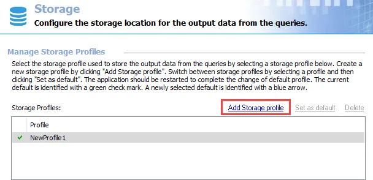
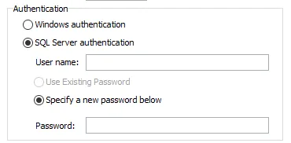
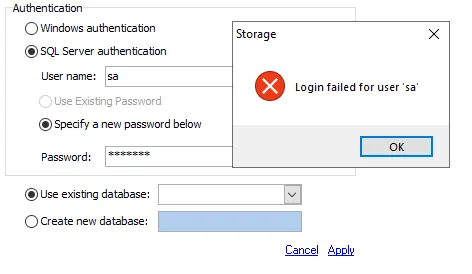
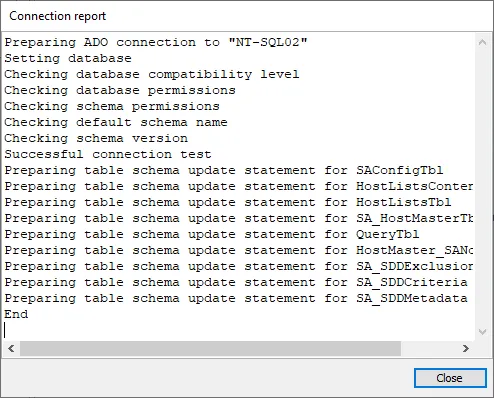

# Add a Storage Profile

Follow the steps to create a Storage Profile.



__Step 1 –__ Click __Add Storage profile__ at the top of the Storage view.


__Step 2 –__ A new profile line appears in the Storage Profiles list with a generic name. Change the Profile name to a unique and descriptive name.


__Step 3 –__ Type the SQL __Server name__ in the textbox provided. This can be a NetBIOS name, a fully qualified domain name, or an IP Address. If the SQL Server specified is configured to use a named instance, provide the __Instance name__ in the next textbox.


__Step 4 –__ Specify the time in minutes that must expire before Access Analyzer halts any SQL queries running for that amount of time.



__Step 5 –__ Select the radio button for the appropriate authentication mode. If using __SQL Server authentication__ , provide a __User name__ and __Password__ in the textboxes.

___RECOMMENDED:___ When possible, use Windows Authentication. Windows Authentication is more secure than SQL Server Authentication. See the Microsoft [Choose an authentication mode](https://learn.microsoft.com/en-us/sql/relational-databases/security/choose-an-authentication-mode) article for additional information.

|  |  |
| --- | --- |
| Good Connection Test | Bad Connection Test |

__Step 6 –__ It is recommended to test the credentials provided at this point. The radio button for __Use existing database__ should be selected by default. Test the SQL Server connection by clicking the drop-down arrow for an existing database. If the connection is established, a listing of databases appears. If the connection cannot be established, an error warning displays.


__Step 7 –__ Set the database through one of the following options:

- Use existing database – Click this radio button and select a database from this list provided in the drop-down menu
- Create new database – Click this radio button and provide a unique, descriptive name in the textbox



__Step 8 –__ Click __Apply__ and a Connection report window opens. The Connection report checks for the appropriate permissions and lists any that are missing. If no permissions are present, an error message appears in the Connection report window. When there is a ```Successful connection test```, click __Close__.

__Step 9 –__ If __Create new database__ was selected, the new database now exists. If __Use existing database__ was selected, the Storage Profile is now linked to the database. Click __Save__ and then __OK__ to complete the creation of the new Storage Profile.

The new Storage Profile is available to be used by Access Analyzer.
