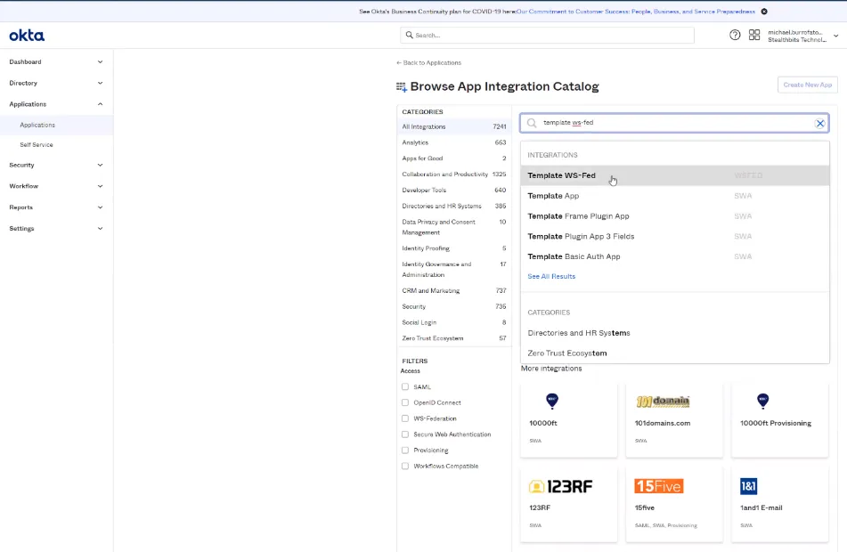
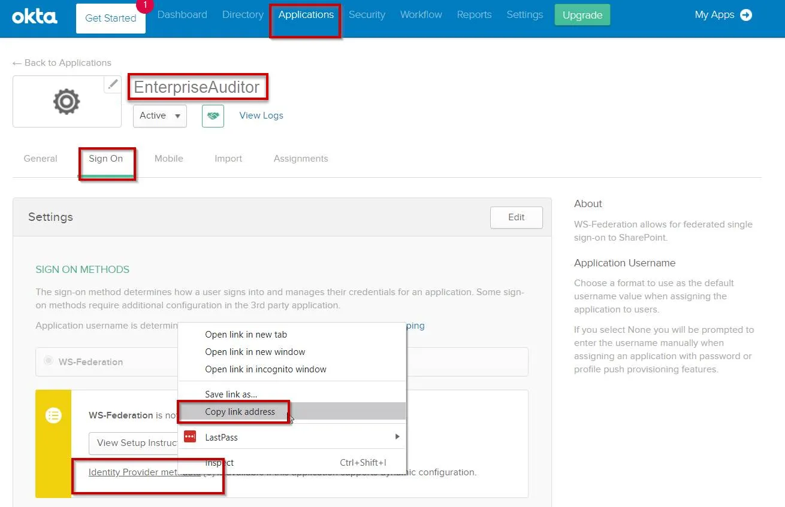
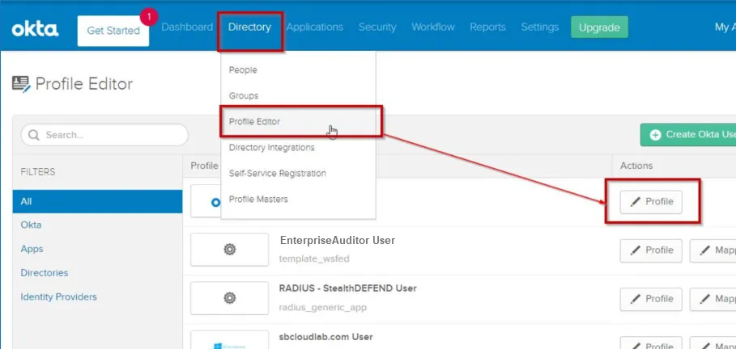
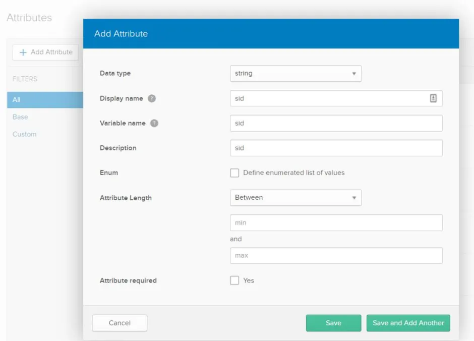
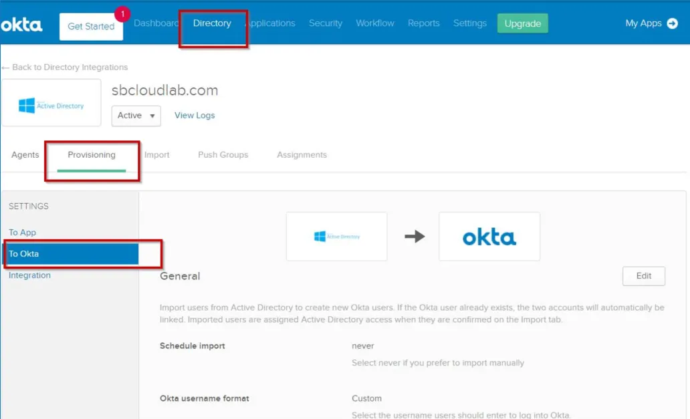
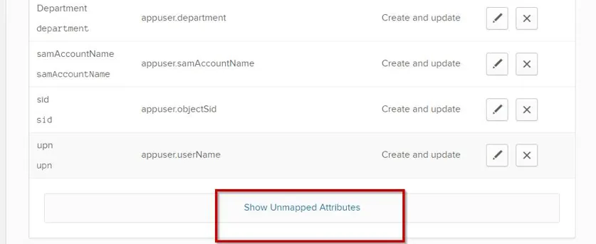
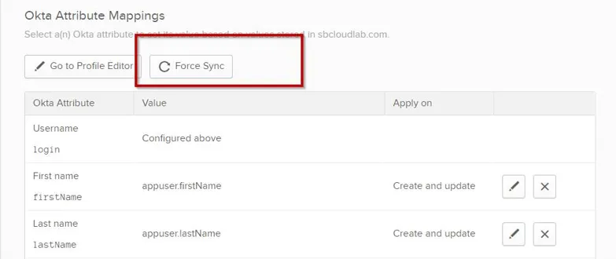
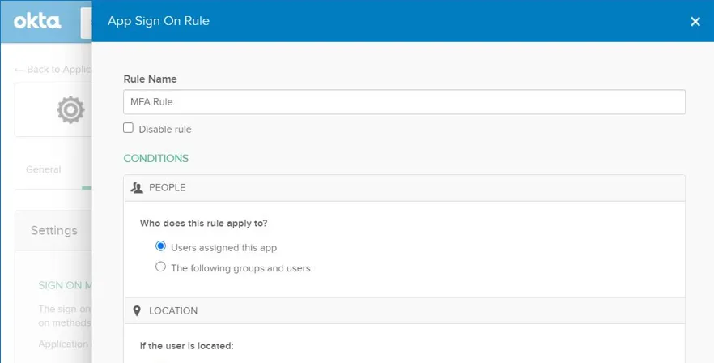
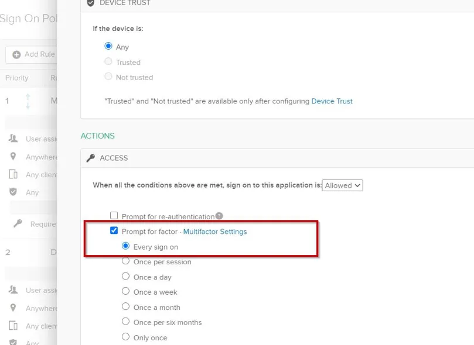

# Creating an Application and Attributes in Okta

Create an Access Analyzer Application in Okta Using the WS-Fed Template

Follow the steps to create an Access Analyzer Application in Okta Using the WS-Fed Template:

__Step 1 –__ Log in to Okta.

__Step 2 –__ In the left-pane menu, expand __Applications__ and then click __Applications__.

__Step 3 –__ Click __Create App Integration__.



__Step 4 –__ Browse the App Integration Catalog and select __Template WS-Fed__.

__Step 5 –__ Click __Create__. Name the application Access Analyzer.

Retrieve the Values to Paste into the Access Analyzer WebServer.exe.config File



__Step 1 –__ In the Access Analyzer application, click the __Sign On__ tab.

__Step 2 –__ Right click on the __Identity Provider metadata__ link and select __Copy Link Address__ to get the value for the WSFederationMetadata URL.

<add key="WsFederationMetadata" value="INSERT URL HERE" />

__Step 3 –__ Click on the General tab to copy the value for the __Realm__. This value will be unique per tenant.

`https://www.okta.com/<YOURVALUEHERE>`

__Step 4 –__ Construct the ReplytoURL using the FQDN of your Access Analyzer server:

https://FQDNofEnterpriseAuditorserver.com:8082/federation

Edit the WebServer.exe.config File

Follow the steps to edit the __WebServer.exe.config__ file:

__Step 1 –__ Open the __WebServer.exe.config__ file with a text editor, such as Notepad++. It is located in the Web folder within the Access Analyzer installation.

__Step 2 –__ Change the value for the ```BindingUrl``` parameter from ```http``` to ```https```:

```
<add key="BindingUrl" value="https://+:8082" />
```


__Step 3 –__ Update the following values in the __WebServer.exe.config__ file with the values retrieved from the Access Analyzer Okta application.

__CAUTION:__ These values are case sensitive. The values used here must match the values in the Access Analyzer Okta application.

- ```WSFederationMetadata``` – Paste the copied link address into the __WebServer.exe.config__ file as:

  ```
  <add key="WsFederationMetadata" value="INSERT URL HERE" />
  ```

- ```WSFederationRealm``` – Paste the value for the Realm into the __WebServer.exe.config__ file as:

  ```
  <add key="WsFederationRealm" value="INSERT URL HERE" />
  ```

- ```WSFederationReply``` – Enter the value for the WSFederationReply based on the FQDN of the Access Analyzer server and port into the __Webserver.exe.config__ file as:

  ```
  <add key="WsFederationMetadata" value="INSERT URL HERE" />
  ```

__Step 4 –__ Restart the Access Analyzer Web Server.

Configure the App Settings for the StealthAUDIT Application

__Step 1 –__ In the Access Analyzer application, navigate to the General Tab and click __Edit__ to populate the following fields.

- Web Application URL – This value should follow this format:```https://<FQDNofEnterpriseAuditorserver.com>:8082/```
- Realm – This value is unique per tenant and should follow this format: `https://www.okta.com/<YOURVALUEHERE>`
- Audience Restriction – This value should match the value for the Realm
- ReplyToURL – Enter the value from the WSFederationReply setting from the __Webserver.exe.config__ file

  - ```https://FQDNofEnterpriseAuditorserver.com:8082/federation```
- Custom Attribute Statement – This value must match the following format, including case and bold areas:

  http://schemas.microsoft.com/ws/2008/06/identity/claims/windowsaccountname|${user.__samaccountname__}|, http://schemas.xmlsoap.org/ws/2005/05/identity/claims/sid|${user.__SID__}|,http://schemas.xmlsoap.org/ws/2005/05/identity/claims/upn|${user.__upn__}|



__Step 2 –__ Navigate to the Directory menu and select __Profile Editor__ from the drop-down menu. Click the __Edit Profile__ button for the Access Analyzer application.


__Step 3 –__ Click __Add Attribute__ to open the Add Attribute window.



__Step 4 –__ In the Add Attribute window, add the following attributes:

- Username
- SID
- samaccountname
- upn
- department

__NOTE:__ The case of the attributes in bold must match the case used in the custom attribute.

Click __Save__ to save the attribute details and close the Add Attribute window. To add another attribute, click __Save and Add Another__.



__Step 5 –__ Navigate to the __Directory__ menu and click on the __Provisioning__ tab. Click __To Okta__.



__Step 6 –__ Locate and map the attributes that were added for the profile by clicking the __Pencil__ icon to edit attributes. To locate the attributes, scroll down and select __Show Unmapped Attributes__.


__Step 7 –__ Click the pencil icon for __SID__, __upn__, and __samAccountName__ to map the attributes. They will display in the mapped section.

__Step 8 –__  Click __Save__ and return to the __Okta Attribute Mappings__ page.



__Step 9 –__ On the Okta Attribute Mappings page, click __Force Sync__. The new attributes will display for any user under the profile.

To configure Okta Multi-Factor Authentication, see the [Setting Up Multi-Factor Authentication](#setting-up-multi-factor-authentication) topic for additional information.

## Setting Up Multi-Factor Authentication

Follow the steps to configure multi-factor-authentication for Access Analyzer:



__Step 1 –__ Navigate to the __Sign On Policy__ page and click __Add Rule__. The App Sign On Rule opens. Configure the following options:

- Rule Name – Name of the rule
- Conditions – Select whether the rule applies to either the __Users assigned to this app__ or __The following groups and users__.



__Step 2 –__ Scroll down to the Access section. Check the __Prompt for factor__ box and select __Every Sign On__. Click __Save__.

Multi-Factor Authentication is now configured for Access Analyzer.
