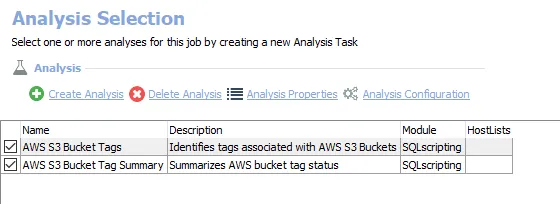

# AWS_S3BucketTags Job

The AWS_S3BucketTags job identifies tags associated with AWS S3 Buckets. Tagging can be helpful to identify the storage class or purpose of a bucket and can be used in AWS IAM Policy assignments.

## Analysis Tasks for the AWS_S3BucketTagsJob

Navigate to the __AWS__ > __7.S3 Content__ > __AWS_S3BucketTags__ > __Configure__ node and select __Analysis__ to view the analysis tasks.

__CAUTION:__ Do not modify or deselect the selected analysis tasks. The analysis tasks are preconfigured for this job.

The following analysis tasks are selected by default:

- AWS S3 Bucket Tags – Identifies tags associated with AWS S3 Buckets. Creates the AWS_BucketTag_Details table accessible under the job’s Results node.
- AWS S3 Bucket Tag Summary – Summarizes AWS bucket tag status. Creates the AWS_BucketTag_Summary table accessible under the job’s Results node.

## Report for the AWS_S3BucketTags Job

In addition to the tables and views created by the analysis tasks, the AWS_S3BucketTags job produces the following preconfigured report:

| Report | Description | Default Tags | Report Element |
| --- | --- | --- | --- |
| Bucket Tags | This report highlights AWS S3 Bucket Tags. | None | This report is comprised of the following elements:   - Stacked Bar Chart – Displays buckets tagged by account - Table – Shows bucket tagging summary - Table – Provides details on bucket tagging |
