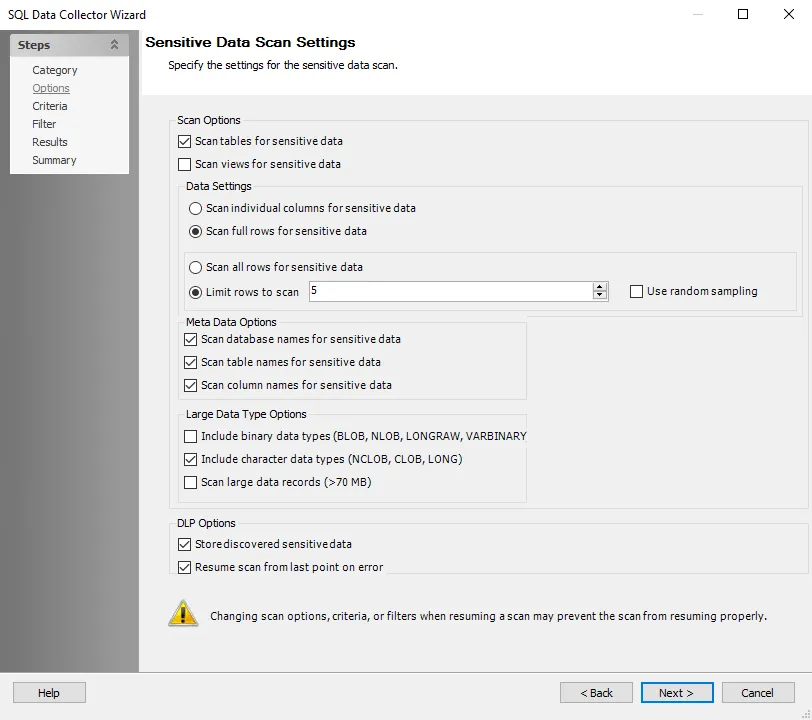
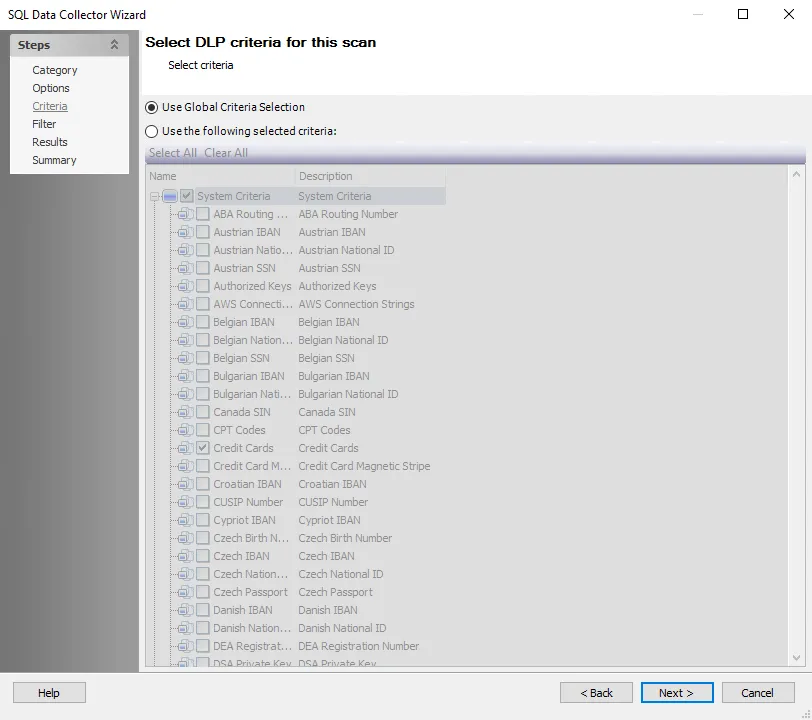
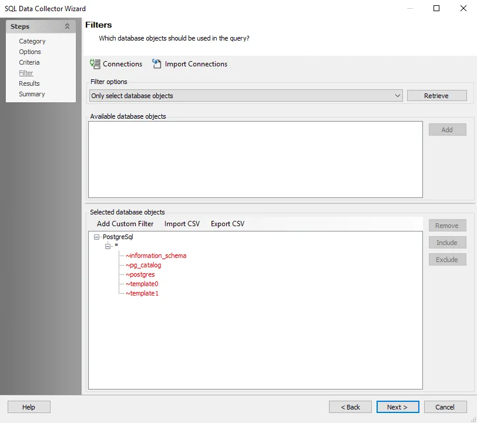
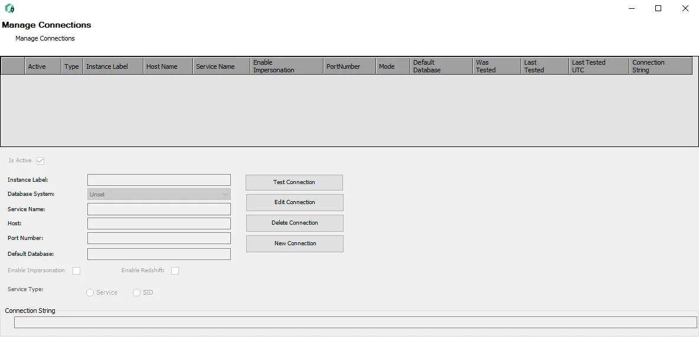
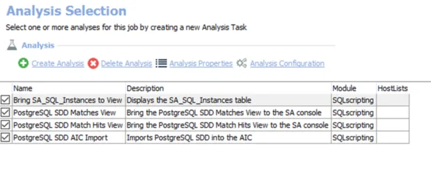

# PgSQL_SensitiveDataScan Job

The PgSQL_SensitiveDataScan Job is designed to discover sensitive data in PostgreSQL databases based on pre-defined or user-defined search criteria.

## Queries for the PgSQL_SensitiveDataScan Job

The PgSQL_SensitiveDataScan Job uses the SQL Data Collector.

The query is:

- PostgreSQL — Scans the PostgreSQL database for sensitive data. For configuring the [SQL Data Collector](../../../../admin/datacollector/sql/overview.md), see the SQL Data Collector topic for additional information.

### Configure the SensitiveDataScan Query

The PgSQL_SensitiveDataScan Job is preconfigured to run using the default settings for the Sensitive Data Collection category. Follow the steps to customize configurations.

__Step 1 –__ Navigate to the __Databases__ > __0.Collection__ > __PostgreSQL__ > __PgSQL_SensitiveDataScan__ > __Configure__ node and select Queries.

__Step 2 –__ In the Query Selection view, select the __PostgreSQL__ query click on Query Properties. The Query Properties window appears.

__Step 3 –__ Select the Data Source tab, and click Configure. The SQL Data Collector Wizard opens.

__CAUTION:__ Do not make changes to other wizard pages as they have been pre-configured for this job.

__Step 4 –__ To modify sensitive data scan options, navigate to the [SQL Data Collector](../../../../admin/datacollector/sql/overview.md) page. Select the desired scan options.

__NOTE:__ The Sensitive Data Scan Settings are pre-configured for optimal performance for a high-level table scan. Configuring these settings to increase the scope of the sensitive data scan may significantly increase scan time.

__Step 5 –__ To modify criteria, navigate to the [SQL Data Collector](../../../../admin/datacollector/sql/overview.md) page. By default, the Sensitive Data Scan job is configured to scan for criteria configured in the Global Criteria settings. See the [Sensitive Data Criteria Editor](../../../../sensitivedatadiscovery/criteriaeditor/overview.md) topic for additional information.

__Step 6 –__ PostgreSQL databases must be added to the query before they can be scanned. Navigate to the __Filter__ page and click __Connections__ to open the Manage Connections window.

__Step 7 –__ In the Manage Connections window, click __New Connection__ and add the following information:

- Is Active Checkbox — Check to include the database on the Servers Pane on the Filter page.
- Instance Label — The name of the instance
- Database System — Select PostgreSQL from the dropdown list
- Host — Name or IP address of the host where the database is located
- Port Number — Port number for the database. The default port for PostgreSQL is 5432

Exit the Manage Connections window to return to the Filter page.

__Step 8 –__ On the Filter page, the query is configured by default to target Only select database objects. Click Retrieve. The Available database objects box will populate. The default filter will scan all PostgreSQL databases returned, excluding the listed system or default schemas and tables in red. Databases and instances can be added in the following ways:

- Select the desired database objects and click Add.
- Use the Import CSV button to import a list from a CSV file, if desired.
- Use the Add Custom Filter button to create and apply a custom filter.

__Step 9 –__ Navigate to the Summary page, click Finish to save any setting modifications or click Cancel if no changes were made. Then click OK to close the Query Properties window.

The PgSQL_SensitiveDataScan Job is now ready to run with the customized settings.

## Anaylsis Tasks for the PsgSQL_SensitiveDataScan Job

Navigate to the __Databases__ > __0.Collection__ > __PostgreSQL__ > __PgSQL_SensitiveDataScan__ > __Configure__ node and select Analysis to view the analysis tasks.

__CAUTION:__ Do not modify or deselect the selected analysis tasks. The analysis tasks are preconfigured for this job.

The default analysis tasks are:

- Bring SA_SQL_Instances to View — Displays the SA_SQL_Instances table
- PostgreSQL SDD Matches View — Bring the PostgreSQL SDD Matches View to the SA console
- PostgreSQL SDD Match Hits View — Bring the PostgreSQL SDD Match Hits View to the SA console
- PostgreSQL SDD AIC Import — Imports PostgreSQL SDD into the AIC
