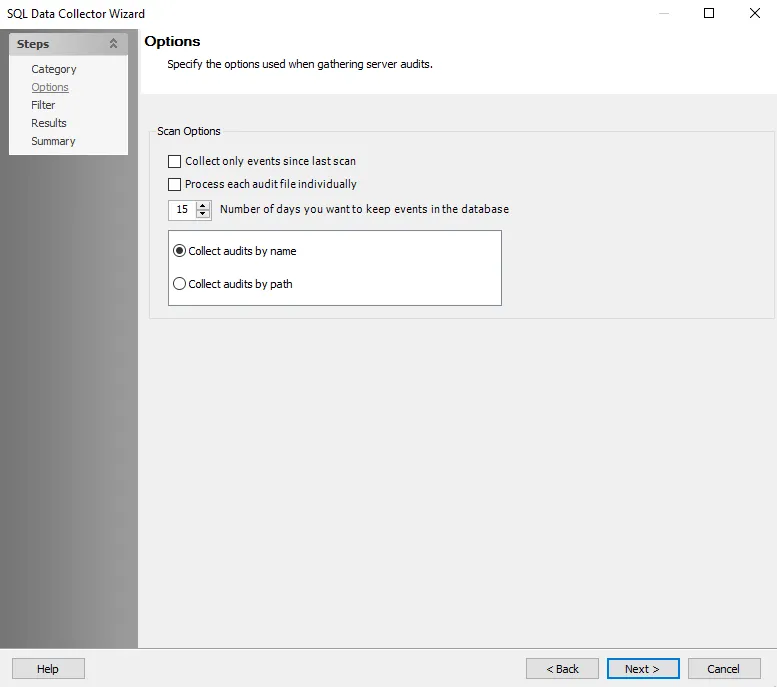
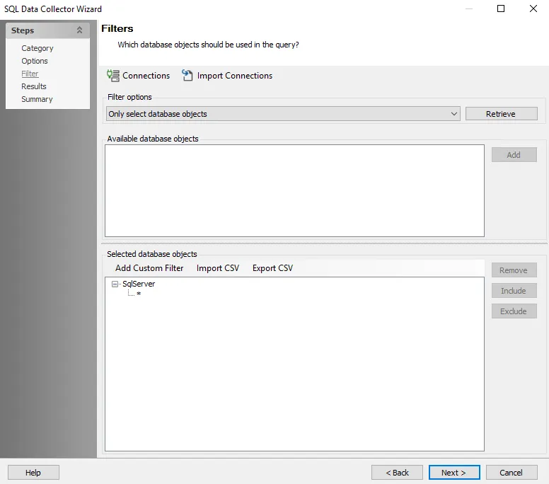
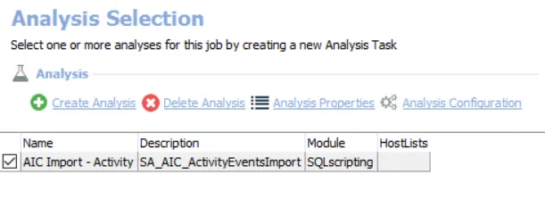

# 3-SQL_ActivityScan Job

The 3-SQL_ActivityScan Job captures user activity from targeted SQL server instances and databases.

Special Dependency

- SQL Server Audit Specifications to be configured on the target databases
  - Audit destination must be a binary file
  - See the Microsoft [Create a Server Audit and Database Audit Specification](https://docs.microsoft.com/en-us/sql/relational-databases/security/auditing/create-a-server-audit-and-database-audit-specification) article for additional information.

## Queries for the 3-SQL_ActivityScan Job

The ActivityScan Job uses the SQL Data Collector for the following query:

- ActivityScan – Collects activity from targeted instances
  - (Optional) This query can be modified to target specific databases/instances. See the [Configure the ActivityScan Query](#configure-the-activityscan-query) topic for additional information.

### Configure the ActivityScan Query

The 3-SQL_ActivityScan Job is preconfigured to run using the default settings within the Server Audits Events Collection category. Follow the steps to customize configurations.

__Step 1 –__ Navigate to the __Databases__ > 0.Collection > SQL > 3-SQL_ActivityScan > Configure node and select Queries.

__Step 2 –__ In the Query Selection view, click on Query Properties. The Query Properties window appears.

__Step 3 –__ Select the Data Source tab, and click Configure. The SQL Data Collector Wizard opens.

__CAUTION:__ Do not make changes to other wizard pages as they have been pre-configured for the purpose of this job.

__Step 4 –__ To modify scan options, navigate to the [SQL Data Collector](../../../../admin/datacollector/sql/overview.md) page. Select the desired scan options. The query is preconfigured with the following default settings:

- Collect only events since last scan – Collects activity recorded since the previous scan
- Number of days you want to keep events in the database – The default setting is 15 days
- Collect audits by name – Finds available audits in the database
- Collect audits by path – Collects audits by a specified path

__Step 5 –__ To scope the query for specific database/instance, navigate to the [SQL Data Collector](../../../../admin/datacollector/sql/overview.md) page. The query is configured by default to target Only select database objects. Click Retrieve. The Available database objects will be populated. Databases and instances can be added in the following ways:

Select the desired database objects and click Add.

Use the Import CSV button to import a list from a CSV file.

Optionally use the Add Custom Filter button to create and apply a custom filter.

__Step 6 –__ Navigate to the Summary page, click Finish to save any setting modifications or click Cancel if no changes were made. Then click OK to close the Query Properties window.

The 3-SQL_ActivityScan Job is now ready to run with the customized settings.

## Analysis Tasks for the 3-SQL_ActivityScan Job

Navigate to the __Databases__ > 0.Collection > SQL > 3-SQL_ActivityScan > Configure node and select Analysis to view the analysis tasks.

__CAUTION:__ Do not modify or deselect the selected analysis task(s). The analysis task(s) are preconfigured for this job.

The default analysis tasks are:

- AIC Import – Activity– Creates the SA_AIC_ActivityEventsImport table accessible under the job’s Results node.
