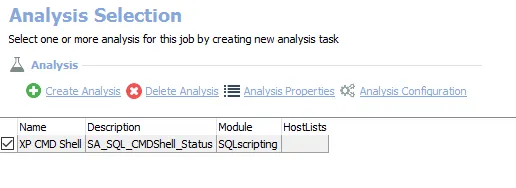

# SQL_CMDShell Job

The SQL_CMDShell Job reports on whether the ```xp_cmdshell``` stored procedure is enabled or disabled. Since ```xp_cmdshell``` allows users to execute operating system commands when connected to the SQL or the Azure SQL server, it can be used to launch malicious attacks. Microsoft recommends that the ```xp_cmdshell``` stored procedure be disabled.

## Analysis Tasks for the SQL_CMDShell Job

Navigate to the __Databases__ > SQL > 4.Configuration > SQL_CMDShell > Configure node and select Analysis to view the analysis tasks.

__CAUTION:__ Do not modify or deselect the selected analysis task(s). The analysis task(s) are preconfigured for this job.



The default analysis task is:

- XP CMD Shell – Creates the SA_SQL_CMDShell_Status table accessible under the job’s Results node

In addition to the tables and views created by the analysis task, the SQL_CMDShell Job produces the following pre-configured report.

| Report | Description | Default Tags | Report Elements |
| --- | --- | --- | --- |
| xp_cmdshell Settings | Because malicious users sometimes attempt to elevate their privileges by using xp_cmdshell, xp_cmdshell is disabled by default. Use sp_configure or Policy Based Management to disable it on any instances which have it enabled. | None | This report is comprised of two elements:   - Pie Chart – Displays instance summary - Table– Displays configuration details |
